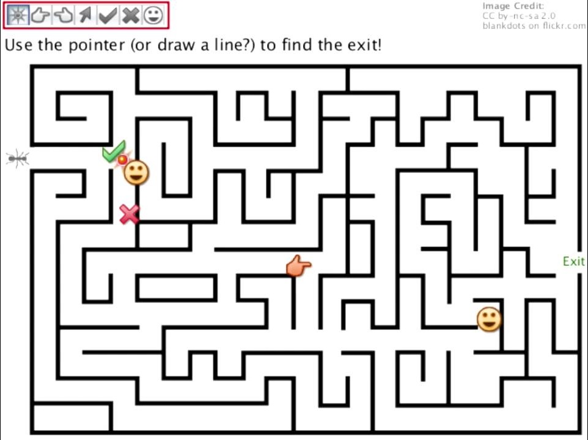

#മുൻവ്യവസ്ഥകൾ/ആവശ്യമായ സംഗതികള്‍

##അത്യാവശ്യം വേണ്ടത്

ഈ ബുക്കില്‍ പറഞ്ഞിരിക്കുന്ന പോലെ പ്രോഗ്രമെഴുത്ത് പഠിക്കണമെങ്കില്‍ ആദ്യം തന്നെ വേണ്ടത് പ്രോഗ്രാം എഴുതാന്‍ അതുപോലെ അത് ഓടിക്കാന്‍ ആവശ്യമായ യന്ത്രമാണ്. ഇതില്‍ പഠനവശ്യത്തിനു വേണ്ടി ഉപയോഗിക്കുന്ന ഭാഷ ജാവാസ്ക്രിപ്റ്റ് ആയതുകൊണ്ട്  അത് ഓടുന്ന ബ്രൌസര്‍ ഉള്ള കമ്പ്യുട്ടറോ, ടാബ്ലെട്ടോ ഒന്നും അല്ലെങ്കില്‍ മൊബൈലോ മതി.

പിന്നെ അത്യാവശ്യം വേണ്ടത് ഒരു പ്രോഗ്രാം ശരിക്ക് നമ്മള്‍ ഉദ്ദേശിക്കുന്നപോലെ വര്‍ക്ക്‌ ചെയ്യുന്നതുവരെ പരിശ്രമിക്കാനുള്ള മനസാണ്. എങ്ങിനെ പോയാലും ആദ്യം എഴുതുന്ന പ്രോഗ്രാമുകള്‍ ശരിക്ക് വര്‍ക്ക്‌ ചെയ്യണം എന്നില്ല. കുറെ പ്രാവശ്യം തിരുത്തി എഴുതേണ്ടി വരും. അതുപോലെ ചിലപ്പോള്‍ ഇതു നിര്‍ദേശം ആണ് കുഴപ്പം ഉണ്ടാക്കുന്നത് എന്ന് മനസിലാകാതെ വരും. അങ്ങനെ വരുമ്പോള്‍ നിരാശപ്പെട്ട് നിറുത്തുന്ന ആളുകള്‍ക്ക് പറഞ്ഞിട്ടുള്ളതല്ല പ്രോഗ്രമെഴുത്ത്. 

എങ്ങിനെ പ്രോഗ്രാം ശരിയാക്കാം എന്നുള്ള കുറച്ചു വഴികള്‍ ഇതില്‍ പറയുന്നുണ്ടെങ്കിലും പ്രോഗ്രാമ്മറുടെ അതീവ ശ്രദ്ധ എപ്പോഴും ആവശ്യമാണ്.

#പ്രോബ്ലം സോള്‍വിംഗ്
പിന്നെയുള്ള ഒരു കഴിവ് ആണ് പ്രശ്നങ്ങള്‍ പടിപടിയായി നിര്‍ധാരണം ചെയ്യാനുള്ള കഴിവ്. പ്രത്യക്ഷത്തില്‍ പ്രോഗ്രാം ആയി ബന്ധപ്പെട്ടതല്ല എന്ന് തോന്നുമെങ്കിലും ഒരു പ്രശ്നം കിട്ടിയാല്‍ അതിനെ എങ്ങിനെ സോള്‍വ്‌ ചെയ്യാം എന്ന് അറിഞ്ഞാല്‍ മാത്രമേ ആ സോള്‍വ്‌ ചെയ്യുന്ന രീതിയെ കമ്പ്യൂട്ടര്‍ പ്രോഗ്രാം ആക്കി മാറ്റി അതിനെക്കൊണ്ട് ചെയ്യിക്കാന്‍ പറ്റൂ. മുന്‍പേ പറഞ്ഞപോലെ കമ്പ്യൂട്ടര്‍ സ്വന്തമായി ചിന്തിക്കാന്‍ ശേഷി ഇല്ലാത്ത ഒരു യന്ത്രമാണ്. ചെയ്യേണ്ട രീതി അതിനു പറഞ്ഞുകൊടുത്താല്‍ അത് നല്ല വേഗതയില്‍ അത് ചെയ്തു തീര്‍ക്കും എന്നേയുള്ളൂ.

# പ്രോഗ്രാമ്മര്‍ ചിന്തിക്കല്‍
അതായത് നമ്മുടെ ചിന്തകള്‍ ഒരു പ്രോഗ്രാമ്മര്‍ ചിന്തിക്കുന്നപോലെയാകണം നമുക്ക് പെട്ടെന്ന്‍ കിട്ടുന്ന ഉത്തരം ആണെങ്കിലും അത് എങ്ങിനെ സ്റ്റെപ്പുകള്‍ ആയി ചെയ്യാം എന്ന് കണ്ടു പിടിക്കണം എന്നാലെ പ്രോഗ്രാം എഴുതാന്‍ പറ്റൂ. പ്രോഗ്രാം എഴുതുന്ന ഭാഷയെക്കുറിച് ഒരുഒരിക്കലും ആവലാതിപ്പെടരുത്. ഇന്ന് ഉപയോഗിക്കുന്ന ഭാഷ ആയിരിക്കില്ല നാളെ. പക്ഷെ സമസ്യകള്‍ പരിഹരിക്കാനുള്ള കഴിവ് അത് ഒരിക്കലും നമുക്ക് നഷ്ടമല്ല. 

ഉദാഹരണമായി നന്നായി കഥഎഴുതാന്‍ കഴിവുള്ള ആളെ എടുക്കുക. കഥയുണ്ടാക്കുക എന്നത് ആണ് കഴിവ് അത് ഏത് ഭാഷയില്‍ എഴുതുന്നു എന്നതല്ല. നമുക്ക് ഒരു പ്രത്യേക ഭാഷ അറിയില്ല എന്ന് വയ്ക്കുക. വേണമെങ്കില്‍ നമുക്ക് ഒരു ദ്വിഭാഷിയെവച്ച് ആ ഭാഷയില്‍ എഴുതിക്കാം. പക്ഷെ കഥ എഴുതാന്‍ ഉള്ള കഴിവ് ഇല്ലെങ്കിലോ ഒന്നും ചെയ്യാന്‍ പറ്റില്ല.

#സമസ്യകള്‍ക്ക് ഉദാഹരണങ്ങള്‍
സമസ്യ സമസ്യ എന്ന് പറഞ്ഞല്ലോ. കുറച്ചു ഉദാഹരണങ്ങള്‍ നോക്കാം.

## വഴി കാണിക്കല്‍
പണ്ടത്തെ ബാലരമ, പൂമ്പാറ്റ, ബാലമംഗളം തുടങ്ങിയ പ്രസിദ്ധീകരണങ്ങളില്‍ നോക്കിയാല്‍ കാണാം വഴി തെറ്റിപ്പോയ മിട്ടു മുയലിനു വഴി കാണിച്ചു കൊടുക്കുക എന്നൊക്കെ പറഞ്ഞുള്ള പ്രശ്നങ്ങള്‍. അവിടെ എങ്ങിനെയാണ്‌ വഴി നമ്മള്‍ കണ്ടു പിടിക്കുന്നത്? ഒരിക്കലും അത് ഒറ്റ നോട്ടത്തില്‍ പറയാന്‍ പറ്റില്ല. 
നമ്മള്‍ ഒരു വഴി എടുക്കുന്നു. അതില്‍ കുറച്ചു പോകുമ്പോള്‍ ഒരു തടസം വന്നാല്‍ പുറകിലേക്ക് വന്നു വേറെ വഴി എടുക്കുന്നു. അങ്ങനെ കുറെ തടസങ്ങള്‍ക്ക് ശേഷം ശരിയായ വഴി നമ്മള്‍ കണ്ടെത്തുന്നു. വഴി കണ്ടു പിടിക്കാനുള്ള രീതി അവിടെ ഒന്നാണ്. അതിനാണ് ബുദ്ധി വേണ്ടത്.  പിന്നെ ആ രീതി ഉപയോഗിച്ച് മുന്നോട്ടും പിന്നോട്ടും പോയി ശരിയായ വഴി കണ്ടു പിടിക്കല്‍ ആവര്‍ത്തനമുള്ള ഒരു പണിയാണ്. ഈ പണി കമ്പ്യൂട്ടര്‍ നമ്മളെക്കാള്‍ നന്നായി വേഗത്തില്‍ ചെയ്യും. പക്ഷെ കണ്ടു പിടിക്കുന്ന രീതി അതിനെ പറഞ്ഞു മനസിലാക്കണം എന്ന് മാത്രം. 

രീതി എന്ന് ഇവിടെ ഉദേശിച്ചത് ഒരു വഴി തിരെഞ്ഞെടുത്ത് മുന്‍പോട്ടു പോകാനും, തടസം വരുമ്പോള്‍ പുറകിലേക്ക് പോയി മുന്‍പ് പോയിട്ടില്ലാത്ത വഴിയില്‍ കൂടി പോകാനും, എപ്പോഴാണ് ലക്ഷ്യത്തില്‍ എത്തിയത് എന്നറിയാനുമുള്ള നിര്‍ദേശങ്ങള്‍ ആണ്. എത്രത്തോളം കാര്യക്ഷമമായി നമ്മള്‍ നിര്‍ദേശങ്ങള്‍ കൊടുക്കുന്നുവോ അത്രയും വേഗതയില്‍ കമ്പ്യൂട്ടര്‍ ആ നിര്‍ദേശങ്ങള്‍ നടപ്പില്‍ വരുത്തി ഒരു തീരുമാനം ഉണ്ടാക്കിത്തരും.

## ഉദാഹരണം - വെള്ളം അളക്കല്‍

#എങ്ങിനെ നമ്മുടെ പ്രോബ്ലം സോള്‍വിംഗ് കഴിവ് കൂട്ടാം
ചിലര്‍ക്ക് നല്ലപോലെ പ്രോബ്ലം നിര്‍ദ്ധരിക്കാന്‍ സാധിക്കും. മറ്റു ചിലര്‍ക്ക് അങ്ങനെയാകണം എന്നില്ല. കുറച്ചു കഴിവ് ജന്മനാ, അല്ലെങ്കില്‍ അവര്‍ വളര്‍ന്ന സാഹചര്യത്തിലൂടെ കിട്ടുന്നത് ആണെങ്കിലും അത് ഇല്ലാത്തവന് ആ കഴിവ് ഉണ്ടാക്കിയെടുക്കാന്‍ പറ്റില്ല എന്നൊന്നും ഇല്ല. പക്ഷെ നല്ലപോലെ അദ്ധ്വാനിക്കണം എന്നേയുള്ളൂ. മുകളില്‍ കാണിച്ചപോലെയുള്ള ധാരാളം സമസ്യകള്‍ ഇന്‍റര്‍നെറ്റില്‍ പരതിയാല്‍ കിട്ടും.അതൊക്കെ എടുത്ത് സ്വന്തമായി ചെയ്തു നോക്കുക.
