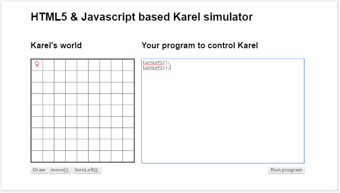

#കരെലിനു ചെയ്യാവുന്ന ജോലികള്‍

നമുക്ക് രണ്ടു വിധത്തില്‍ നിര്‍ദേശങ്ങള്‍ കരെലിനു കൊടുക്കാം. ഒന്നുകില്‍ ബട്ടന്‍ ക്ലിക്ക് വഴി അല്ലെങ്കില്‍ പോഗ്രാം എഴുതി.

##ഇടത്തോട്ട് തിരിയല്‍
 1. ബട്ടണ്‍ ക്ലിക്ക് വഴി
 താഴെയുള്ള ടേണ്‍ലെഫ്റ്റ് എന്ന ബട്ടന്‍ അമര്‍ത്തിയാല്‍ കരെല്‍ ഇടത്തോട്ട് തിരിയുന്ന കാണാം. ഇടത്തോട്ട് തിരിയുക എന്ന് വച്ചാല്‍ ചെറിയ വൃത്തം ഇടതു ഭാഗത്തും വലുത് വലതു ഭാഗത്തും ആകും.
 2. നിര്‍ദേശം വഴി
നിര്‍ദേശം ടൈപ്പ് ചെയ്യേണ്ടത് ഇംഗ്ലീഷില്‍ ആണ്. അടുത്ത പതിപ്പ് ഇറക്കുന്നതിനു മുന്‍പ് മലയാളത്തില്‍ നിര്‍ദേശങ്ങള്‍ കൊടുക്കുന്നതിനു വേണ്ട മാറ്റങ്ങള്‍ വരുത്തുന്നതായിരിക്കു .ടേണ്‍ലെഫ്റ്റ് (എല്‍ വലിയ അക്ഷരമാണ്) എന്നെഴുതി ഒരു തുറക്കുന്ന ബ്രാക്കറ്റും അടക്കുന്ന ബ്രാക്കറ്റും ഇടുക. ബ്രാക്കറ്റ് ഇടുന്നത് എന്തിനാണെന് ഇനി വരുന്ന അധ്യായങ്ങളില്‍ വിവരിക്കുന്നുണ്ട്.  എന്നിട്ട് വലത് ഭാഗത്ത് താഴെയുള്ള റണ്‍ പ്രോഗ്രാം എന്ന ബട്ടണില്‍ ക്ലിക്കുക. പ്രോഗ്രാം പ്രവര്‍ത്തിച്ചു കരെല്‍ ഒന്നുകൂടി ഇടത്തോട്ട് തിരിയുന്ന കാണാം.
താഴെ കൊടുത്ത ചിത്രം നോക്കിയാല്‍ എങ്ങിനെ എഴുതണം എന്ന് പിടികിട്ടും.

മുകളില്‍ കാണിച്ചപോലെ രണ്ടു പ്രാവശ്യം ടേണ്‍ലെഫ്റ്റ് എന്നെഴുതുക. എന്നിട്ട് "റണ്‍ പ്രോഗ്രാം" എന്നാ ബട്ടണി ക്ലിക്ക് ചെയ്യുക. അപ്പോള്‍ കരെല്‍ രണ്ടു പ്രാവശ്യം തിരിയുന്നത് കാണാം. അങ്ങനെ തിരിഞ്ഞതിനു ശേഷം ഉള്ള ചിത്രം ആണ് മുകളില്‍.

ആദ്യമായിട്ടാണ് പ്രോഗ്രാം എഴുതുന്നത് എങ്കില്‍ അഭിനന്ദനങ്ങള്‍...

##മുന്‍പോട്ട് നടക്കല്‍
 1. ബട്ടണ്‍ ക്ലിക്ക് വഴി
മൂവ് എന്ന ബട്ടണില്‍ ക്ലിക്കിയാല്‍ കരെല്‍ മുന്‍പോട്ട് ഒരു കള്ളി നീങ്ങുന്നത് കാണാം. ഭിത്തിയോട് ചേര്‍ന്നാണ് ഇരിക്കുന്നതെങ്കില്‍ അതിനു നീങ്ങാന്‍ കഴിയില്ല അതിനെ ഇടത്തോട്ട് തിരിച്ചു മുന്‍പില്‍ നീങ്ങാന്‍ കളം ഉണ്ടാക്കണം
 2. നിര്‍ദേശം വഴി
മൂവ് എന്ന് ഇംഗ്ലീഷില്‍ ടൈപ്പ് ചെയ്ത് ഒരു തുറക്കുന്ന ബ്രാക്കറ്റും അടക്കുന്ന ബ്രാക്കറ്റും ഇടുക. എന്നിട്ട് മുന്പ് ചെയ്തപോലെ 'റണ്‍' ബട്ടണ്‍ ക്ലിക്ക് ചെയ്യുക. രണ്ട് പ്രാവശ്യം എഴുതിയിട്ട് പ്രവര്‍ത്തിപ്പിച്ചാല്‍ 2 കളങ്ങള്‍ നീങ്ങുന്നത് കാണാം.
<image karel move()>

അടുത്ത അദ്ധ്യായങ്ങളില്‍ നമ്മള്‍ കാണാന്‍ പോകുന്നത്, ഈ രണ്ട് അടിസ്ഥാന നിര്‍ദേശങ്ങള്‍ വച്ച് ഏതൊക്കെ രീതിയില്‍ കരെലിനെ നിയന്ത്രിക്കാം എന്നതാണ്.
