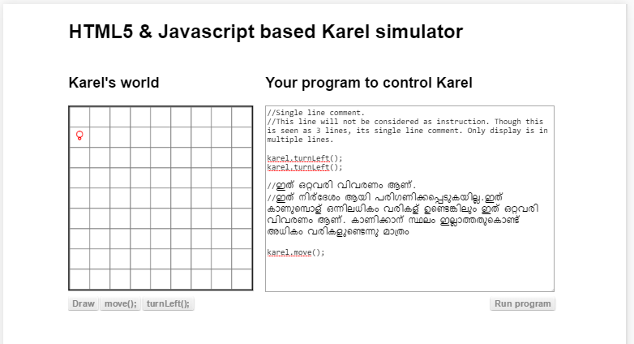
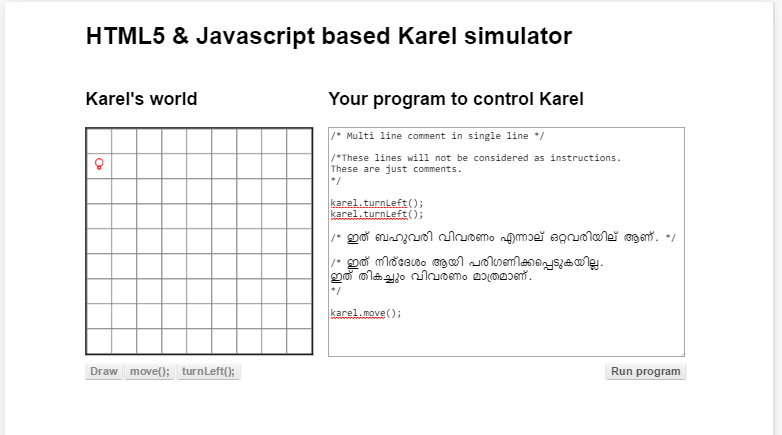

##വിവരണം / കമന്റ്‌
സാധാരണ നമ്മള്‍ പ്രോഗ്രാം എഴുതുമ്പോള്‍ എല്ലാം നിര്‍ദേശങ്ങള്‍ ആയിരിക്കുമല്ലോ. കമ്പ്യൂട്ടര്‍ അല്ലെങ്കില്‍ നമ്മുടെ ജാവാസ്ക്രിപ്റ്റ് പ്രോഗ്രാം പ്രവര്‍ത്തിപ്പിക്കുന ബ്രൌസര്‍, നമ്മള്‍ എഴുതിയ പ്രോഗ്രാമിലെ ഓരോ വാക്കും നിര്‍ദേശങ്ങള്‍ ആയി എടുത്തു അതിനെ പ്രവര്‍ത്തിപ്പിക്കും അല്ലെങ്കില്‍ നടപ്പിലാക്കും എന്നും പറയാം. ഇനിയിപ്പോള്‍ കുറച്ചു വാക്കുകള്‍ അല്ലെങ്കില്‍ വാചകങ്ങള്‍ പ്രവര്‍ത്തിപ്പിക്കേണ്ട എന്നുണ്ടെങ്കിലോ? അതായത് നമ്മള്‍ ഒരു പ്രത്യേക ഗണനരീതി ഉപയോഗിച്ച് പ്രോഗ്രാം എഴുതി അത് എന്താണെന്ന്‍ സാധാരണ ഭാഷയില്‍ എഴുതിവച്ചാല്‍ പിന്നീട് നമ്മുടെ പ്രോഗ്രാം നോക്കുന്ന ആള്‍ക്ക് എളുപ്പം പിടികിട്ടും. അത് വേണമെങ്കില്‍ ഇംഗ്ലീഷില്‍ ആയിരിക്കാം അല്ലെങ്കില്‍ മലയാളത്തില്‍ ആയിരിക്കാം.

നമ്മള്‍ വെറുതെ പ്രോഗ്രാമിന് ഇടയില്‍ ആ പ്രോഗ്രാമിനെക്കുറിച്ചുള്ള വിവരണം എഴുതിയാല്‍ അത് വിവരണം ആണെന്ന് മനസിലാകാതെ കമ്പ്യൂട്ടര്‍ / ബ്രൌസര്‍അത് നിര്‍ദേശം ആണെന്ന് കരുതി എടുത്തു പ്രവര്‍ത്തിപ്പിക്കാന്‍ നോക്കും. അങ്ങനെ വരുമ്പോള്‍ കാര്യങ്ങള്‍ ആകെ കുഴയും. അതിനു എങ്ങിനെ അവ പ്രവര്‍ത്തിപ്പിക്കണം എന്ന് അറിയില്ലല്ലോ. അല്ലെങ്കില്‍ ആ ബ്രൌസര്‍ എന്ന  പ്രോഗ്രാം എഴുതിയവര്‍ക്ക് നമ്മള്‍ എന്താണ് വിവരണം ആയി എഴുതുന്നത് എന്ന് മുന്‍കൂട്ടി അറിയാത്തതുകൊണ്ട് അവ എങ്ങിനെ പ്രവര്‍ത്തിപ്പിക്കണം എന്ന് ബ്രൌസര്‍ പ്രോഗ്രാമില്‍ പറഞ്ഞു വയ്ക്കാനും പറ്റില്ല. അപ്പോള്‍ എന്ത് ചെയ്യണം?

പ്രോഗ്രാം എഴുതുന്ന ഭാഷയില്‍ ഇതുപോലെ വിവരണങ്ങളെ കുറിക്കാന്‍ എന്തെങ്കിലും ഒരു ഉപാധി വേണം. അങ്ങനെ കമ്പ്യൂട്ടര്‍ എടുത്തു പ്രവര്‍ത്തിപ്പിക്കേണ്ടാത്ത / വര്‍ക്ക്‌ ചെയ്യാന്‍ നമുക്ക് താല്‍പര്യം ഇല്ലാത്ത വാക്കുകളെ അല്ലെങ്കില്‍ വാചകങ്ങളെ പ്രോഗ്രാമില്‍ കുറച്ചു വയ്ക്കുന്നതിനുള്ള ഉപാധിയാണ് കമന്റ്‌ എന്നറിയപ്പെടുന്നത്. രണ്ട് തരത്തില്‍ നമുക്ക് കമന്റ്‌ എഴുതാം. ഇനി എങ്ങിനെയാണ്‌ എഴുതുന്നത് നോക്കാം

### ഒറ്റവരി കമന്റ്‌ 
രണ്ട് ഹരണചിഹ്നങ്ങള്‍ ഒന്നിനുപുറകെ ഒന്നായി ഇട്ടാല്‍ അതിനു ശേഷം ആ വരി അവസാനിക്കുന്നത് വരെയുള്ളതൊന്നും പിന്നെ ബ്രൌസര്‍, പ്രോഗ്രാം ആയി കണക്കാക്കി പ്രവര്‍ത്തിപ്പിക്കില്ല. ഇവിടെ രണ്ട് ഹരണചിഹ്നങ്ങള്‍ക്ക് ഇടയില്‍ വിടവ് വരാന്‍ പാടില്ല. വിടവ് വന്നാല്‍ അത് എന്താണ് അര്‍ത്ഥമാക്കുന്നത് എന്ന് ബ്രൌസറിന് മനസിലാകില്ല.

### ബഹുവരികള്‍ ഉള്ള കമന്റ്‌

മിക്കവാറും സാഹചര്യങ്ങളില്‍ നമുക്ക് ഒരു വരിയില്‍ പ്രോഗ്രാമിനെ പറ്റിയുള്ള വിവരണം എഴുതാന്‍ പറ്റി എന്ന് വരില്ല. അപ്പോള്‍ നമുക്ക് എന്ത് ചെയ്യാം? ഒന്നുകില്‍ മുകളില്‍ കണ്ടപോലെ രണ്ടാമത്തെ വിവരണവരിയിലും തുടക്കത്തില്‍ രണ്ട് ഹരണചിഹ്നങ്ങള്‍ ഇട്ടുകൊടുക്കാം. അല്ലെങ്കില്‍ താഴെ കൊടുത്ത രീതി ഉപയോഗിച്ച് എഴുതാം.

ഇവിടെ നമുക്ക് ഒരേ കാര്യം ചെയ്യാന്‍ രണ്ട് വഴികള്‍ കാണാം. ഒറ്റവരി കമെന്‍റ്  സങ്കേതം ഉപയോഗിച്ച് ഒന്നില്‍ കൂടുതല്‍ വരികളും, ബഹുവരികള്‍ എഴുതാനുള്ള സങ്കേതം ഉപയോഗിച്ച് ഒറ്റവരി വിവരണങ്ങളും എഴുതാം. ഇനി നമ്മള്‍ കാണാന്‍ പോകുന്ന ഒരു മാതിരി എല്ലാ പ്രോഗ്രാം എഴുതുന്ന സങ്കേതങ്ങളിലും ഇതുപോലെ ഒരു കാര്യം ചെയ്യാന്‍ പല വഴികളും കാണാം. 

നമ്മുടെ സംസാരഭാഷകള്‍ എടുത്താലും ഇത് തന്നെയല്ലേ അവസ്ഥ. ഒരു കാര്യം അര്‍ഥം മാറ്റം വരാതെ പല രൂപത്തില്‍ പറയാം അതുപോലെതന്നെയാണ് പ്രോഗ്രാമ്മിംഗ് ഭാഷകളും. പലതരത്തില്‍ കാര്യങ്ങള്‍ പ്രകടിപ്പിക്കുന്നതില്‍ , ഇതാണ് പൂര്‍ണമായും ശരിയായത് എന്ന് പറയാന്‍ ബുദ്ധിമുട്ടാകും. കുറച്ചൊക്കെ നിയമങ്ങള്‍ വച്ച് പറയാമെങ്കിലും 100% ഇതാണ് ശരി എന്ന് പറയാന്‍ പറ്റില്ല. അതുകൊണ്ട് അത് പ്രോഗ്രാം എഴുതുന്നവരുടെ താല്‍പര്യത്തിനു വിടേണ്ടി വരും.

പ്രോഗ്രാം ഭാഷ, നമ്മുടെ സംസാരഭാഷകള്‍ പോലെതന്നെയാണ് എന്ന് മനസിലയാലോ. നിങ്ങള്‍ എഴുതുന്ന പ്രോഗ്രാം വിചാരിച്ചപോലെ പ്രവര്‍ത്തിച്ചാലും, അവതരണരീതി, അല്ലെങ്കില്‍ അത് എഴുതിയിരിക്കുന്ന ഗുണമേന്മ നിങ്ങള്‍ക്ക് നന്നായി തോന്നാമെങ്കിലും മറ്റുള്ളവര്‍ക്ക് അതുപോലെ തോന്നണം എന്നില്ല. അതിനു പ്രവര്‍ത്തിപരിചയം തന്നെയണ് വഴി.
