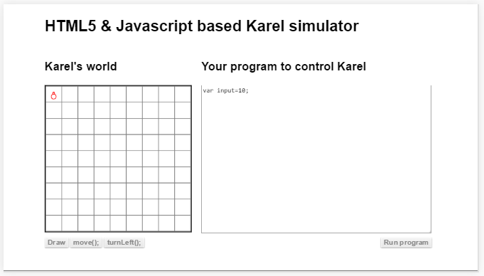
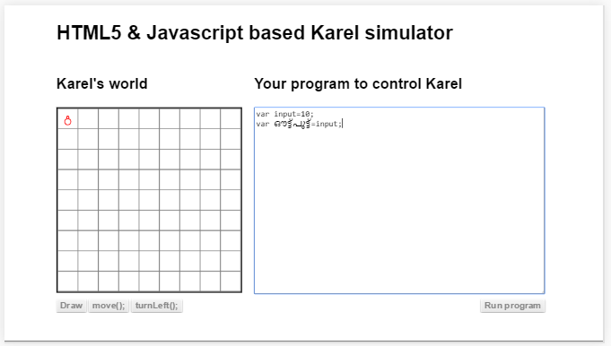
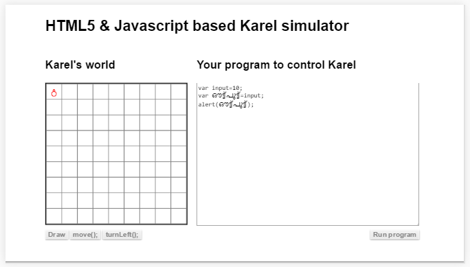
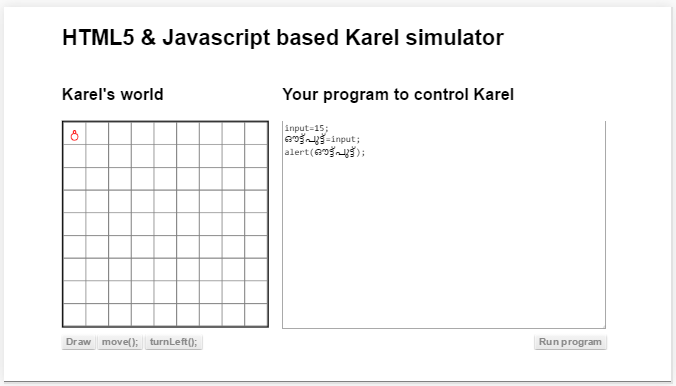

##ചരം / വേരിയബിള്‍
ഇതിനെ അലമാരയോടോ, അടുക്കളയില്‍ സാധനങ്ങള്‍ ഇട്ടു വയ്ക്കുന്ന ഡബ്ബയോടോ ഉപമിക്കാം. ഒരു വ്യത്യാസം ഇവിടെ പ്രോഗ്രാം എഴുതുമ്പോള്‍ പഞ്ചസാരക്കും, ഉപ്പിനും പകരം സൂക്ഷിക്കുന്നത് ഡാറ്റ ആണെന്ന് മാത്രം. അതായത് ഉപയോക്താവ് തരുന്ന ഇന്‍പുട്ട് (`input`), ഒരു പ്രോഗ്രാം പ്രവര്‍ത്തിപ്പിക്കുമ്പോള്‍ ഇടയില്‍ ഉണ്ടാകുന്ന സംഖ്യകള്‍ അല്ലെങ്കില്‍ ഡാറ്റ. കണക്കില്‍ ഇതുപോലെയുള്ള സങ്കേതത്തെ വിളിക്കുന്നത് വേരിയബില്‍ / `variable` എന്നാണ്. അതിന്‍റെ മലയാളം ചരം എന്നും. വേണമെങ്കില്‍ ഒരു ഡാറ്റ സംഭരണി എന്നും വിളിക്കാം.

ഇവിടെ കാണുന്നത് ഒരു ചരത്തില്‍ 10 എന്ന സംഖ്യ സൂക്ഷിചിരിക്കുന്നതാണ്.

ഒരു ചരത്തില്‍ സൂക്ഷിച്ചിരിക്കുന്ന സാധനത്തെ നമുക്ക് വേറെ ചരത്തിലെക്ക് കോപ്പി ചെയ്യാം.

ഇപ്പോള്‍ ഇന്‍പുട്ട് എന്ന ചരത്തിലും ഔട്ട്‌പുട്ട് എന്ന ചരത്തിലും 10 ആണ് വച്ചിരിക്കുന്നത്. ഇനി ഔട്പുട്ട് എന്ന ചരത്തില്‍ ആ ഡാറ്റ വന്നിട്ടുണ്ടോ എന്ന് നോക്കാം. അതിനു അലേര്‍ട്ട് എന്ന ഫങ്ഷന്‍ (`Function`) ഉപയോഗിക്കണം. ഫങ്ഷന്‍ എന്താണെന്ന്‍ ഇനി വരുന്ന അദ്ധ്യായങ്ങളില്‍ ഉണ്ട്.

ഈ പ്രോഗ്രാം പ്രവര്‍ത്തിപ്പിച്ചാല്‍ ഒരു മെസ്സേജ് ബോക്സ്‌ വരും അതില്‍ 10 എന്ന് എഴുതിയിട്ടുണ്ടാകും.

###പ്രോഗ്രമെഴുത്തില്‍ മലയാളം
മുകളില്‍ മലയാളത്തില്‍ ഔട്ട്‌പുട്ട് എന്ന് എഴുത്തികണ്ടപ്പോള്‍ ചിലര്‍ക്കെങ്കിലും ഒരു സംശയം ഉണ്ടായിക്കാണും. മലയാളം പ്രോഗ്രാം എഴുതുമ്പോള്‍ ഉപയോഗിക്കാവോ എന്ന്? തീര്‍ച്ചയായും ഉപയോഗിക്കാന്‍ പറ്റുന്ന സ്ഥലങ്ങളില്‍ ഉപയോഗിക്കാം. 
ചരത്തിന് ഒരു പേര് വേണമെന്നെയുള്ളൂ. അത് യൂണികോഡ്‌ ഉള്ള ഇതൊരു ഭാഷയിലും എഴുതാം. പക്ഷെ വാര്‍ എന്നത് മലയാളത്തില്‍ എഴുതാന്‍ പറ്റില്ല. കാരണം അത് ബ്രൌസര്‍ വായിച്ചു മനസിലാക്കേണ്ടതാണ്. ബ്രൌസര്‍ ഇംഗ്ലീഷുകാരനാണ്. അല്ലെങ്കില്‍ തന്നെ ലോകത്തെല്ലായിടത്തും ഉള്ള ഭാഷകളില്‍ വാര്‍ എന്ന അര്‍ത്ഥം വരുന്ന വേണ്ട വാക്കുകള്‍ കണ്ടുപിടിക്കുക എന്നതും അത് ബ്രൌസര്‍ ഓര്‍ത്തുവയ്ക്കുക എന്നതും ബുദ്ധിമുട്ടുള്ള കാര്യമാണ്.

### എന്താണ് വാര്‍(`var`)

നമ്മള്‍ എഴുതുന്ന വാക്ക് ഒരു ചരം  ആണ് എന്ന് ജാവാസ്ക്രിപ്റ്റ് പ്രവര്‍ത്തിപ്പിക്കുന്ന ബ്രൌസറിനോട് പറയാന്‍ ഉപയോഗിക്കുന്ന സൂചകപദം ആണ് വാര്‍. ഇത് ഒരു നിര്‍ദേശം അല്ല. കാരണം ഇത് വച്ച് ബ്രൌസര്‍/കമ്പ്യൂട്ടര്‍ ഒന്നും ചെയ്യുന്നില്ല. പകരം പ്രോഗ്രാം കൂടുതല്‍ നന്നായി മനസിലാക്കുകയാണ്. ജാവാസ്ക്രിപ്റ്റ് എന്ന ഭാഷയില്‍ ഇതു ഡാറ്റയും സൂക്ഷിക്കാവുന്ന ചരങ്ങള്‍ പറഞ്ഞു വയ്ക്കുന്നത് ഇതേ സൂചകപദം ഉപയോഗിച്ചാണ്‌.

താഴെ കൊടുത്തിരിക്കുന്ന പ്രോഗ്രാം ശ്രദ്ധിക്കുക. 

ഇത് പ്രവര്‍ത്തിപ്പിച്ചാല്‍ ഇത് വിചാരിച്ച ഫലം ഉണ്ടാക്കുകയുമില്ല. തെറ്റാണു എന്ന് നമുക്ക് തോന്നും. 

പക്ഷെ എല്ലാസമയത്തും ഇങ്ങനെ വരണം എന്നില്ല. ഇവിടെ വര്‍ക്ക്‌ ചെയ്യാത്തത് ഈ പ്രോഗ്രാം സ്ട്രിക്റ്റ് മോഡില്‍ പ്രവര്‍ത്തിക്കുന്നത് കൊണ്ടാണ്. അല്ലെങ്കില്‍ ഒരു പരാതിയും കൂടാതെ ബ്രൌസര്‍ അതിനെ ഒരു ചരം ആയി കണ്ടു കൈകാര്യം ചെയ്തോളും. ഇനിയിപ്പോള്‍ വാര്‍ ഇല്ലെങ്കിലും കുഴപ്പമില്ല എന്ന് വച്ച് അത് എഴുതാതിരിക്കേണ്ട. 
കാരണം വേറെ ഒരാള്‍ നമ്മുടെ പ്രോഗ്രാം വായിച്ചാല്‍ അവര്‍ക്ക് മനസിലാകാന്‍ എളുപ്പം വാര്‍ എന്ന സൂചകപദം ഉപയോഗിക്കുന്നതാണ്. അതുപോലെ സ്ട്രിക്റ്റ് മോഡില്‍(`strict mode`) പ്രോഗ്രാം എഴുതുമ്പോള്‍ അത് മുന്‍പ് ജാവാസ്ക്രിപ്റ്റ് എന്ന ഭാഷയില്‍ ഉണ്ടായിരുന്ന പ്രോഗ്രാമ്മര്‍മാരെ കുഴക്കുന്ന ചില പ്രശ്നങ്ങള്‍ ഉണ്ടാവാതെ നോക്കുകയും ചെയ്യും.

എന്താണ് സ്ട്രിക്റ്റ് മോഡ് എന്ന് അനുബന്ധത്തില്‍ കൊടുത്തിട്ടുണ്ട്.
