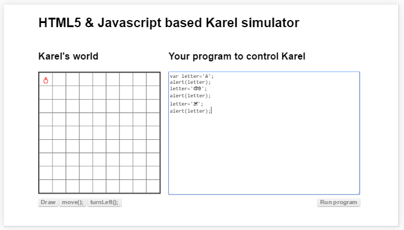
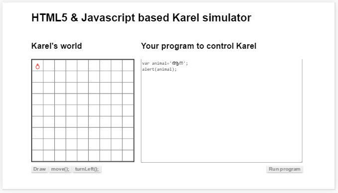
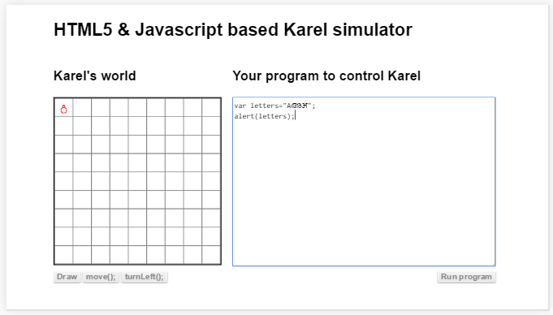
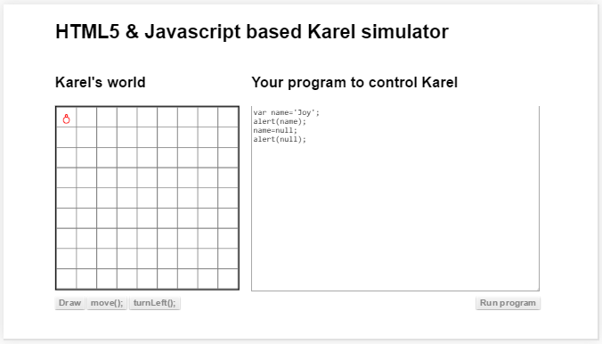
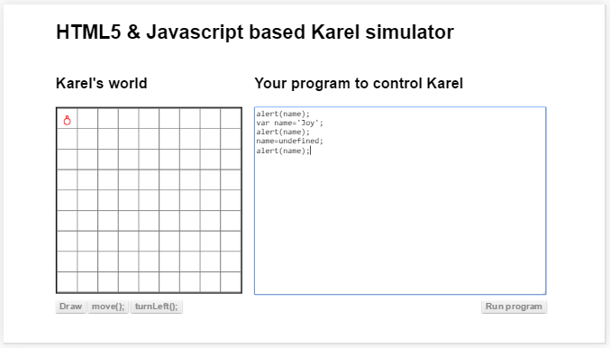
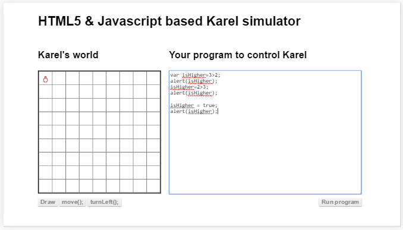
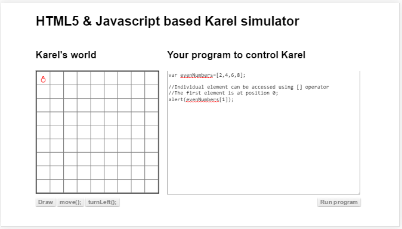
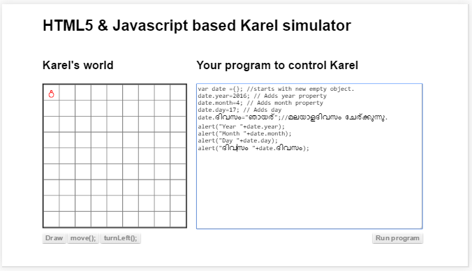

## ചരങ്ങളില്‍ വിവിധതരം ഡാറ്റകള്‍
ചരങ്ങള്‍ വെറും ഡാറ്റസംഭരണികള്‍ ആണെന്ന് മനസിലായല്ലോ. ഇനി അതിനു ഉള്‍ക്കൊള്ളാവുന്ന ഡാറ്റകള്‍ ഏതൊക്കെ എന്ന് നോക്കാം. അതായത് നമ്മള്‍ ഒരു ചരം പരിശോദിക്കുമ്പോള്‍ താഴെ പറയുന്ന ഏതെങ്കിലും ആയിരിക്കും അതില്‍ ഉണ്ടാകുക. ഡാറ്റ ടൈപ്പ് എന്ന് ഇംഗ്ലീഷില്‍ പറയും.

###സംഖ്യകള്‍
പൂര്‍ണസംഖ്യകളും, ഭിന്ന സംഖ്യകളും ചരങ്ങളില്‍ നേരിട്ട് വയ്ക്കാം. വാര്‍ എന്ന സൂചകചിഹ്നം ആണ് ചരം എന്ന് കാണിക്കാന്‍ ഉപയോഗിക്കുന്നത്.

###അക്ഷരങ്ങള്‍

ഏതൊരു അക്ഷരവും നമുക്ക് ഒരു ചരത്തില്‍ സൂക്ഷിക്കാം. ഇംഗ്ലീഷില്‍ ഉള്ള അക്ഷരങ്ങള്‍ പോലെതന്നെ  'അ' എന്ന മലയാളം അക്ഷരവും അതുപോലെ ഏതൊരു യൂണികോഡ്‌ അംഗീകരിച്ച ഭാഷയിലെ അക്ഷരവും ചരത്തില്‍ സൂക്ഷിക്കാം. 

താഴെ കൊടുത്തിരിക്കുന്ന പ്രോഗ്രാമില്‍ ഒരു ഇംഗ്ലീഷില്‍ അക്ഷരവും, മലയാളം 'അ' യും അതുപോലെ ഹിന്ദി ഭാഷയില്‍ ഉള്ള അ എന്ന അക്ഷരവും മെസ്സേജ് ബോക്സില്‍ കാണിക്കുന്നത് കാണാം.

###വാക്കുകളും വാചകങ്ങളും

അക്ഷരങ്ങള്‍ വയ്ക്കുന്നതുപോലെ തന്നെ വാചകങ്ങളും ചരത്തില്‍ സൂക്ഷിക്കാം. ജാവാസ്ക്രിപ്റ്റ് ആയതുകൊണ്ട് വ്യത്യാസം ഇല്ല. മറ്റുള്ള ചില പ്രോഗ്രാം എഴുതുന്ന ഭാഷകളില്‍ അക്ഷരം സൂക്ഷിക്കുന്ന ചരവും, വാചകം സൂക്ഷിക്കുന്ന ചരവും പ്രത്യേകമായി സൂചിപ്പിക്കണം. 

ആന എന്ന വാക്ക് മെസ്സേജ് ബോക്സില്‍ കാണിക്കുന്ന പ്രോഗ്രാം ആണ് താഴെ.

അതുപോലെ ഒന്നില്‍ കൂടുതല്‍ ഭാഷകളില്‍ ഉള്ള അക്ഷരങ്ങള്‍ ചേര്‍ത്തും വാക്കുകള്‍ ഉണ്ടാക്കാം. ഉദാഹരണം താഴെ.

വാക്കുകളും, അക്ഷരങ്ങളും ആണെന്ന് കാണിക്കാന്‍ " അല്ലെങ്കില്‍ ' എന്നിവയില്‍ ഏതു വേണമെങ്കിലും ഉപയോഗിക്കാം. ഇവ തമ്മിലുള്ള വ്യത്യാസം ചിഹ്നങ്ങള്‍ കൂടുതലായി വിവരിക്കുന്ന സ്ഥലത്ത് കൊടുത്തിട്ടുണ്ട്.

###ശൂന്യത / നള്ള്
ചില സമയം സംഭരണിയില്‍ നിന്നും എല്ലാം എടുത്തു അത് ശൂന്യമായി ഇരിക്കുന്ന അവസ്ഥ ഉണ്ടാകും.  അതാണ് ഈ അവസ്ഥ. താഴെ കൊടുത്തിരിക്കുന്ന പ്രോഗ്രാം ഒരു ചരം എങ്ങിനെ ശൂന്യമാക്കാം എന്ന് കാണിച്ചു തരുന്നു,

ഈ ചരം നോക്കിയാല്‍ അതില്‍ നള്ള് എന്ന് വരുന്ന കാണാം. ശ്രദ്ധിക്കേണ്ട വസ്തുത നള്ള്  എന്ന് എഴുതുമ്പോള്‍ അത് ഉദ്ദരണിയില്‍ അല്ല എന്നുള്ളതാണ്. നള്ള്  എന്നത് ഒരു സൂചക പദം ആണ്. അതുകൊണ്ട് തന്നെ അത് മലയാളത്തില്‍ എഴുതാനും പാടില്ല.

###നിര്‍വചിക്കപ്പെടാത്തത് / അണ്‍ഡിഫൈന്‍ണ്ട്

മുകളില്‍ പറഞ്ഞത് പ്രോഗ്രാമില്‍ ഉപയോഗിച്ച ഒരു ചരത്തിനെ ശൂന്യം ആക്കുന്നതിനെക്കുറിച്ചാണ്.  അതില്‍ ഇപ്പോള്‍ എന്താണ് എന്ന് നോക്കുമ്പോള്‍  നള്ള് / ശൂന്യത എന്ന് കിട്ടും. ഇനിയുള്ളത്. നമ്മള്‍ ഒരിക്കലും ഉപയോഗിച്ചിട്ടില്ലാത്ത ഒരു ചരത്തില്‍ എന്ത് ആണ് എന്ന് നോക്കുമ്പോഴത്തെ അവസ്ഥയാണ്‌. അപ്പോള്‍ അവിടെ അങ്ങിനെ ഒന്നില്ല. അതിനെ കുറിക്കുന്നതാണ് അണ്‍ഡിഫൈന്‍ണ്ട്.

അതായത് മുകളില്‍ പറഞ്ഞ നള്ള് എന്ന് പറയുന്നത്, ഒരു പാത്രത്തില്‍ ഒന്നും ഇല്ലാത്ത അവസ്ഥയാണ്‌. പക്ഷെ അണ്‍ഡിഫൈന്‍ണ്ട് അവസ്ഥയില്‍ പാത്രം തന്നെയില്ല.

മുകളില്‍ കൊടുത്ത പ്രോഗ്രാം പ്രവര്‍ത്തിപ്പിക്കുമ്പോള്‍ ആദ്യം 'അണ്‍ഡിഫൈന്‍ണ്ട്' എന്ന് കാണാം. കാരണം അങ്ങനെ ഒരു ചരം അപ്പോള്‍ നിലവിലില്ല. പിന്നെ ചരം ഉണ്ടാക്കുന്നു. അതുകൊണ്ട് രണ്ടാമത് വരുന്ന മെസ്സേജ് ബോക്സില്‍ ഡാറ്റ വരുന്നത് കാണാം. അതിനുശേഷം നമ്മള്‍ വീണ്ടും ചരത്തിനെ 'അണ്‍ഡിഫൈന്‍ണ്ട്' ആക്കുന്നു.

###ബൈനറി / ബൂളിയന്‍

എന്തെങ്കിലും ഒരു കാര്യം ശരിയാണോ തെറ്റാണോ എന്ന് കുറിച്ചുവക്കാന്‍ രണ്ട് അവസ്ഥകള്‍ ഉള്‍ക്കൊള്ളുന്ന ചരം മതി. അങ്ങനെയുള്ള ചരങ്ങള്‍ ആണ്  ബൂളിയന്‍ അല്ലെങ്കില്‍ ബൈനറി ചരങ്ങള്‍. അവയില്‍ ശരി തെറ്റ് എന്ന രണ്ട് ഡാറ്റകള്‍ മാത്രമേ സൂക്ഷിക്കാന്‍ പറ്റൂ.

മുകളില്‍ കൊടുത്ത പ്രോഗ്രാം എന്താണ് ചെയ്യുന്നത് എന്ന് ഒന്ന് നോക്കാം. ആദ്യം തന്നെ ഒരു ചരം ഉണ്ടാക്കി അതിലേക്ക് 3>2 എന്ന താരതമ്യത്തിന്റെ ഉത്തരം എടുത്തു വയ്ക്കുന്നു. ഉത്തരം 'ശരി/ട്രൂ' അതായത് മൂന്ന് എന്ന സംഖ്യ2 എന്ന സംഖ്യയെക്കാളും വലുതാണോ എന്ന് ചോദിച്ചപ്പോള്‍ കമ്പ്യൂട്ടര്‍ ശരി എന്ന് പറഞ്ഞു. അതിനു ശേഷം ചാരത്തിലെ ഡാറ്റ കാണിച്ചപ്പോള്‍ ട്രൂ എന്ന് വന്നു. 

ഇവിടെ ശ്രദ്ധിക്കേണ്ട ഒരു കാര്യം ട്രൂ എന്നത് ഒരു സൂചകപദമാണ്‌. അത് മലയാളത്തില്‍ കാണിക്കാന്‍ പറ്റില്ല. മലയാളത്തില്‍ ശരി എന്ന് കാണിക്കണമെങ്കില്‍ നമ്മള്‍ കുറച്ചുകൂടി പ്രോഗ്രാം എഴുതി ട്രൂ വന്നാല്‍ 'ശരി' എന്ന മലയാളം വാക്ക് കാണിക്കൂ എന്ന് പറയേണ്ടി വരും.

വിവിധ ഡാറ്റകള്‍ എങിനെ താരതമ്യം എങ്ങിനെ ചെയ്യാം എന്ന് ഇനി വരുന്ന അദ്ധ്യായങ്ങളില്‍ വിവരിച്ചിട്ടുണ്ട്.

അതിനുശേഷം അതേ ചരത്തിലേക്ക് 2>3 എന്ന താരതമ്യത്തിന്റെ ഉത്തരം എടുത്തു വയ്ക്കുന്നു. അത് തെറ്റ്/ഫാള്‍സ് ആണ്. അത് ഇംഗ്ലീഷില്‍ മെസ്സേജ് ബോക്സില്‍ കാണിക്കുന്നു.

പിന്നെക്കാണുന്നത് ചരത്തിലേക്ക് താരതമ്യം ഒന്നും കൂടാതെ നേരിട്ട് ട്രൂ എന്ന ഡാറ്റ അതിന്‍റെ സൂചകപദം വഴി വയ്ക്കുന്നതാണ്. അതിനു ശേഷം അത് ട്രൂ എന്ന് കാണിക്കുന്നു.
ട്രൂ എന്ന സൂചകപദം പോലെത്തന്നെ ഫാള്‍സ് എന്ന സൂചകപദം കൂടിയുണ്ട്. സൂചകപദം ഉപയോഗിക്കുമ്പോള്‍ ശ്രദ്ധിക്കേണ്ട കാര്യം ഉദ്ദരണി ചിഹ്നങ്ങള്‍ ("") വേണ്ട എന്നതാണ്
###അറ

ഒന്നിലധികം ഡാറ്റകളെ ചേര്‍ത്ത് ഒരു കൂട്ടമായി ശ്രേണിയില്‍ വക്കുന്നതിനെയാണ് അറ എന്ന് പറയുന്നത്. ഉദാഹരണമായി ഒന്നുമുതല്‍ പത്ത് വരെയുള്ള ഇരട്ടസംഖ്യകള്‍.

ഇതിനെപ്പറ്റി കൂടുതല്‍ ആയി വേറെ ഒരു അദ്ധ്യായത്തില്‍ വിശദമായി പറയുന്നുണ്ട്. ഇപ്പോള്‍ ലളിതമായി അറ എന്നൊരു സംഭരണിയുണ്ടെന്നും അതില്‍നിന്നും വച്ചിരിക്കുന്ന സ്ഥലം പറഞ്ഞുകൊടുത്തു ഡാറ്റ എടുക്കാമെന്നും മനസിലാക്കാം. സ്ഥലത്തിന്‍റെ നമ്പര്‍ തുടങ്ങുന്നത് പൂജ്യത്തില്‍ നിന്നാണ്.

###ഒബ്ജെക്റ്റ്

ജാവാസ്ക്രിപ്റ്റ് തരുന്ന ഡാറ്റ ടൈപ്പുകള്‍ എല്ലാ അവസരങ്ങളിലും മതിയാകും എന്നില്ല. അപ്പോള്‍ നമുക്ക് നമ്മുടെതായ ഡാറ്റ ടൈപ്പ് ഉണ്ടാക്കേണ്ടി വരും അതിനുവേണ്ടിയുള്ള സങ്കേതമാണ് ഒബ്ജെക്റ്റ്.
ഉദാഹരണമായി ഒരു തിയ്യതി എങ്ങിനെ സൂക്ഷിക്കും? അതിനു കുറഞ്ഞത് 3 ഡാറ്റകള്‍ വേണം ദിവസം, മാസം പിന്നെ കൊല്ലം. അത് മൂന്നും ചേര്‍ന്ന്‍ കിട്ടിയാല്‍ മാത്രമേ തിയ്യതിക്ക് അര്‍ത്ഥം വരുന്നുള്ളൂ. അവയെ മൂന്നും ചേര്‍ത്ത് ഒരു ഡേറ്റ് ഒബ്ജെക്റ്റ് എന്ന് വിളിക്കാം.

ഈ ഉദാഹരണം കുറച്ചു വിവരണം ഇല്ലെങ്കില്‍ മനസിലാക്കാന്‍ കുറച്ചു പ്രയാസമായിരിക്കും. ഇതില്‍ ആദ്യം ചെയ്തിരിക്കുന്നത് ഒരു ഒബ്ജെക്റ്റ് ഉണ്ടാക്കുക എന്നതാണ്. ഉണ്ടാക്കുമ്പോള്‍ അതിനുള്ളില്‍ ഡാറ്റ ഇല്ല. പിന്നെ നമ്മള്‍ ഓരോ ഡാറ്റകള്‍ ആയി ചേര്‍ക്കുന്നു. ഒബ്ജെക്റ്റിന്‍റെ ഉള്ളില്‍ ഡാറ്റ ചേര്‍ക്കണമെങ്കില്‍ അതിനു ഓരോ പേരുകള്‍ വേണം. ചരത്തിന് പേര് വേണം എന്ന് പറയുന്നപോലെ. അങ്ങനെ ചേര്‍ക്കുന്ന ഡാറ്റക്ക് സാധാരണയായി പ്രോപ്പര്‍ട്ടി എന്ന് ഇംഗ്ലീഷില്‍ പറയും. മലയാളത്തില്‍ ആസ്തി എന്നോ ഒബ്ജെക്റ്റിന്‍റെ ഗുണം എന്നോ സവിശേഷത എന്നോ പറയാം. നമുക്ക് ആസ്തി എന്ന് വിളിക്കാം.
ഇവിടെ ആദ്യം ചേര്‍ത്തിരിക്കുന്നത് ഇയര്‍ എന്ന ആസ്തിയാണ്.ആസ്തിയുടെ പേര്‍ ഇംഗ്ലീഷില്‍ അല്ലെങ്കില്‍ ഇതു ഭാഷയില്‍ വേണമെങ്കിലും എഴുതാം. അതുപോലെ ഒബ്ജെക്റ്റിന്‍റെ പേരും അതിന്‍റെ ആസ്തിയുടെ പേരും വേര്‍തിരിക്കുന്നത് ഒരു പൂര്‍ണവിരാമം ഇട്ടിട്ടാണ്. മുന്‍പേ ആരെങ്കിലും അതേ പേരില്‍ ഒരു ആസ്തി ചേര്‍ത്തിട്ടുണ്ട് എങ്കില്‍ ആ ഡാറ്റ മാറ്റി പുതിയത് വയ്ക്കും അല്ലെങ്കില്‍ പുതുതായി പറഞ്ഞ പേരില്‍ ഒരു അസ്തിയുണ്ടാക്കി അതില്‍ ഡാറ്റ വയ്ക്കും. ഇയര്‍ എന്ന ആസ്തി ഡേറ്റിലേക്ക് വച്ചിരിക്കുന്നതുപോലെ തന്നെയാണ് ബാക്കി ആസ്തികളും വച്ചിരിക്കുന്നത്.

ഒബ്ജെക്റ്റില്‍ ആസ്തികള്‍ ചുമ്മാ ഇരുന്നിട്ട് കാര്യമില്ല. നമുക്ക് എന്തെങ്കിലും ചെയ്യണമെങ്കില്‍ അതില്‍ നിന്നും ആസ്തികളുടെ ഡാറ്റ എടുക്കണം. ഒബ്ജെക്റ്റില്‍ നിന്നും ആസ്തികള്‍ എടുക്കാനും പൂര്‍ണവിരാമം തന്നെയാണ് ഉപയോഗിക്കുന്നത്.

മറ്റുള്ള പ്രോഗ്രാമിംഗ് ഭാഷകളില്‍ അറയും, ഒബ്ജെക്റ്റും തമ്മില്‍ സാരമായ വ്യത്യാസം ഉണ്ടെങ്കിലും ജാവാസ്ക്രിപ്റ്റില്‍ അവ തമ്മില്‍ അധികം വ്യത്യാസം ഇല്ല. ഒബ്ജെക്റ്റുകളെ പറ്റി ഇനിയൊരു അദ്ധ്യായത്തില്‍ വിശദമായി പറയുന്നുണ്ട്.
