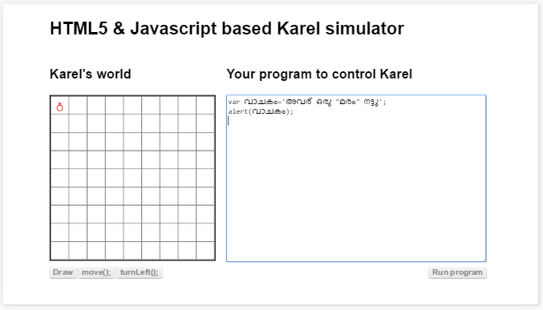

## വ്യാകരണചിഹ്നങ്ങള്‍
ഒരു ഭാഷയില്‍ ചിഹ്നങ്ങള്‍ക്ക് ഒരു സ്ഥാനം ഉണ്ടായിരിക്കും. ഇംഗ്ലീഷ് , മലയാളം അല്ലെങ്കില്‍ ഒട്ടുമിക്ക ഭാഷകളിലും ഒരു വാചകം അവസാനിപ്പിക്കാന്‍ ഉപയോഗിക്കുന്ന ചിഹ്നം ആണ് പൂര്‍ണവിരാമം(`dot`) '.' .കുത്ത് എന്ന് സാധാരണ ഭാഷയില്‍ പറയും. അതുപോലെ പ്രോഗ്രാം എഴുതുന്ന ഭാഷകളിലും ചിഹ്നങ്ങള്‍ക്ക് പ്രാധാന്യം ഉണ്ട്. ഒരാള്‍ എഴുതിയത് മറ്റൊരാള്‍ വായിക്കുമ്പോള്‍ മനസിലാകണമെങ്കില്‍ രണ്ട് പേരും ഒരു രീതി അങ്കീകരിക്കണം. കുറഞ്ഞപക്ഷം വായിക്കുന്ന ആള്‍ എന്താണ് ചിഹ്നങ്ങള്‍ക്ക് നല്‍കുന്ന അര്‍ത്ഥം എന്ന് എഴുതുന്ന ആള്‍ അറിഞ്ഞിരിക്കണം. അല്ലെങ്കില്‍ എഴുതുന്നത് വ്യര്‍ത്ഥമാകും. അതുപോലെതന്നെ പ്രോഗ്രാം എഴുതുമ്പോഴും. നമ്മള്‍ എഴുതുന്നത് കമ്പ്യൂട്ടര്‍ / ബ്രൌസര്‍ അത് വായിച്ചു അതിനനുസരിച്ച് പ്രവര്‍ത്തിക്കാന്‍ ആണ്. അപ്പോള്‍ അത് ചിഹ്നങ്ങള്‍ക്ക് കൊടുക്കുന്ന അര്‍ത്ഥം നമ്മള്‍ അറിഞ്ഞിരിക്കണം. അല്ലെങ്കില്‍ ഉദ്ദേശിച്ച കാര്യം കമ്പ്യുട്ടറിനെക്കൊണ്ട് നടത്തിക്കാന്‍ നമുക്ക് കഴിയില്ല.

സാധാരണ പ്രോഗ്രാം ചെയുമ്പോള്‍ അത്യാവശ്യം വേണ്ട ജാവാസ്ക്രിപ്റ്റ് ചിഹ്നങ്ങള്‍ ആണ് താഴെ കൊടുത്തിരിക്കുന്നത്. ഇനിയും വേറെ ചിഹ്നങ്ങളും ഉണ്ട്. അവയെ ഈ ബുക്കിന്‍റെ അവസാനം ചേര്‍ത്തിട്ടുണ്ട്. ആവശ്യമുള്ളവര്‍ക്ക് അവിടെ പോയി നോക്കാം.

### ; - അര്‍ദ്ധവിരാമം 

അര്‍ദ്ധവിരാമം(`semicolon`) പ്രോഗ്രാം എഴുതുമ്പോള്‍ അതിലെ ഒരു വാചകം പൂര്‍ത്തിയായത് കാണിക്കുന്നു. 

### . - പൂര്‍ണവിരാമം 
ഭിന്ന സംഖ്യകള്‍ എഴുതാനും, ഒരു ഒബ്ജെക്റ്റ്റില്‍ നിന്നും ഡാറ്റ എടുക്കാനും പൂര്‍ണവിരാമം(`dot`) ഉപയോഗിക്കുന്നു.

### " - ഉദ്ദരണി

ഇംഗ്ലീഷ്, മലയാളം അല്ലെങ്കില്‍ ഏതു ഭാഷയിലും ഉള്ള വാക്കുകളെയും വാചകങ്ങളെയും പ്രോഗ്രാമില്‍ ഉള്‍പ്പെടുത്താന്‍ ഉപയോഗിക്കുന്നു. ജാവാസ്ക്രിപ്റ്റ് യൂണികോഡ് ഉപയോഗിക്കുന്നതുകൊണ്ട് ലോകത്തുള്ള എല്ലാ ഭാഷകളിലും ഉള്ള വാക്കുകളും പ്രോഗ്രാമില്‍ ഉള്‍പ്പെടുത്താം. ഇത് ഡാറ്റയാണ്. ഇംഗ്ലീഷില്‍ സ്ട്രിംഗ് എന്ന് പറയുന്നു. കമ്പ്യൂട്ടര്‍ അല്ലെങ്കില്‍ പ്രോഗ്രാം പ്രവര്‍ത്തിപ്പിക്കുന്ന ബ്രൌസര്‍ ഇത് ഒരിക്കലും വായിച്ചു അര്‍ത്ഥം മനസിലാക്കി അതിനനുസരിച്ച് പ്രവര്‍ത്തിക്കില്ല. അതുകൊണ്ട് തന്നെ ഇപ്പോള്‍ നിലവില്‍ ഉള്ള ബ്രൌസറുകള്‍ വച്ച് ഒരിക്കലും നിര്‍ദേശങ്ങള്‍ / സൂചകപദങ്ങള്‍ ഇംഗ്ലീഷ് അല്ലാതെ വേറെ ഒരു ഭാഷയിലും കൊടുക്കാന്‍ കഴിയില്ല. അല്ലെങ്കില്‍ വേറെ ഭാഷകളില്‍ എഴുതിയ നിര്‍ദേശങ്ങള്‍ നമ്മള്‍ പ്രോഗ്രാം എഴുതി ഇംഗ്ലീഷ് ആക്കി മാറ്റണം. അല്ലെങ്കില്‍ മലയാളം മനസിലാകുന്ന പുതിയ ബ്രൌസര്‍ ഉണ്ടാക്കണം.

ഒരു ഉദാഹരണം താഴെ കൊടുത്തിരിക്കുന്നു.

ഒരു വാചകത്തില്‍ എങ്ങിനെ " എന്ന ചിഹ്നം ഉള്‍പ്പെടുത്താം? " ഇട്ടു കഴിഞ്ഞാല്‍ അത് വാചകത്തിന്‍റെ അവസാനം ആയി കണക്കാക്കില്ലേ. അപ്പോള്‍ ഉപയോഗിക്കുന്ന സങ്കേതമാണ് താഴെ കൊടുത്തിരിക്കുന്നത്.

### ' - ഏകഉദ്ദരണി

ഇത് മുകളില്‍ കൊടുത്തിട്ടുള്ള ഉദ്ദരണി പോലെതന്നെ അക്ഷരങ്ങളെയും വാക്കുകളെയും സൂചിപ്പിക്കാന്‍ ഉപയോഗിക്കാം. 
ഒരു വാക്യത്തില്‍ " എന്നാ ചിഹ്നം ചേര്‍ക്കണമെങ്കില്‍ വാക്ക് തുടങ്ങേണ്ടത് ' ഉപയോഗിച്ച് ആയിരിക്കണം അതുപോലെ ' ഉപയോഗിച്ച് വേണം അവസാനിപ്പിക്കാന്‍.

താഴെ കൊടുത്തിരിക്കുന്ന വാചകത്തില്‍ " എന്ന ചിഹ്നം ഡാറ്റ ആയി ഉപയോഗിച്ചിരിക്കുന്നത് കാണാം.
'അവര്‍ ഒരു "മരം" നട്ടു' 

ഒരു വാചകത്തില്‍ ' എങ്ങിനെ ഉപയോഗിക്കാം എന്ന് മുകളില്‍ കണ്ടു കഴിഞ്ഞല്ലോ. ചുരുക്കിപ്പറഞ്ഞാല്‍  " ഉം 'ഉം മാറി മാറി ആവശ്യാനുസരണം ഉപയോഗിക്കാം. താഴെ കാണിച്ചിരിക്കുന്നത് ഒരു വാചകത്തില്‍ എങ്ങിനെ ' എന്ന ചിഹ്നം ഡാറ്റ ആയി ഉപയോഗിക്കാം എന്നാണ്.

ഇനി ഒരു വാചകത്തില്‍ എങ്ങിനെ ഈ രണ്ടു ചിഹ്നങ്ങളും ചേര്‍ത്ത് ഉപയോഗിക്കാം എന്നൊരു ചോദ്യം നിങ്ങളില്‍ ഉയര്‍ന്നു വരുന്നുണ്ടോ? എങ്കില്‍ നിങ്ങള്‍ ഒരു എഞ്ചിനീയര്‍ ആയിക്കൊണ്ടിരിക്കുന്നു. എന്ന് പറയാം. ഒരു എഞ്ചിനീയര്‍ക്ക് സംശയങ്ങള്‍ ഉണ്ടായേ തീരൂ. എങ്ങിനെ ചെയ്യാം എന്ന് ഗൂഗിള്‍ നോക്കി കണ്ടു പിടിക്കുക.

### {} - നിര്‍ദേശങ്ങളുടെ കൂട്ടം 

ഒന്നില്‍കൂടുതല്‍ നിര്‍ദേശങ്ങള്‍ ചേര്‍ത്ത് ഒരു കൂട്ടം ആക്കി വയ്ക്കാന്‍ ഉപയോഗിക്കുന്നു. ഈ 2 ചിഹ്നങ്ങളുടെയും ഇടയില്‍ വരുന്ന നിര്‍ദേശങ്ങള്‍ ഒരു കൂട്ടം ആയി പരിഗണിക്കപ്പെടുന്നു. ചിലപ്പോള്‍ അത് ലൂപ്പ് ചെയ്യാന്‍ ഉപയോഗിക്കാം അല്ലെങ്കില്‍ ഒരു ഫങ്ഷന്‍ ആയിരിക്കാം. 

അതുപോലെ ഒരു ഒബ്ജെക്റ്റ് ഉണ്ടാക്കാനും ഇതേ ചിഹ്നം ഉപയോഗിക്കാം.

### () - ബ്രാക്കറ്റ്
ഫങ്ഷന്‍ പ്രവര്‍ത്തിപ്പിക്കാന്‍ ഉള്ള നിര്‍ദേശം കൊടുക്കാനും, ഗണിത വാക്യങ്ങളില്‍ ചില ഭാഗങ്ങള്‍ക്ക് മുന്‍ഗണന കൊടുക്കാനും ഉപയോഗിക്കുന്നു.	 

### [] - ചതുരബ്രാക്കറ്റ്
ഇത് ഉപയോഗിക്കുന്നത്  അറ എന്ന സങ്കേതത്തെ കാണിക്കാനാണ്. അറ എന്ന് പറയുന്നത്  ഒരു വിലാസം കൊടുത്തു അടുക്കി വച്ചിരിക്കുന്ന ഡാറ്റകളുടെ  കൂട്ടമാണ്.   വിലാസം ചിലപ്പോള്‍ നമ്പര്‍ ആകാം അല്ലെങ്കില്‍ വാക്കുകളോ വാചകങ്ങളോ ആകാം.

ലൂപ്പ്, ഫങ്ഷന്‍,ഒബ്ജെക്റ്റ്  തുടങ്ങിയവ എന്താണെന്ന്‍ വരുന്ന അദ്ധ്യായങ്ങളില്‍ കാണാം.
