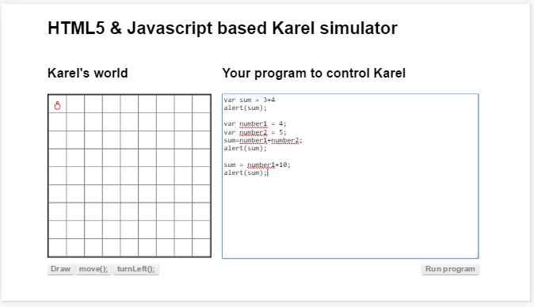
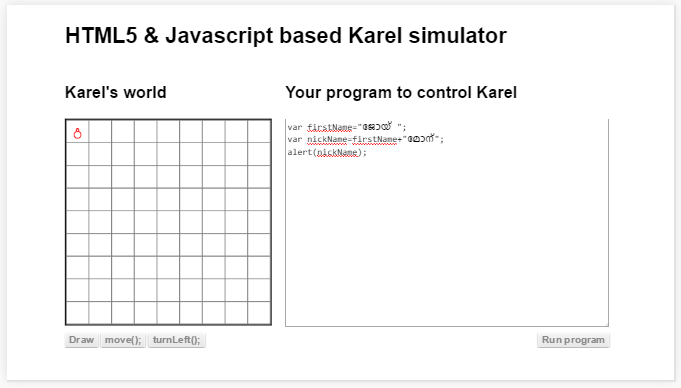
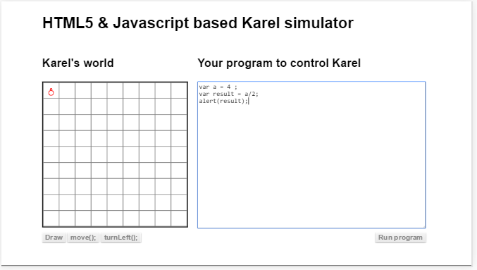
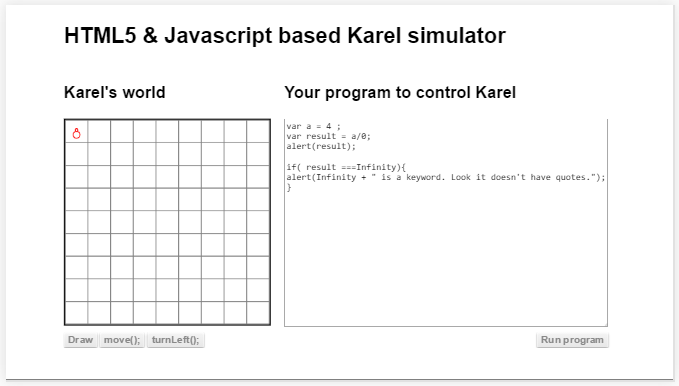
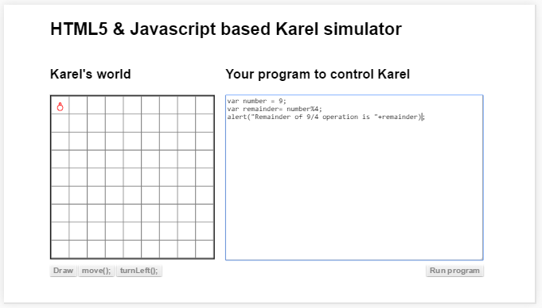
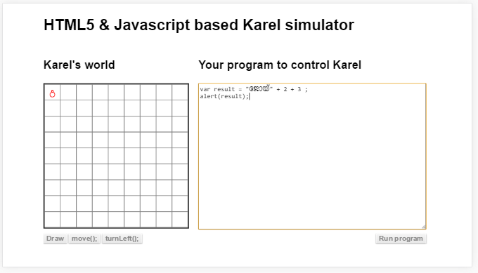
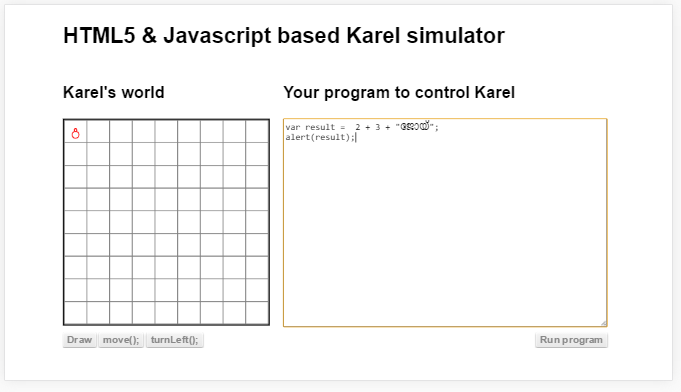
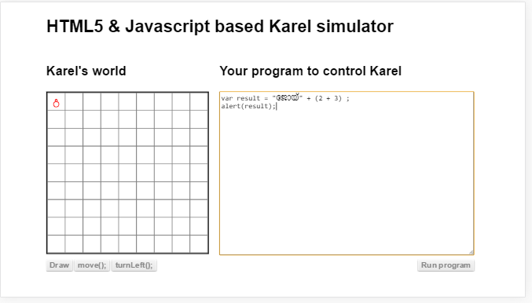

##ഗണിതചിഹ്നങ്ങള്‍

ഇനി ഏതൊക്കെ ഗണിത ചിഹ്നങ്ങള്‍ ആണ് ജാവാസ്ക്രിപ്റ്റ് തരുന്നത് എന്ന് നോക്കാം. മറ്റുള്ള ഭൂരിഭാഗം പ്രോഗ്രാം ഭാഷകളും തരുന്നപോലെ വളരെ അടിസ്ഥാനപരമായ ചിഹ്നങ്ങള്‍ മാത്രമേ ജാവാസ്ക്രിപ്റ്റ് തരുന്നുള്ളൂ.

### + - സങ്കലനം
രണ്ടോ അതില്‍കൂടുതലോ ഡാറ്റകള്‍ തമ്മിലോ അല്ലെങ്കിൽ ചരങ്ങള്‍ തമ്മിലോ കൂട്ടാന്‍ ഈ ചിഹ്നം ഉപയോഗിക്കാം. ഉദാഹരണങ്ങള്‍ താഴെ

ഒന്ന് നേരിട്ടുള്ള ഡാറ്റയും മറ്റേത് ചരം ആയാലും നമുക്ക് അവയെ കൂട്ടാം.

രണ്ടോ അധിലധികമോ വാക്കുകള്‍ അല്ലെങ്കില്‍ വാചകങ്ങള്‍ തമ്മില്‍ ചേര്‍ക്കാനും ഇതേ ചിഹ്നം തന്നയാണ് ഉപയോഗിക്കുന്നത്. വാക്കുകളും വാചകങ്ങളും നേരിട്ട് ഡാറ്റ ആയോ അല്ലെങ്കില്‍ ചരത്തിലോ ആകാം.

### - വ്യവകലനം

ഇത് കുറക്കല്‍ എന്ന പ്രവൃത്തി ചെയ്യാന്‍ ഉപയോഗിക്കാം. ഗണിതത്തിലും ഇതേ ചിഹ്നം തന്നെയാണ് ഉപയോഗിക്കുന്നത്.  രണ്ട് സംഖ്യകള്‍ നേരിട്ടോ, അല്ലെങ്കില്‍ 2 ചരങ്ങള്‍ തമ്മിലോ അല്ലെങ്കില്‍ ഒരു ചരം ഒരു സംഖ്യയുംയോ വ്യവകലന ചിഹ്നം ഉപയോഗിക്കാം.

സങ്കലന ചിഹ്നത്തില്‍ നിന്നും  ഇതിനുള്ള വ്യത്യാസം ഇത് വാചകങ്ങള്‍ തമ്മില്‍ വേര്‍പ്പെടുത്താന്‍ ഉപയോഗിക്കാന്‍ കഴിയില്ല എന്നതാണ്.

### * - ഗുണനം

ഇത് സാധാരണ നമ്മള്‍ 2x3 എന്ന് ഗുണനത്തെ എഴുതുന്നതുപോലെതന്നെയാണ് . x എന്ന ചിഹ്നത്തിനു പകരം പ്രോഗ്രാം എഴുതുമ്പോള്‍ * എന്ന ചിഹ്നം ഉപയോഗിക്കണം എന്ന് മാത്രം.

പിന്നെയുള്ള ഒരു വ്യത്യാസം /*/* എന്ന ചിഹ്നമാണ്. ഇതിനെ വേണമെങ്കില്‍ വേറെ ഒരു ചിഹ്നമായി പരിഗണിക്കാം. 2\**3 എന്ന് പറഞ്ഞാല്‍ 2\*2*2 എന്നു അര്‍ത്ഥം. പക്ഷെ ഇത് ഇപ്പോള്‍ സാധാരണമായി ഉപയോഗിക്കുന്ന ഇഎസ് 5 എന്ന വെര്‍ഷന്‍ നല്‍കുന്ന ബ്രൌസറുകളില്‍   പ്രവര്‍ത്തിക്കില്ല. ഭാവിയില്‍ ഇത് ഇഎസ് 7 എന്ന ജാവാസ്ക്രിപ്റ്റ് വേര്‍ഷനില്‍ വരുന്നുണ്ട്.

### / - ഹരണം
ഇത് സാധാരണ ഹരിക്കുന്നതിന് ഉപയോഗിക്കുന്ന ചിഹ്നം തന്നെയാണ്. 4ഇല്‍ നിന്ന് 2 ഹരിക്കാന്‍ ലളിതമായി 4/2 എന്ന് കൊടുത്താല്‍ മതി. ഇതേ ചിഹ്നം ഉപയോഗിച്ച് ചരങ്ങളെയും ഹരിക്കാം.

ഇനി  ഒരു സംഖ്യയെ പൂജ്യം കൊണ്ട് ഹരിച്ചാല്‍ എന്ത് സംഭവിക്കും എന്ന് നോക്കാം. നമ്മള്‍ സ്കൂള്‍ ക്ലാസുകളില്‍ പഠിച്ചത് അനുസരിച്ച് അങ്ങനെ ഹരിക്കാന്‍ പറ്റില്ല.

മുകളിലെ പ്രോഗ്രാം പ്രവര്‍ത്തിപ്പിച്ചാല്‍, ഇന്‍ഫിനിറ്റി എന്ന  ഒരു വിലയാണ് കിട്ടുന്നത് എന്ന് കാണാം. അത് ഒരു സൂചകപദമാണ്‌.  അതിനെ നമുക്ക് ഉദ്ദരണികള്‍ ഇല്ലാതെ  നേരിട്ട് എഴുതാം.

### % - ശിഷ്ടം

പണ്ട് സ്കൂളില്‍ പഠിച്ചപ്പോള്‍ കേട്ട അതെ ശിഷ്ടം തന്നെയാണ് പ്രോഗ്രാം എഴുതുമ്പോഴും വരുന്നത്.  9%4 എന്ന് കൊടുത്താല്‍ 9ഇല്‍ നിന്ന് 4 രണ്ടു പ്രാവശ്യം എടുത്തു ബാക്കി വരുന്ന 1 ആണ് നമുക്ക് ഈ ഗണിത ക്രിയയുടെ ഉത്തരം ആയി കിട്ടുന്നത്.  താഴെ കൊടുത്തിരിക്കുന്ന പ്രോഗ്രാം ഇത് കൂടുതല്‍ മനസിലാകാന്‍ സഹായിക്കും. ഒരു സംഖ്യ ഒറ്റയാണോ ഇരട്ടയാണോ എന്നറിയാന്‍ ഈ സങ്കേതം ഉപയോഗിക്കാം.

### = - സമം

ഇത് സാധാരണയായി എന്തെങ്കിലും ഡാറ്റ ഒരു ചരത്തിലെക്ക് എടുത്തു വയ്ക്കുന്നതിനു വേണ്ടി ഉപയോഗിക്കുന്നു. ചരം പഠിച്ചപ്പോഴും, ഗണിത ചിഹ്നങ്ങള്‍ പഠിച്ചപ്പോഴും ഇത് മനസിലയിട്ടുണ്ട് എന്നുള്ളതുകൊണ്ട് അധികം അതിനെപറ്റി വിശദീകരിക്കുന്നില്ല.

### () - ബ്രാക്കറ്റ്

സങ്കലനത്തിലെക്ക് മടങ്ങിവരാം. ഇനി ആദ്യത്തേത് വാക്കും രണ്ടാമത്തേയും മൂന്നാമത്തെയും സംഖ്യകളും ആണെങ്കില്‍ എന്ത് സംഭവിക്കും എന്ന് നോക്കാം

ഇനി തിരിച്ചു നോക്കുക

ഇതെങ്ങിനെ സംഭവിച്ചു എന്ന് നോക്കാം. ബ്രൌസര്‍ ആദ്യത്തെ പ്രോഗ്രാം പ്രവര്‍ത്തിപ്പിക്കുമ്പോള്‍  ആദ്യം വാക്ക് കാണുന്നു. പിന്നെ കാണുന്നത് സംഖ്യ ആണ്. വാക്കും സംഖ്യയും ഗണിതരീതിയില്‍ കൂട്ടുക അസാധ്യം ആണെന്ന് ബ്രൌസര്‍ ഉണ്ടാക്കിയവര്‍ മനസിലാക്കിയിരുന്നു. അവര്‍ അങ്ങനെ വരുമ്പോള്‍ ഗണിത രീതിയില്‍ അല്ലാതെ വാക്കുകള്‍ ആയി രണ്ടും ചേര്‍ത്ത് വയ്ക്കാന്‍ നിര്‍ദേശം എഴുതിയിട്ടുണ്ട്. അത് കഴിഞ്ഞു കിട്ടിയത് ഒരു വാക്കാണ്‌.  ആ വാക്കും മൂന്നാമത്തെ സംഖ്യയും കൂടി കൂട്ടാന്‍ പറ്റില്ല. അപ്പോള്‍ എന്ത് ചെയ്തു? അതിനെയും വാക്കായി എടുത്തു കൂട്ടിച്ചേര്‍ത്തു. അതുകൊണ്ടാണ് വാക്കുകള്‍ കൂട്ടിച്ചേര്‍ത്ത പോലത്തെ ഉത്തരം കിട്ടിയത്.

അപ്പോള്‍ രണ്ടാമത്തെ സാഹചര്യം വിശദീകരിക്കാന്‍ എളുപ്പമായല്ലോ. 2സംഖ്യകള്‍ കാണുന്നു. അവയെ ഗണിതരീതിയില്‍ കൂട്ടുന്നു. പിന്നെ കാണുന്നത് വാക്കാണ്‌. അപ്പോള്‍ രണ്ടിനെയും കൂട്ടിയോജിപ്പിക്കുന്നു.

ഇനി ആദ്യത്തെ സാഹചര്യത്തില്‍ രണ്ടാമത്തെയും മൂന്നാമത്തെയും സംഖ്യകളെ ഗണിതപരമായി കൂട്ടി എങ്ങിനെ ആദ്യത്തെതിനോട് കൂട്ടിച്ചേര്‍ക്കാം എന്ന് നോക്കാം?

ഇത് സാധാരണ ഗണിതവിദ്യയാണ്. ജാവാസ്ക്രിപ്റ്റ് ഭാഷ ഇതെലേക്ക് മാറ്റങ്ങള്‍ ഒന്നും വരുത്തുന്നില്ല.

### ++ & -- ചിഹ്നങ്ങള്‍
ഒരു സംഖ്യയെ വഹിക്കുന്ന ചരത്തിലെക്ക്  ആ സംഖ്യയെ ഒന്ന് കൂട്ടി അതിലേക്ക് തന്നെ വയ്ക്കണം എന്ന് വിചാരിക്കുക. അതിനുള്ള ചിഹ്നങ്ങള്‍ ആണ് ++ അല്ലെങ്കില്‍ -- എന്നിവ. ഇത് ഗണിതവിദ്യയില്‍ ഇല്ലാത്തതാണ്. സാധാരണ പ്രോഗ്രാമിംഗ് ഭാഷകളില്‍ ഒക്കെ ഇത് കണ്ടു വരുന്നു. ആകെ ഒരു ഉദ്ദേശ്യം പ്രോഗ്രാമിന്‍റെ വലിപ്പം കുറയ്ക്കുക എന്നതാണ്. ആദ്യകാലത്ത് കമ്പ്യൂട്ടര്‍ മെമ്മറി വളരെ കുറവായിരുന്നല്ലോ. അതുപോലെ നെറ്റ്‌വര്‍ക്ക് വഴി പ്രോഗ്രാം കൈമാറ്റം ചെയ്യുമ്പോഴും പ്രോഗ്രാമിന്‍റെ വലിപ്പം ഒരു പ്രശ്നം ആയിരുന്നു. അങ്ങിനെ അക്കാലത്ത് ആ പ്രശ്നം പരിഹരിക്കാന്‍ വേണ്ടി ഉണ്ടാക്കിയതാണ് ഈ ചിഹ്നങ്ങള്‍.
image add alert a++ / b--

###+= , -= , *= , /= , %=
++ / -- എന്നിവ ഒന്നാണ് കൂട്ടുന്നത്. നമുക്ക് ഒരു ചരത്തില്‍ ഉള്ള സംഖ്യയോടു 2 കൂട്ടി അതില്‍ത്തന്നെ വക്കണമെങ്കില്‍ എന്ത് ചെയ്യും? അതിനാണ് . ഈ ചിഹ്നങ്ങള്‍. 
image add alert a+=3
image b-=a

ഇതുപോലെ തന്നെയാണ് ബാക്കിയുള്ള ചിഹ്നങ്ങളും പ്രവര്‍ത്തിക്കുന്നത്.

ഈ ചിഹ്നങ്ങളും പ്രോഗ്രാമിന്‍റെ വലിപ്പം കുറക്കാന്‍ ഉണ്ടാക്കിയതാണ്. ഇപ്പോള്‍ ഉള്ള കമ്പ്യൂട്ടര്‍ ഒക്കെ വളരെയധികം മെമ്മറിയും അതുപോലെ നെറ്റ്‌വര്‍ക്കുകള്‍ക്ക് ആണെങ്കില്‍ അത്യാവശ്യം വേഗതയും ഉണ്ട്. അതുകൊണ്ട്ഇക്കാലത്ത് പ്രോഗ്രാം എഴുതുമ്പോള്‍ ഈ ചിഹ്നങ്ങള്‍ ഉപയോഗിക്കണം എന്നില്ല. അതുപോലെ മറ്റൊരു പ്രശ്നമാണ് ഈ ചിഹ്നങ്ങള്‍ വേറെ എവിടെയും ഉപയോഗിക്കാത്തതുകൊണ്ട്, പ്രോഗ്രാമിംഗ് പഠിക്കാത്ത ആള്‍ക്ക് മനസിലാകില്ല എന്നത്. മുമ്പേ പറഞ്ഞപോലെ യന്ത്രത്തിന് മനസിലാകുന്നതില്‍ കൂടുതല്‍ ആയി മനുഷ്യര്‍ക്ക് മനസിലാകുന്ന ഭാഷയില്‍ ആണ് പ്രോഗ്രാം എഴുതേണ്ടത്.
