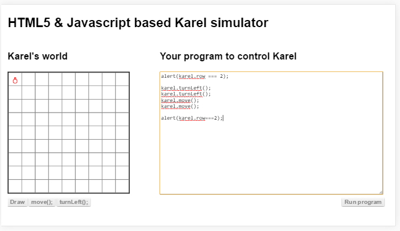
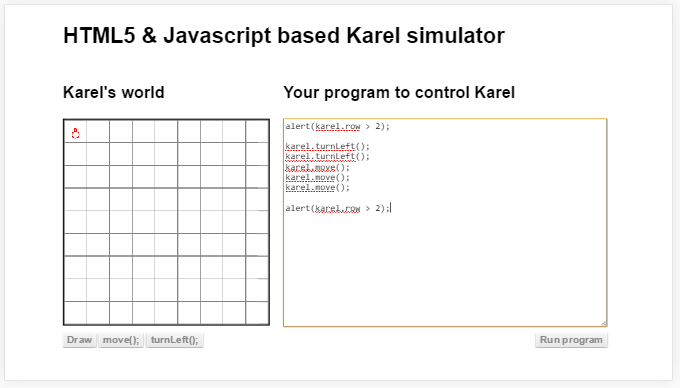
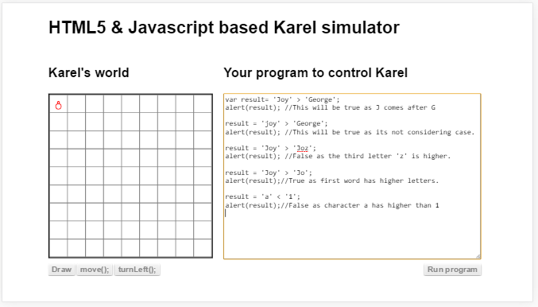
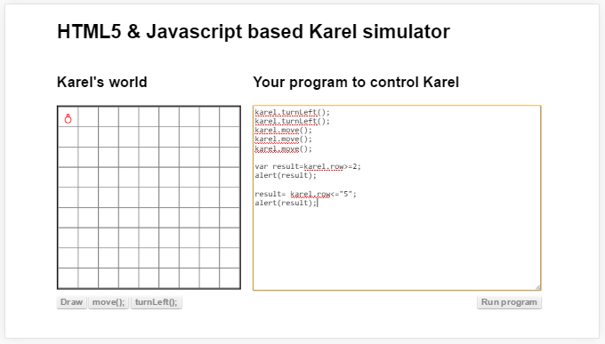
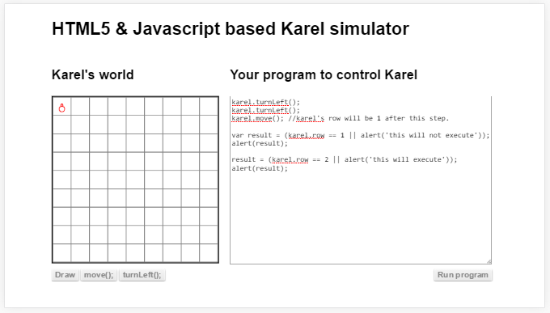
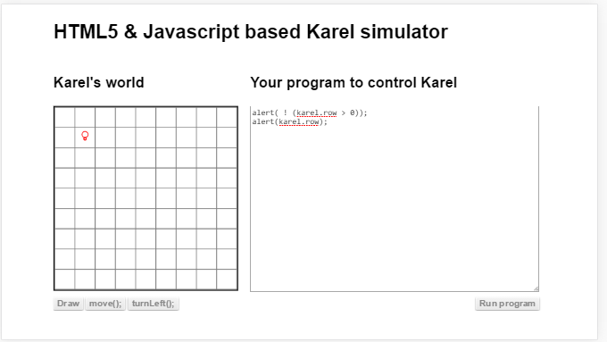


##വിശകലന ചിഹ്നങ്ങള്‍
ഈ ചിഹ്നങ്ങള്‍ ഡാറ്റ വിശകലനം ചെയ്യാന്‍ ഉപയോഗിക്കുന്നവയാണ്. ലോജിക്കല്‍ ഓപ്പറേറ്റര്‍ എന്ന് ഇംഗ്ലീഷില്‍ പറയും.

### == , !=
രണ്ട് ഡാറ്റകള്‍ തുല്യം ആണോ എന്നറിയാന്‍ ഉപയോഗിക്കുന്ന ചിഹ്നം. പക്ഷെ ഇത് ഉപയോഗിക്കരുത് കാരണം ഇത് താരതമ്യം ചെയ്യുന്നതിന് വേണ്ടി ഡാറ്റയെ ഒരു പരിവര്‍ത്തനം ചെയ്യുന്നുണ്ട്. അത് ചിലപ്പോള്‍ വിചാരിക്കാത്ത ഫലങ്ങള്‍ ഉളവാക്കും.

### === , !==

ഡാറ്റകള്‍ താരതമ്യം ചെയ്യാന്‍ ഉപയോഗിക്കേണ്ട ചിഹ്നം ആണ് ഇത്. എന്തുകൊണ്ട് ഇത് ഉപയോഗിക്കണം എന്ന് താരതമ്യങ്ങളെക്കുറിച്ച് കൂടുതല്‍ വിവരിക്കുന്ന അദ്ധ്യായത്തില്‍ കൊടുത്തിട്ടുണ്ട്. ഇത് ഉപയോഗിച്ച് സംഖ്യകള്‍ മാത്രമല്ല വാചകങ്ങളും താരതമ്യം ചെയ്യാം.

മുകളില്‍ കൊടുത്തിരിക്കുന്ന പ്രോഗ്രാം പ്രവര്‍ത്തിപ്പിച്ചാല്‍ നമുക്ക് രണ്ട് തവണയായി അലേര്‍ട്ട് മെസ്സേജ് ലഭിക്കും. ആദ്യതെതില്‍ ഫാള്‍സ് എന്നും രണ്ടാമതെതില്‍ ട്രൂ എന്നും കാണാം. 

എന്താണ് ഇവിടെ സംഭവിച്ചത്? ആദ്യം നമ്മള്‍ ഇപ്പോള്‍ കരെല്‍ ഇരിക്കുന്ന വരി രണ്ടാണോ എന്ന് വിശകലനം ചെയ്തു. അത് രണ്ടല്ല അതുകൊണ്ട്, തെറ്റ് അല്ലെങ്കില്‍ അസത്യം എന്ന് കാണിക്കുന്ന ഫാള്‍സ് കിട്ടി. അത് കഴിഞ്ഞു നമ്മള്‍ പ്രോഗ്രാം വഴി രണ്ടാമത്തെ വരിയില്‍ കൊണ്ട് പോയി. അതിനുശേഷം കരെല്‍ ഇരിക്കുന്ന വരിയും രണ്ടും ഒത്തു നോക്കിയപ്പോള്‍ സത്യം , ശരി എന്ന് കാണിക്കുന്ന ട്രൂ കിട്ടി.

ഇവിടെ ശ്രദ്ധിക്കേണ്ട കാര്യം വരിയുടെ നമ്പര്‍ തുടങ്ങുന്നത് പൂജ്യത്തില്‍ നിന്നാണ്. നിത്യജീവിതത്തില്‍ നമ്മള്‍ എണ്ണുന്നത് മിക്കവാറും ഒന്നില്‍ നിന്നായിരിക്കും. പൂജ്യത്തില്‍ നിന്നും എണ്ണിത്തുടങ്ങുക എന്നത് ഒട്ടുമുക്കാല്‍ കമ്പ്യൂട്ടര്‍ ഭാഷകളിലും ഉള്ള ഒരു രീതിയാണ്‌. 

### > , <

ഒന്ന് മറ്റേതിനെ അപേക്ഷിച്ച് വലുതാണോ ചെറുതാണോ എന്നുള്ള താരതമ്യം ചെയ്യാന്‍ ഉപയോഗിക്കാം. ഡാറ്റ ചിലപ്പോള്‍ നേരിട്ട് കൊടുത്തത് ആയിരിക്കാം. അല്ലെങ്കില്‍ ചരത്തില്‍ ഉള്ളതായിരിക്കാം. കൂടുതല്‍ ആയി പ്രോഗ്രാം നോക്കിയാല്‍ മനസിലാകും

ഇവിടെ ആദ്യം ഇപ്പോള്‍ കരെല്‍ ഇരിക്കുന്ന വരി രണ്ടിനെക്കാളും മുകളിലാണോ എന്ന് നോക്കുന്നു. പ്രോഗ്രാം പ്രവര്‍ത്തനം തുടങ്ങുന്ന സമയത്ത് വരി പൂജ്യം ആണ്. അതുകൊണ്ട് ആ വിശകലനം അസത്യം എന്ന് ഉത്തരം തരുന്നു. അതിനുശേഷം കരെലിനെ താഴോട്ട് 3 കളങ്ങള്‍ പ്രോഗ്രാം വഴി നീക്കുന്നു. അപ്പോള്‍ വരി 3 ആയിരിക്കും. അതിനുശേഷം വരി രണ്ടില്‍ കൂടുതല്‍ ആണോ എന്ന് വിശകലനം ചെയ്‌താല്‍ അത് സത്യം എന്ന് ഉത്തരം തരും.

ശ്രദ്ധിക്കേണ്ട സംഗതി. തരുന്ന ഉത്തരം പ്രോഗ്രാം പ്രവര്‍ത്തനം തുടങ്ങുമ്പോള്‍ കരെല്‍ ഇരിക്കുന്ന സ്ഥലത്തെ അപേക്ഷിച്ച് ഇരിക്കും. മുന്‍പ് പ്രോഗ്രാം വഴിയോ, ബട്ടന്‍ ഉപയോഗിച്ചോ കരെലിനെ സ്ഥാനം മാറ്റിയിട്ടുണ്ട് എങ്കില്‍ കിട്ടുന്ന ഉത്തരം മുകളില്‍ പറഞ്ഞപോലെ ആയിരിക്കില്ല.

ഇനി താഴെ കൊടുത്തിരിക്കുന്ന പ്രോഗ്രാം നോക്കുക. വാചകങ്ങള്‍ എങ്ങിനെ താരതമ്യം ചെയ്യുന്നു എന്ന് കാണാം

### >= & <=

ഒന്ന് മറ്റേതിനേക്കാള്‍ കൂടുതലോ അല്ലെങ്കില്‍ തുല്യമോ എന്ന് നോക്കാന്‍ ഉപയോഗിക്കുന്ന ചിഹ്നമാണ് >= അതുപോലെ <= തിരിച്ചും. 
സൂക്ഷിക്കേണ്ട വസ്തുത == നു === , != നു !== ഉള്ളപോലെ >= നു >== വോ <= നു <== വോ ഇല്ല. അവിടെ ടൈപ്പ് മാറ്റല്‍ നടക്കുന്നുണ്ട്.

ഇതും നേരേ ഡാറ്റകള്‍ തമ്മിലോ അല്ലെങ്കില്‍ ചരങ്ങള്‍ തമ്മിലോ അല്ലെങ്കില്‍ ഇവ രണ്ടും തമ്മിലോ ആകാം.

### &&

രണ്ടോ അതില്‍ കൂടുതലോ വിശകലനങ്ങളെ കൂട്ടിച്ചേര്‍ക്കാന്‍ ഉപയോഗിക്കുന്ന ഒരു ചിഹ്നം ആണ്  ഇത്. ഇതിന്‍റെ രണ്ടു വശങ്ങളിലും ഉള്ള താരതമ്യങ്ങള്‍ അല്ലെങ്കില്‍ വിശകലനം ചെയ്യുന്ന പോഗ്രാം വാചകങ്ങള്‍ 'സത്യ' മായായാല്‍ മാത്രമേ ഇത് ശരിയാകൂ. 

### ||
രണ്ടോ അതില്‍ കൂടുതലോ വിശകലനങ്ങളെ കൂട്ടിച്ചേര്‍ക്കാന്‍ ഉപയോഗിക്കുന്ന മറ്റൊരു ചിഹ്നം ആണ്  ഇത്. ഇതിന്‍റെ രണ്ടു വശങ്ങളിലും ഉള്ള താരതമ്യങ്ങള്‍ അല്ലെങ്കില്‍ വിശകലനം ചെയ്യുന്ന പോഗ്രാം വാചകങ്ങളില്‍ എന്തെങ്കിലും ഒന്ന്  'സത്യ' മായായാല്‍ ഇത് ശരിയാകും.

ശ്രദ്ധിക്കേണ്ട കാര്യം - ഈ ചിഹ്നം ഉപയോഗിച്ച് പ്രോഗ്രാം വാചകങ്ങള്‍ കൂട്ടിയോജിപ്പിക്കുംപോള്‍ ആദ്യത്തേത് ശരിയാണ് തരുന്നത് എങ്കില്‍ രണ്ടാമത്തെ ഭാഗം പ്രവര്‍ത്തിക്കുന്നതല്ല.

### ! 

ഈ ചിഹ്നം ഉപയോഗിക്കുന്നത് ശരിയെ തെറ്റ് ആക്കാനും അതുപോലെ തിരിച്ചും ആണ്.ഇംഗ്ലീഷില്‍ `not` എന്നാണ് ഈ ചിഹ്നത്തിനു പറയുന്ന പേര്. താഴെ കൊടുത്തിരിക്കുന്ന പ്രോഗ്രാം നോക്കുക

ഇവിടെ വേണമെങ്കില്‍ karel.row <= 0 എന്ന് എഴുതാമായിരുന്നു. രണ്ടും ഒന്നുതന്നെയാണ്. പക്ഷെ പ്രോഗ്രാം എഴുതുമ്പോള്‍ ചില സ്ഥലങ്ങളില്‍ "ഇങ്ങനെയല്ലെങ്കില്‍" എന്ന് പറഞ്ഞു പ്രോഗ്രാം എഴുതേണ്ടി വരും. അവിടെ ! ചിഹ്നം നമ്മളെ സഹായിക്കും.

### മറ്റുള്ള ചിഹ്നങ്ങള്‍
ഇത്രയും ചിഹ്നങ്ങള്‍ ആണ് സാധാരണ പ്രോഗ്രാം ചെയുമ്പോള്‍ ആവശ്യം വരുന്നത്. ഇനിയും വേറെ ചിഹ്നങ്ങളും ഉണ്ട്. അവയെ ഈ ബുക്കിന്‍റെ അവസാനം ചേര്‍ത്തിട്ടുണ്ട്. ആവശ്യമുള്ളവര്‍ക്ക് അവിടെ പോയി നോക്കാം.
