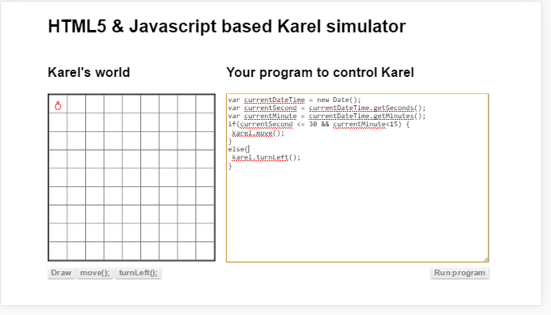

#സാഹചര്യപരിശോദന (ഇഫ്‌ കണ്ടീഷന്‍)
പ്രോഗ്രാം പ്രവര്‍ത്തിക്കുമ്പോള്‍ ഒരു പ്രത്യേക സാഹചര്യം വന്നാല്‍ ഇതുപോലെ, അല്ലെങ്കില്‍ വേറെ പോലെ പ്രവര്‍ത്തനരീതി മാറ്റണം എന്ന് പറയുന്ന പ്രോഗ്രാമ്മിംഗ് ഭാഷയിലെ നിര്‍ദേശങ്ങളെ കൂട്ടിയോജിപ്പിക്കുന്ന സങ്കേതമാണ് സാഹചര്യചെക്കുകള്‍.  സാഹചര്യചെക്ക് ആണോ, താരതമ്യം ആണോ ശരിയായ വാക്ക് എന്നറിയില്ല. എന്തായാലും പ്രോഗ്രാം പ്രവര്‍ത്തിക്കുമ്പോള്‍ ഇനി അടുത്ത നിര്‍ദേശംഎന്ത്  എടുക്കണം എന്നുള്ള തീരുമാനം അപ്പോഴത്തെ സാഹചര്യത്തിന് അനുസരിച്ച് മാറ്റാന്‍ ഇതുമൂലം സാധിക്കുന്നു. സാഹചര്യം എന്ന് പറയുന്നത് ഉപയോക്താവ് കൊടുക്കുന്ന ഇന്‍പുട്ട് ആകാം അല്ലെങ്കില്‍ അപ്പോഴത്തെ സമയം ആകാം. ഇതിനെ സ്റ്റേറ്റ് എന്ന് ഇംഗ്ലീഷില്‍ പറയുന്നു.

ചുരുക്കിപ്പറഞ്ഞാൽ നമുക്ക് മുന്നിലുള്ള രണ്ടു വഴികളിൽ നിന്നും ഒന്ന് തെരെഞ്ഞെടുക്കുന്നതുപോലെ തന്നെ. താഴേക്കോടുത്തിരിക്കുന്നപോലെ നമുക്ക് പ്രോഗ്രാം എഴുതാം.

## പ്രവര്‍ത്തനം

ബ്രൌസര്‍ സാഹചര്യപരിശോദന ചെയ്യാന്‍ പറയുന്ന സൂചകപദം കാണുമ്പൊള്‍ അതിനു ശേഷം വരുന്ന ബ്രായ്ക്കറ്റില്‍ കൊടുത്തിട്ടുള്ള പ്രോഗ്രാം വാചകം പ്രവര്‍ത്തിപ്പിച്ചു അത് സത്യം (ശരി)/ട്രൂ, ആണോ അതോ അസത്യം (തെറ്റ്) /ഫാള്‍സ് ആണോ ഉത്തരം ആയി തരുന്നത് എന്ന് നോക്കുന്നു. അത് ശരി എന്നാണെങ്കില്‍ ആദ്യത്തെ നിര്‍ദേശകൂട്ടവും ഇല്ലെങ്കില്‍ എല്‍സ് എന്ന സൂചകപടം  കഴിഞ്ഞു വരുന്ന നിര്‍ദേശ കൂട്ടവും പ്രവര്‍ത്തിപ്പിക്കും. രണ്ടും കൂടി ഒരിക്കലും ഒരുമിച്ച് പ്രവര്‍ത്തിപ്പിക്കുകയില്ല. കാരണം ഒരിക്കലും സാഹചര്യം പരിശോദിക്കാന്‍ കൊടുത്തിട്ടുള്ള വാചകത്തിന്  ഉത്തരമായി ശരി എന്നും തെറ്റ് എന്നും നല്‍കാന്‍ കഴിയില്ല. പിന്നെ പ്രോഗ്രാമിംഗ് ആകുമ്പോള്‍ കുറച്ചു ശരി അല്ലെങ്കില്‍ തെറ്റ് എന്നൊന്നില്ല. ഒന്നുകില്‍ ശരി അല്ലെങ്കില്‍ തെറ്റ് എന്നേ അവിടെ വരൂ.

ട്രൂ എന്നും ഫാള്‍സ് എന്നും ഇംഗ്ലീഷില്‍ പറയുന്ന വാക്കുകള്‍ക്ക് മലയാളത്തില്‍ വേണമെങ്കില്‍ ശരി, തെറ്റ് എന്നോ സത്യം അസത്യം എന്നോ അര്‍ത്ഥം വിചാരിക്കാം.

ഇവിടെ എന്താണ് കരെല്‍ ചെയ്യുന്നത് എന്ന് നോക്കാം. നിങ്ങള്‍ പ്രോഗ്രാം പ്രവര്‍ത്തിപ്പിക്കുമ്പോള്‍ നിങ്ങളുടെ കമ്പ്യൂട്ടര്‍ സമയം നോക്കി 1-30 ഇടയില്‍ ആണ് സെക്കന്റ്‌ എങ്കില്‍ ഇടത്തോട്ട് തിരിയുന്നു. അല്ലെങ്കില്‍ മുന്‍പോട്ട് നീങ്ങുന്നു. സമയം എങ്ങിനെയാണ് എടുക്കുന്നത് എന്നത് ഇപ്പോള്‍ മനസിലായില്ലെങ്കിലും ഇനി വരുന്ന അദ്ധ്യായത്തില്‍ വിവരിച്ചിട്ടുണ്ട്.

ഇഫ് മാത്രമായി വേണമെങ്കിലും നമുക്ക് പ്രോഗ്രാം എഴുതാം. സാഹചര്യപരിശോധന ശരിയായില്ലെങ്കിൽ വരുന്ന else / 'അല്ലെങ്കിൽ' ഭാഗം വേണമെന്ന് നിർബന്ധമില്ല.

താഴെ കൊടുത്തിരിക്കുന്ന പ്രോഗ്രാം നോക്കുക. കരെൽ എങ്ങോട്ടാണ് തിരിഞ്ഞിരിക്കുന്നത് എന്നതിന് അനുസരിച്ചു ഇടത്തോട്ട് തിരിയുന്നു. വ്യക്തമായി പറഞ്ഞാൽ  കരെൽ  സ്‌ക്രീനിന്റെ മുകളിലേക്ക് ആണ് ഇപ്പോൾ തിരിഞ്ഞിരിക്കുന്നതെങ്കിൽ karel.direction വടക്ക് എന്ന് സൂചിപ്പിക്കുന്ന "N" എന്ന അക്ഷരം ആണ് തരിക. 

##എന്തൊക്കെയാണ് ബ്രൌസറിന്റെ 'ശരി' കള്‍

ശരിക്കും പറഞ്ഞാല്‍ ഇത് ബ്രൌസര്‍ തീരുമാനിക്കുന്നത് അല്ല. ജാവാസ്ക്രിപ്റ്റ് ഭാഷ എങ്ങിനെയായിരിക്കണം എന്ന് തീരുമാനിക്കുന്ന സംഘടന തീരുമാനിക്കുന്നതാണ്. ബ്രൌസര്‍ അവര്‍ പറയുന്നപോലെ ജാവാസ്ക്രിപ്റ്റ് പ്രവര്‍ത്തിപ്പിക്കുന്നു എന്ന് മാത്രം.

ബ്രായ്ക്കറ്റില്‍ കൊടുത്തിട്ടുള്ള പ്രോഗ്രാം വാചകം താഴെ പറയുന്ന എന്തെങ്കിലും ആണ് ഉത്തരം ആയി തരുന്നതെങ്കില്‍ അത് 'ശരി' യായി കണക്കാക്കും

- 1
- undefined /null അല്ലാത്ത എന്തും അഥവാ സാധുതയുള്ള ഒരു ഡാറ്റ
- ട്രൂ എന്ന ബൂളിയന്‍ 

ഇതേ സാഹചര്യ പരിശോദന ഉപയോഗിച്ചിട്ടാണ് ഇനി വരുന്ന ഭാഗങ്ങളില്‍ കുറെയധികം പ്രോഗ്രാം എഴുതുന്ന സങ്കേതങ്ങള്‍ പ്രവര്‍ത്തിക്കുന്നത്.

## ഒന്നില്‍ കൂടുതല്‍ താരതമ്യങ്ങള്‍ വരുന്ന വാചകങ്ങള്‍
താരതമ്യം വഴി നിര്‍ധാരണം ചെയ്യുമ്പോള്‍ ഒന്നില്‍ കൂടുതല്‍ താരതമ്യങ്ങളും ഉപയോഗിക്കാം. ഉദാഹരണമായി ഇപ്പോഴത്തെ സമയത്തില്‍ സെക്കന്റ്‌ 30നു താഴെയായിരിക്കുകയും മിനിറ്റ് 15നു താഴെയായിരിക്കുകയും   ചെയ്യുമ്പോള്‍ മാത്രം കരെല്‍ മുന്നോട്ട് ചലിക്കണം. അല്ലെങ്കില്‍ ഇടത്തോട്ട് തിരിയണം എന്ന് പ്രോഗ്രാമില്‍ പറയുന്നതാണ് താഴെ കൊടുത്തിരിക്കുന്നത്.

 ഇതുപോലെ 'ആന്‍ഡ്‌' എന്ന && ചിഹ്നം ഉപയോഗിച്ച് എത്ര വേണമെങ്കിലും താരതമ്യങ്ങളെ കൂട്ടിച്ചേര്‍ക്കാം. പ്രോഗ്രാം പ്രവര്‍ത്തിക്കുമ്പോള്‍ അവയുടെ ആകെത്തുക മുകളില്‍ പറഞ്ഞ ശരികളില്‍ ഒന്ന് ( ട്രൂ , 1 , സാധുതയുള്ള ഒബ്ജെക്റ്റ്) ആണോ എന്ന് മാത്രം നോക്കിയാണ് ഏത് കൂട്ടം നിര്‍ദേശങ്ങള്‍ പ്രവര്‍ത്തിക്കണം എന്ന് തീരുമാനിക്കുന്നത്.

program if (3+3)

"ഓര്‍" "||" എന്ന സങ്കേതം വച്ചാണ് കൂട്ടിയിണക്കിയിരിക്കുന്നത് എങ്കില്‍ ചില സമയത്ത് എല്ലാ നിര്‍ദേശങ്ങളും ചെയ്തു നോക്കേണ്ട ആവശ്യം വരുന്നില്ല. കാരണം ഏതെങ്കിലും ഒന്ന് ട്രൂ ആയാല്‍ പിന്നീട് ഉള്ളവ നോക്കേണ്ടതില്ലല്ലോ. 

program karel വിത്ത്‌ 2 conditions forst ട്രൂ

ഒരു ഇഫ്‌ സങ്കേതത്തിനുള്ളില്‍ && ഉം || നമുക്ക് ചേര്‍ത്ത് ഉപയോഗിക്കാം. വേണമെങ്കില്‍ (ബ്രാക്കറ്റ് ) ഉപയോഗിച്ച് ഒരു കൂട്ടം താരതമ്യങ്ങള്‍ക്ക് കൂടുതല്‍ മുന്‍ഗണന കൊടുക്കാം.

program karel വിത്ത്‌ 2 conditions ഇന്‍ () other outside

## എന്തുകൊണ്ട് == നുപകരം === ഉപയോഗിക്കണം
സംസാരഭാഷകളില്‍ എന്നപോലെ പ്രോഗ്രാം എഴുതുന്ന ഭാഷകളിലും ഒരേ കാര്യം രേഖപ്പെടുത്താന്‍ ഒന്നില്‍ കൂടുതല്‍ വഴികള്‍ ഉണ്ടെന്നു മുന്‍പേ പറഞ്ഞല്ലോ. ഇനി പറയാന്‍ പോകുന്നത് അങ്ങിനെയുള്ള ഒരു നല്ല ഉദാഹരണമാണ്‌.

program karel left if 2="2"

മുകളില്‍ കൊടുത്തിട്ടുള്ള ആദ്യം പ്രവര്‍ത്തിപ്പിക്കുക. കരെല്‍ ഇടത്തോട്ട് തിരിയുന്ന കാണാം. ഇനി പ്രോഗ്രാം ശ്രദ്ധാപൂര്‍വ്വം വായിക്കുക. ശരിക്കും തിരിയാന്‍ പാടുണ്ടോ? നമുക്ക് കാണുമ്പൊള്‍ ഈ താരതമ്യം ശരിയാണ് എന്ന് തോന്നും എങ്കിലും രണ്ടു സൈഡിലും താരതമ്യം ചെയ്യാന്‍ കൊടുത്തിട്ടുള്ള ഡാറ്റ സമമല്ല. ഒന്ന് നമ്പര്‍ രണ്ടും മറ്റേത് അക്ഷരം രണ്ടും ആണ്. പക്ഷെ ജാവാസ്ക്രിപ്റ്റ് എന്ത് ചെയ്യുന്നു. അവിടെ കുറച്ചു ബുദ്ധി പ്രയോഗിക്കുന്നു. അത് ഡാറ്റയുടെ ടൈപ്പ് മാറ്റി താരതമ്യം ചെയ്യുന്നു. അപ്പോള്‍ രണ്ടും സമം ആയി. ഒരിക്കലും രണ്ടു പേര്‍ ബുദ്ധി പ്രയോഗിച്ചാല്‍ കാര്യങ്ങള്‍ വിചാരിച്ചപോലെ നടക്കുകയില്ല. ആളുകൂടിയാല്‍ പാമ്പ്‌ ചാകുകയില്ല എന്ന് പറയുന്നതുപോലെ ജാവാസ്ക്രിപ്റ്റ് ഓടിക്കുന്ന ബ്രൌസറും പ്രോഗ്രാമ്മറും ബുദ്ധി ഉപയോഗിക്കുമ്പോള്‍ കാര്യങ്ങള്‍ ശരിക്ക് നടക്കാതെ വന്നപ്പോള്‍ ജാവാസ്ക്രിപ്റ്റ് ഭാഷയെ നിയന്ത്രിക്കുന്ന ആളുകള്‍ പുതിയ ഒരു ചിഹ്നം കൊണ്ടുവന്നു. അതാണ് ===

മുകളില്‍ കൊടുത്ത പ്രോഗ്രാമില്‍ == നുപകരം === ഇട്ടു പ്രോഗ്രാം പ്രവര്‍ത്തിപ്പിച്ചു നോക്കുക. അപ്പോള്‍ കാണാം ആ മാറ്റം. ഇതിന്‍റെ ചുരുക്കം ഇതാണ്. എപ്പോഴും എന്തെങ്കിലും ഡാറ്റകള്‍ തമ്മില്‍ താരതമ്യം ചെയ്യണം എന്നുണ്ടെങ്കില്‍ === ഉപയോഗിക്കുക.

### എന്തുകൊണ്ടാണ് == എടുത്തു കളയാത്തത്? ഇല്ലെങ്കില്‍ == പ്രവര്‍ത്തനരീതി മാറ്റാത്തത്?

മുന്‍പേ പറഞ്ഞപോലെ ജാവാസ്ക്രിപ്റ്റ് എന്ന ഭാഷ പരിപൂര്‍ണമല്ല. അതില്‍ തെറ്റു കുറ്റങ്ങള്‍ ഉണ്ട്. അതില്‍ ഒന്നാണ് ഇത്. ആദ്യം == മാത്രമേ ഉണ്ടായിരുന്നുള്ളൂ. അന്ന് അത് എങ്ങിനെ വര്‍ക്ക്‌ ചെയ്യുന്നുവോ അതിനു അനുസരിച്ച് കുറെ വെബ്‌ പേജുകള്‍ ഉണ്ടാക്കിയിരുന്നു. പിന്നെ == വര്‍ക്ക്‌ ചെയ്യുന്ന രീതി ശരിയല്ല എന്ന് മനസിലായപ്പോള്‍ വേണമെങ്കില്‍ അതിന്‍റെ പ്രവര്‍ത്തന രീതി മാറ്റമായിരുന്നു. പക്ഷെ അതിന്‍റെ പഴയ പ്രവര്‍ത്തനരീതി മനസില്‍ വച്ച് എഴുതിയ പ്രോഗ്രാമുകള്‍ പൊട്ടും. അപ്പോള്‍ ഉള്ള ഒരു മാര്‍ഗം പണ്ട് == ന്‍റെ പ്രവര്‍ത്തനം അനുസരിച്ച് എഴുതിയ എല്ലാ പ്രോഗ്രാമുകളും അതായത് വെബ്‌ പേജുകള്‍ തിരുത്തിഎഴുതുക എന്നതാണ്. അതുപോലെ ബ്രൌസറുകള്‍ == നെ പ്രവര്‍ത്തിപ്പിക്കുന്ന രീതിയും മാറ്റണം. അത് പ്രായോഗികമല്ല. മുന്‍പ് വെബ്‌ പേജ് ഉണ്ടാക്കിയ കമ്പനി ചിലപ്പോള്‍ പൂട്ടിപ്പോയിട്ടുണ്ടാകാം. അതുപോലെ മറ്റനേകം കാരണങ്ങള്‍ കൊണ്ട് ഇന്ന ഒരു തിയ്യതി എല്ലാവരും തങ്ങളുടെ പ്രോഗ്രാമുകള്‍ മാറ്റിഎഴുതും എന്ന് കരുതാന്‍ ആകില്ല. അപ്പോള്‍ എന്താണ് പോംവഴി?

ഭാഷയിലേക്ക് പുതിയ സങ്കേതം കൊണ്ട് വരിക. ഇനി മുതല്‍ പ്രോഗ്രാം എഴുതുന്നവരോട് == ഉപയോഗിക്കാതെ === ഉപയോഗിക്കാന്‍ പറയുക. 

നിത്യജീവിതത്തിലും ഇങ്ങനത്തെ സാഹചര്യങ്ങള്‍ കാണാം. പണ്ട് കാറുകള്‍ക്ക് സീറ്റ്‌ ബെല്‍റ്റ്‌ ഉണ്ടായിരുന്നില്ല. പിന്നീട് അത് കണ്ടുപിടിച്ചു. സര്‍ക്കാര്‍ അത് നടപ്പിലാക്കാന്‍ തീരുമാനിക്കുന്നു. അപ്പോള്‍ സര്‍ക്കാരിനു വേണമെങ്കില്‍ എല്ലാ കാറുകളും ഇനി മുതല്‍ സീറ്റ്  ബെല്‍റ്റ്‌ വയ്ക്കണം എന്ന് പറയാമായിരുന്നു. പക്ഷെ അത് പ്രായോഗികം അല്ലാത്തതുകൊണ്ട്, പുതിയ കാറുകള്‍ക്ക് അത് നിര്‍ബന്ധമാക്കി. ക്രമേണ എല്ലാവരും സീറ്റ് ബെല്‍റ്റ്‌ ഉപയോഗിക്കുന്നവരാകും.

