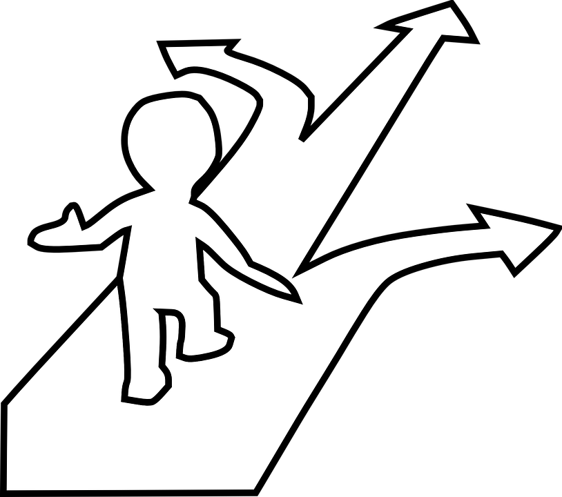
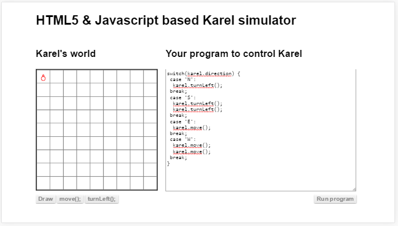

#ബഹുതാരതമ്യങ്ങള്‍
ഇത് രണ്ടിലധികം സാഹചര്യചെക്കുകളുടെ കൂട്ടമാണ്. ഒരു സാഹചര്യത്തെ അടിസ്ഥാനപ്പെടുത്തി മുന്നേ പറഞ്ഞു വച്ചിട്ടുള്ള ഒന്നിലധികം വഴികളില്‍ ഒന്ന് തിരെഞ്ഞെടുക്കുന്നു. സാഹചര്യം എന്നാല്‍ ഇവിടെ ചരത്തില്‍ ഉള്ള ഡാറ്റ.

ഈ പടത്തിനു നന്ദി https://pixabay.com/en/confusion-left-right-straight-311388/

മുകളില്‍ കൊടുത്തിരിക്കുന്നത് ഈ സങ്കേതം വഴി എങ്ങിനെ ഒരു പ്രോഗ്രാം എഴുതാം എന്നാണ്. ഈ പ്രോഗ്രാം പ്രവര്‍ത്തിപ്പിക്കുമ്പോള്‍ കരെല്‍ എങ്ങോട്ടാണോ തിരിഞ്ഞിരിക്കുന്നത് അതിനു അനുസരിച്ച് ആണ് അടുത്ത തീരുമാനം എടുക്കുന്നത്. 
കരെല്‍ മുകളിലേക്ക് (ഇംഗ്ലീഷ് അഷരം N ആണ് karel.direction എന്ന ചരത്തില്‍ ഉണ്ടാകുക) തിരിഞ്ഞു ഇരിക്കുകയാണെങ്കില്‍ അടുത്ത പടി ഇടത്തോട്ട് തിരിയുകയാണ്. താഴേക്കാണ് തിരിഞ്ഞു ഇരിക്കുന്നത് എങ്കില്‍ രണ്ട് പ്രാവശ്യം ഇടത്തോട്ട് തിരിയും. ഇപ്പോഴത്തെ വശം വലത് ആണെങ്കില്‍ ഒരു കളം മുന്നിലേക്ക് നീങ്ങും, അതുപോലെ ഇടത്തോട്ടാണ് ഇപ്പോള്‍ ഇരിക്കുന്നത് എങ്കില്‍ രണ്ട് കളം മുന്‍പോട്ട് നീങ്ങും. 

## നിവൃത്തികേട്

മുകളില്‍ എല്ലാം എളുപ്പം ആയിരുന്നു. എങ്ങാനും karel.direction എന്ന ചരത്തില്‍ ഉള്ള ഡാറ്റ 'J' ആകുമായിരുന്നെങ്കില്‍ എന്താകും അവസ്ഥ? കമ്പ്യൂട്ടറിന് ഒന്നും ചെയ്യാന്‍ പറ്റില്ല. മുന്‍പേ പറഞ്ഞപോലെ സ്വന്തമായി ബുദ്ധിയില്ലാത്ത ഒരു യന്ത്രമാണ് കമ്പ്യൂട്ടര്‍. അപ്പോള്‍ നിര്‍ദേശം കൊടുക്കുന്ന  നമ്മള്‍‍ എന്ത് ചെയ്യണം?

നിവൃതികെട്ടാല്‍ എന്താണ് ചെയ്യേണ്ടത് എന്നുകൂടി പറഞ്ഞു കൊടുക്കണം. അതിനു ഉപയോഗിക്കുന്ന സൂച്ചകപടമാണ് default.

Image switch default 