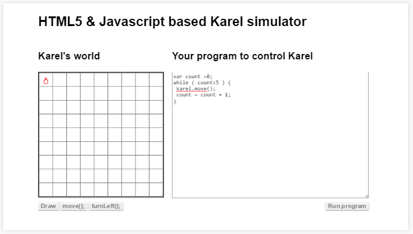

#ലൂപ്പ്

കരെലിനെ മുന്‍പോട്ട് 3 കളം നീക്കണം എന്ന് വിചാരിക്കുക. നമുക്ക് 3 പ്രാവശ്യം മുന്നോട്ട് നീങ്ങാനുള്ള നിര്‍ദേശം കൊടുക്കാം. 5 കളം നീങ്ങണം എങ്കിലോ ? അഞ്ചു പ്രാവശ്യം കൊടുക്കേണ്ടി വരും. അഞ്ചു പ്രാവശ്യം എഴുതാതെ അഞ്ചു പ്രാവശ്യം ആവര്‍ത്തിച്ചു മുന്‍പോട്ടു നീങ്ങാനുള്ള നിര്‍ദേശം കൊടുക്കാന്‍ പറ്റിയാല്‍ നമുക്ക് ടൈപ്പ് ചെയുന്നത് കുറയ്ക്കാം അല്ലെങ്കില്‍ കോപ്പി പേസ്റ്റ് ചെയ്യുന്നത് കുറയ്ക്കാം. അങ്ങനെയുള്ള നിര്‍ദേശം ആണ് ലൂപ്. മലയാളത്തില്‍ ചുറ്റ് അല്ലെങ്കില്‍ കേട്ട് എന്ന് പറയാം. 

മറ്റൊരു രീതിയില്‍ പറഞ്ഞാല്‍ ആവര്‍ത്തിക്കപ്പെടെണ്ട നിര്‍ദേശങ്ങളെ എങ്ങിനെ സാമാന്യവല്‍ക്കരിക്കാം എന്നുള്ള ചോദ്യത്തിന്‍റെ ഉത്തരമാണ് ലൂപ്. സാമാന്യവല്‍ക്കരണം പ്രോഗ്രാം എഴുതുമ്പോള്‍ നമ്മള്‍ ചിന്തിക്കേണ്ട പ്രധാനപ്പെട്ട ഒരു സംഗതിയാണ്. അല്ലെങ്കില്‍ നമ്മള്‍ എഴുതുന്ന പ്രോഗ്രാം വളരെയധികം വലിപ്പമുള്ളതാകും. മിക്കവാറും ഒരു പ്രവൃത്തി ചെയ്യാനുള്ള ഒരു കൂട്ടം നിര്‍ദേശങ്ങള്‍ എടുത്താല്‍ അതേ നിര്‍ദേശങ്ങളുടെ കൂട്ടങ്ങള്‍ വേറെ സ്ഥലത്തും കാണാന്‍ കഴിയും

ഒരു കൂട്ടം നിര്‍ദേശങ്ങളെ പ്രോഗ്രാം ഒരു പ്രത്യേക സ്ഥിതിയില്‍ എത്തുന്നത്‌ വരെ ആവര്‍ത്തിച്ച് ചെയിക്കുന്ന പ്രോഗ്രാമെഴുത്ത് സങ്കേതമാണ് ലൂപ്.

മുന്‍പ് അഞ്ച് പ്രാവശ്യം ചെയ്യുക എന്ന് പറയാന്‍ അഞ്ച് പ്രാവശ്യം ആ നിര്‍ദേശം ടൈപ്പ് ചെയ്യുകയാണ് ചെയ്തത്. അഞ്ച് പ്രാവശ്യം കഴിഞ്ഞാല്‍ അത് അതിനു ശേഷമുള്ള നിര്‍ദേശം എടുത്തു പ്രവര്‍ത്തിപ്പിക്കും. പക്ഷെ നമ്മള്‍ സാമാന്യവല്‍ക്കരിച്ചുകൊണ്ട്‌ നിര്‍ദേശങ്ങള്‍ ആവര്‍ത്തിക്കാന്‍ പറയുമ്പോള്‍ അത് എത്ര തവണ ആവര്‍ത്തിക്കണം എന്ന് പറയണം. അല്ലെങ്കില്‍ കമ്പ്യൂട്ടര്‍ ആ നിര്‍ദേശങ്ങള്‍ ആവര്‍ത്തിച്ചുകൊണ്ടേയിരിക്കും.  പ്രോഗ്രമെഴുത്ത് ഭാഷയില്‍ അതിനെ "അനന്തമായ ആവര്‍ത്തനം" എന്ന് പറയും"

പക്ഷെ എത്ര തവണ ലൂപ് ഓടിക്കണം എന്നത് എങ്ങിനെ പറയും? നിര്‍ദേശങ്ങളെ ഒരു കൂട്ടമാക്കി ഒരു നമ്പര്‍ കൊടുത്താല്‍  മതിയോ? അങ്ങനെയാണെങ്കില്‍ ഇടയ്ക്കു വച്ച് നിറുത്തുവാന്‍ പറയാന്‍ പറ്റില്ല. അതുകൊണ്ടാണ്. ആവര്‍ത്തനം നിയന്ത്രിക്കാന്‍ പ്രോഗ്രാം ഒരു പ്രത്യേക സ്ഥിതിയില്‍ എത്തിയോ എന്ന് ഓരോ ആവര്‍ത്തനം കഴിയുമ്പോഴും നോക്കേണ്ടത്.

ഇവിടെ പ്രോഗ്രാമിന്‍റെ അവസ്ഥ എന്ന് ഉദ്ദേശിക്കുന്നത് ഒരു തെറ്റോ ശരിയോ എന്ന് ഉത്തരം തരുന്ന ഒരു പ്രോഗ്രാം വാചകമാണ്.
 

## വയില്‍ ലൂപ്പ് (while)

വയില്‍ ലൂപ്പ് എന്നതിന് മലയാളം കണ്ടുപിടിക്കാന്‍ ബുദ്ധിമുട്ട് ആയതുകൊണ്ടും കണ്ടു പിടിച്ചാല്‍ തന്നെ അതേ അര്‍ത്ഥം കിട്ടും എന്നുറപ്പില്ലാത്തതുകൊണ്ടും ഇംഗ്ലീഷ് വാക്ക് തന്നെ ഉപയോഗിക്കാം. ഇവിടെ ആവര്‍ത്തിക്കപ്പെടെണ്ട നിര്‍ദേശങ്ങളെ {} എന്നീ ചിഹ്നങ്ങളുടെ ഇടയില്‍ എഴുതി അതിനു മുകളില്‍ ഒരു പ്രോഗ്രാം വാചകം വച്ചിരിക്കുന്നു.

###പ്രവര്‍ത്തനം

ബ്രൌസര്‍  പ്രോഗ്രാം പ്രവര്തിപ്പിച്ച് വയില്‍ ലൂപ്പില്‍ എത്തുമ്പോള്‍ ആദ്യം ബ്രായ്ക്കറ്റില്‍ കൊടുത്തിരിക്കുന്ന പ്രോഗ്രാം വാചകം പ്രവര്‍ത്തിപ്പിച്ചു അത് ശരി /ട്രൂ എന്ന ഫലം  ആണോ നല്‍കുന്നത് എന്ന് നോക്കും. ഇതാണ് പ്രോഗ്രാമിന്‍റെ അവസ്ഥ/സ്റ്റേറ്റ് നോക്കുന്നു എന്ന് മുന്‍പ് പറഞ്ഞത്. അത് ശരി എന്നാനെങ്കില്‍ അതിനു താഴെ കൊടുത്തിരിക്കുന്ന നിര്‍ദേശങ്ങളുടെ കൂട്ടം പ്രവര്‍ത്തിപ്പിക്കും. അതിനു ശേഷം വീണ്ടും സ്റ്റേറ്റ് നോക്കുന്നു. വീണ്ടും നിര്‍ദേശങ്ങളുടെ കൂട്ടം പ്രവര്‍ത്തിപ്പിക്കുന്നു. വീണ്ടും ആവര്‍ത്തിക്കണോ വേണ്ടയോ എന്നുള്ള പ്രോഗ്രാം വാചകം തെറ്റ് / ഫാള്‍സ് എന്നു പറയുന്നത് വരെ ഈ ലൂപ്പിന് കൊടുത്തിട്ടുള്ള നിര്‍ദേശങ്ങള്‍ ആവര്‍ത്തിച്ചുകൊണ്ടേയിരിക്കും. 

നമ്മള്‍ ആണ് ബ്രൌസര്‍ എന്ന് സങ്കല്‍പ്പിച്ചു മുകളില്‍ കൊടുത്ത വയില്‍ ലൂപ്പ്പ്രവര്‍ത്തിപ്പിച്ചു നോക്കിയാല്‍ കാര്യങ്ങള്‍ എങ്ങിനെ പ്രവര്‍ത്തിക്കുന്നു എന്ന് എളുപ്പം മനസിലാകും. ഒരു പേനയും പേപ്പറും ഉണ്ടെങ്കില്‍ കാര്യങ്ങള്‍ കൂടുതല്‍ എളുപ്പമുണ്ടാകും. ആദ്യം count എന്ന ചരത്തില്‍ 0 വക്കുന്നു. അപ്പോള്‍ പേപ്പറില്‍ count = 0 എന്ന് എഴുതുക. ഇനി count <5 എന്ന നിര്‍ദേശം ശരിയാണോ എന്ന് പരിശോദിച്ചു ഉത്തരം പേപ്പറില്‍ എഴുതുക. countഇല്‍ ഇപ്പോള്‍ 0 ആയതുകൊണ്ട് 0<5 സത്യം ആണെന്ന് കാണാം. സത്യം എന്ന് പേപ്പറില്‍ എഴുതുക.
അടുത്തത് കരെല്‍ ഒരു കളം മുന്‍പോട്ടു നീങ്ങാനുള്ള നിര്‍ദേശമാണ്. പേപ്പറില്‍ കരെല്‍ നീങ്ങി എന്ന് എഴുതുക. അതിനുശേഷം പറഞ്ഞിരിക്കുന്ന നിര്‍ദേശം count നോട് ഒന്ന് കൂട്ടി count എന്ന ചരത്തില്‍ തന്നെ വെക്കാനാണ്. ആ നിര്‍ദേശം പ്രവര്‍ത്തിച്ചു കഴിഞ്ഞാല്‍ count എന്ന ചരത്തിലെ ഡാറ്റ 1 ആകും. അപ്പോള്‍ count = 1 എന്ന് പേപ്പറില്‍ എഴുതുക.
ഇനി വീണ്ടും മുകളിലേക്ക് പോയി താരതമ്യം ചെയ്യുന്നതിനുള്ള നിര്‍ദേശം പ്രവര്‍ത്തിപ്പിച്ചു പേപ്പറില്‍ ഉത്തരം എഴുതുക. ഉത്തരം സത്യം ആണെങ്കില്‍ വീണ്ടും ആവര്‍ത്തിക്കുക.
അങ്ങനെ പോയി പോയി count എന്ന ചരത്തില്‍ 5 എന്ന ഡാറ്റ വരും. അപ്പോള്‍ താരതമ്യം അസത്യം എന്ന് വരും. അപ്പോള്‍ ലൂപ്പ് കഴിഞ്ഞു. ലൂപ്പിന് ശേഷം നിര്‍ദേശങ്ങള്‍ ഒന്നും ഇല്ലാത്തതുകൊണ്ട് പ്രോഗ്രാം പ്രവര്‍ത്തനം നിറുത്തുന്നു. അല്ലെങ്കില്‍ ലൂപ്പിന് ശേഷം വരുന്ന നിര്‍ദേശങ്ങള്‍ ഓരോന്നായി പ്രവര്‍ത്തിപ്പിക്കാം.

പേപ്പറില്‍ കാണുന്നത് താഴെ കൊടുത്തപോലെയിരിക്കും. അഞ്ച് പ്രാവശ്യം കരെല്‍ മുന്‍പോട്ടു നീങ്ങിയതായി അതില്‍ നിന്നും മനസിലാക്കാം.

*count =0;*

*സത്യം*

*കരെല്‍ നീങ്ങി*

*count = 1*

*സത്യം*

*കരെല്‍ നീങ്ങി*

*count = 2*

*സത്യം*

*കരെല്‍ നീങ്ങി*

*count = 3*

*സത്യം*

*കരെല്‍ നീങ്ങി*

*count = 4*

*സത്യം*

*കരെല്‍ നീങ്ങി*

ലളിതമായ ലൂപ്പ് ആണെങ്കില്‍ നമുക്ക് മനസ്സില്‍ അതിന്‍റെ പ്രവര്‍ത്തനം ഊഹിക്കാം. പക്ഷെ വലിയ പ്രോഗ്രാമുകള്‍ എഴുതുമ്പോള്‍ അങ്ങനെ ചെയ്യാന്‍ വളരെ ബുദ്ധിമുട്ടാകും. അങ്ങനെ വരുമ്പോള്‍ പ്രോഗ്രമെഴുത്ത് കുഴപ്പം പിടിച്ച സംഗതിയായി അനുഭവപ്പെടും. അപ്പോള്‍ നല്ലത് പ്രോഗ്രാം എഴുതി പഠിച്ചു തുടങ്ങുമ്പോള്‍ തന്നെ പേപ്പര്‍ ഉപയോഗിച്ച് ശീലിക്കുന്നതാണ്.

ഇപ്പോള്‍ തന്നെ ഈ പ്രോഗ്രാമില്‍ count = count + 1 എന്ന നിര്‍ദേശം നമ്മള്‍ വിട്ടുപോയി എന്ന് വിചാരിക്കുക. എന്ത് സംഭവിക്കും? പ്രോഗ്രാം നിറുത്താതെ പ്രവര്‍ത്തിച്ചു കൊണ്ടിരിക്കും. അതിനെയാണ് മുകളില്‍ അനന്തമായ ആവര്‍ത്തനം എന്ന് പറഞ്ഞത്. നമ്മള്‍ പേപ്പര്‍ ഉപയോഗിച്ച് പ്രവര്‍ത്തനം ഉറപ്പുവരുത്തിയാല്‍, കമ്പ്യൂട്ടറില്‍ പ്രവര്‍ത്തിക്കുമ്പോള്‍ കുഴപ്പമുണ്ടാകില്ല. അല്ലെങ്കില്‍ അതിലെ ബഗ് തിരുത്താനെ സമയം കാണൂ. അപ്പോഴും നമുക്ക് തോന്നും പ്രോഗ്രമെഴുത്ത് നമുക്ക് പറ്റിയ സംഗതി അല്ലെന്നു.
 
##ടു വയില്‍ ലൂപ്പ്

വയില്‍ ലൂപ്പില്‍ താരതമ്യം കഴിഞ്ഞിട്ടാണ് ആവര്‍ത്തിക്കേണ്ട നിര്‍ദേശങ്ങള്‍ പ്രവര്‍ത്തിക്കുന്നത് എങ്കില്‍ ഈ ലൂപ്പില്‍ ആദ്യം ഒരു തവണ നിര്‍ദേശങ്ങളുടെ കൂട്ടം പ്രവര്‍ത്തിച്ചു കഴിഞ്ഞാണ് താരതമ്യം ചെയ്യുന്നത്. അതുകൊണ്ട് ഒറ്റതവണ എന്തായാലും നിര്‍ദേശങ്ങള്‍ പ്രവര്‍ത്തിക്കും എന്ന് ഉറപ്പുണ്ട്. വയില്‍ ലൂപ്പില്‍ ആദ്യം തന്നെ താരതമ്യം അസത്യം ആണ് തരുന്നത് എങ്കില്‍ ഒറ്റ തവണ പോലും നിര്‍ദേശങ്ങള്‍ പ്രവര്‍ത്തിക്കില്ല. 
ഒറ്റതവണ നിര്‍ബന്ധമായും പ്രവര്‍ത്തിക്കേണ്ട ലൂപ്പുകള്‍ ആവശ്യമെങ്കില്‍ ഈ ലൂപ്പ് ഉപയോഗിക്കാം.

##ഫോര്‍ ലൂപ്പ്

ശരിക്കും പറഞ്ഞാല്‍ മുകളില്‍ കൊടുത്തിട്ടുള്ള ലൂപ്പ് വച്ചിട്ട് നമുക്ക് എല്ലാ ആവര്‍ത്തനങ്ങളും ചെയ്യാന്‍ കഴിയും. പക്ഷെ മുന്‍പ് പറഞ്ഞപോലെ സംസാരഭാഷയോ,  പ്രോഗ്രാമിംഗ് ഭാഷയോ ആയിക്കൊള്ളട്ടെ, അതില്‍ ഒരു കാര്യം പറയാന്‍ ഒന്നില്‍  കൂടുതല്‍ വഴികള്‍ ഉണ്ടായിരിക്കും. ഒരു ഫോര്‍ ലൂപ്പ് ആണ് താഴെ കൊടുത്തിട്ടുള്ളത്.

###പ്രവര്‍ത്തനം

ഇതിനു പ്രധാനമായി 4 ഭാഗങ്ങള്‍ ഉണ്ട്. 

### ഫോര്‍ ലൂപ്പ് ഉപയോഗിച്ച് ചെയ്യുന്നതെല്ലാം വയില്‍ ലൂപ്പ് വച്ചും ചെയ്യാം

<image വയില്‍ loop counting>

###ഇഫും ലൂപ്പുകളും

ഇവിടെ കൊടുത്തിരിക്കുന്നത് ഇഫ്‌ എന്ന സങ്കേതവുമായി താരതമ്യം ചെയ്‌താല്‍ കാണുന്ന ഒരു വ്യത്യാസം ഇഫ്‌ എന്ന സങ്കേതത്തില്‍ ശരിയായാലും തെറ്റായാലും എന്താണ് ചെയ്യേണ്ടത് എന്ന് പറഞ്ഞു വച്ചിട്ടുണ്ട്. ഇവിടെ ശരിയാകുകയാണ് എങ്കില്‍ അതിനു താഴെ കൊടുത്തിരിക്കുന്ന നിര്‍ദേശം വീണ്ടും വീണ്ടും പ്രവര്‍ത്തിപ്പിക്കുകയാണ്. താരതമ്യം ചെയ്യുക അല്ലെങ്കില്‍ ഒരു പ്രോഗ്രാം വാചകം പ്രവര്‍ത്തിപ്പിച്ചു ശരിയാണോ തെറ്റാണോ എന്ന് നോക്കുക എന്നതാണ് ഇവിടെയും പ്രധാനമായ സംഗതി.

ഇവിടെ കൊടുത്തിരിക്കുന്നത് ഇഫ്‌ എന്ന സങ്കേതവുമായി താരതമ്യം ചെയ്‌താല്‍ കാണുന്ന ഒരു വ്യത്യാസം ഇഫ്‌ എന്ന സങ്കേതത്തില്‍ ശരിയായാലും തെറ്റായാലും എന്താണ് ചെയ്യേണ്ടത് എന്ന് പറഞ്ഞു വച്ചിട്ടുണ്ട്. ഇവിടെ ശരിയാകുകയാണ് എങ്കില്‍ അതിനു താഴെ കൊടുത്തിരിക്കുന്ന നിര്‍ദേശം വീണ്ടും വീണ്ടും പ്രവര്‍ത്തിപ്പിക്കുകയാണ്. താരതമ്യം ചെയ്യുക അല്ലെങ്കില്‍ ഒരു പ്രോഗ്രാം വാചകം പ്രവര്‍ത്തിപ്പിച്ചു ശരിയാണോ തെറ്റാണോ എന്ന് നോക്കുക എന്നതാണ് ഇവിടെയും പ്രധാനമായ സംഗതി.
