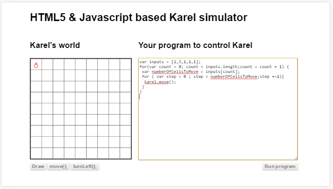
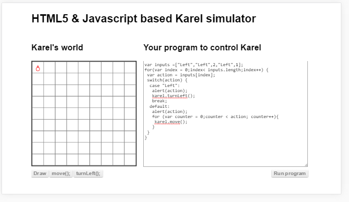

##അറ

കുറച്ചധികം ഡാറ്റകളെ നമ്പര്‍ ഇട്ടു ഒരു ചരത്തില്‍ സൂക്ഷിക്കുന്നതിനാണ് അറ എന്ന് പറയുന്നത്.  സൂക്ഷിക്കുമ്പോള്‍ കൊടുത്ത നമ്പര്‍ ഉപയോഗിച്ച് മാത്രമേ ഡാറ്റ തിരിച്ചു എടുക്കാന്‍ പറ്റൂ. പിന്നെയുള്ള തിരിച്ചെടുക്കാന്‍ പറ്റിയ ഒരു വഴി ലൂപ്പ് ഉപയോഗിച്ച് പൂജ്യം മുതല്‍ അറയുടെ കപ്പാസിറ്റി /നീളം വരെയുള്ള നമ്പര്‍ ഉണ്ടാക്കി ഓരോ ഡാറ്റകളെയും എടുക്കുക എന്നതാണ്.

###അറയില്‍ നിന്നും എടുക്കുന്നതെങ്ങിനെ

ഒരു അറ ഉണ്ടാക്കി അതില്‍ 5 സംഖ്യകള്‍ വച്ചിരിക്കുന്ന പ്രോഗ്രാം ആണ് താഴെ കാണുന്നത്.  അതില്‍ നിന്നും ഓരോ നമ്പറുകള്‍ എടുത്തു കരെല്‍ അത്രയും കളങ്ങള്‍ മുന്‍പോട്ട് പോകുന്നതും കാണാം.

ഒരു അറയില്‍ വിവിധ തരത്തില്‍ ഡാറ്റടൈപ്പുകളില്‍ ഉള്ള ഡാറ്റകള്‍ സൂക്ഷിക്കാം.  താഴെ കൊടുത്തിരിക്കുന്ന പ്രോഗ്രാമില്‍ ഒരു അറയില്‍ സംഖ്യകളും, ദിശയും വച്ചിരിക്കുന്നു. കരെല്‍ അതില്‍നിന്നും ഓരോന്ന്‍ എടുത്ത് അതിനനുസരിച്ച് പ്രവര്‍ത്തിക്കുന്ന കാണാം

###അറയിലേക്ക് വക്കുന്നതെങ്ങിനെ

അറയിലേക്ക് ഒരു ഡാറ്റ വെക്കാന്‍ രണ്ട് രീതികള്‍ ഉണ്ട്. ഒന്ന് സ്ഥാനം പറഞ്ഞു ആ സ്ഥാനത്ത് വയ്ക്കാം. അതിനു ഉദാഹരണമാണ്‌ താഴെ.

<program array[] = value>

പിന്നെയുള്ള വഴി ഇപ്പോഴുള്ള ഡാറ്റകളുടെ അവസാനം വയ്ക്കുകയാണ്. അതിനെ വേറെ ഫങ്ഷന്‍ ആണ് ഉപയോഗിക്കുന്നത്. മുകളില്‍ കണ്ട രീതിയില്‍ ചെയ്യുമ്പോള്‍ അതിന്‍റെ അവസാനഭാഗത്താണ് വെക്കേണ്ടത് എങ്കില്‍ കുറച്ചു അധികം വരികള്‍ എഴുതേണ്ടി വരും. ഈ ഫങ്ഷന്‍ ഉപയോഗിച്ചാല്‍ അത് വേണ്ട.

<program array.push()>

###അറയില്‍ നിന്നും എടുത്തു കളയാന്‍
ആദ്യം തന്നെ അറയുടെ അവസാനഭാഗത്തുനിന്നു ഒരെണ്ണം എടുക്കാനുള്ള ഫങ്ഷന്‍ നോക്കാം. ഈ ഫങ്ഷന്‍ ഉപയോഗിക്കുമ്പോള്‍ ഒരെണ്ണം എടുത്തു നമുക്ക് തരുന്നതുപോലെയാണ്. അത് വേണമെങ്കില്‍ നമുക്ക് ഉപയോഗിക്കാം അല്ലെങ്കില്‍ ഉപേക്ഷിക്കാം.
<program array.pop()>

അറയുടെ ഇടയില്‍ നിന്നും എടുത്തു കളയാന്‍ കുറച്ചു ബുദ്ധിമുട്ടാണ്.  ആദ്യം അതിന്‍റെ നമ്പര്‍ അല്ലെങ്കില്‍ സ്ഥാനം കണ്ടു പിടിക്കണം.അത് കണ്ടു പിടിച്ചാല്‍ താഴെ കൊടുത്തിരിക്കുന്ന ഫങ്ഷന്‍ വഴി ഒരു പ്രത്യേക ഡാറ്റ എടുത്തു കളയാം.
<program array.splice()>

###അറയുടെ നീളം ഉപയോഗിച്ചാലുള്ള പ്രശ്നം

