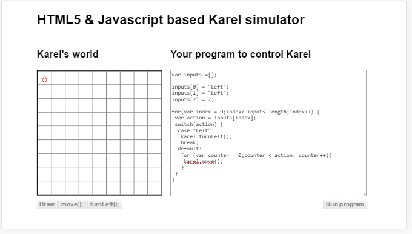
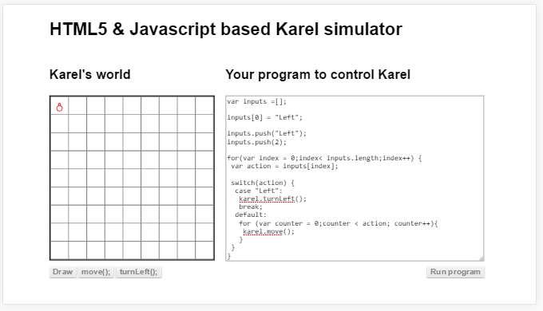
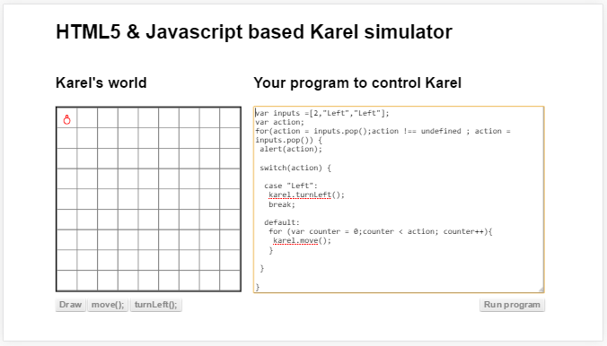
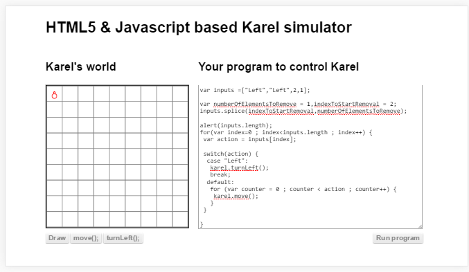
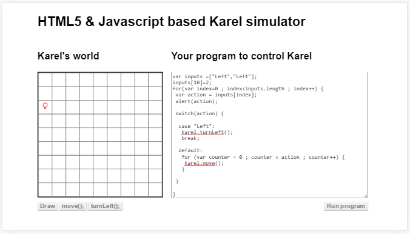
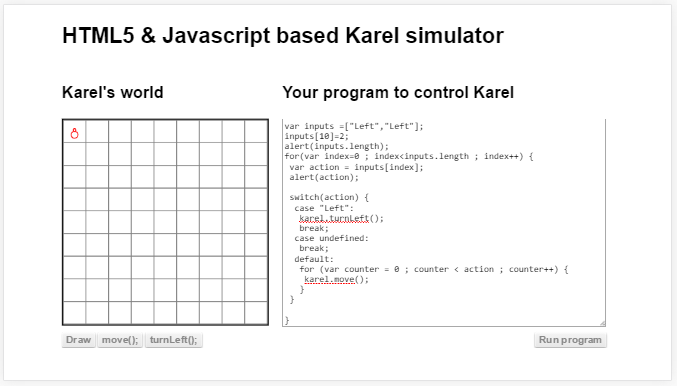

##അറ

കുറച്ചധികം ഡാറ്റകളെ നമ്പര്‍ ഇട്ടു ഒരു ചരത്തില്‍ സൂക്ഷിക്കുന്നതിനാണ് അറ എന്ന് പറയുന്നത്.  സൂക്ഷിക്കുമ്പോള്‍ കൊടുത്ത നമ്പര്‍ ഉപയോഗിച്ച് മാത്രമേ ഡാറ്റ തിരിച്ചു എടുക്കാന്‍ പറ്റൂ. പിന്നെയുള്ള തിരിച്ചെടുക്കാന്‍ പറ്റിയ ഒരു വഴി ലൂപ്പ് ഉപയോഗിച്ച് പൂജ്യം മുതല്‍ അറയുടെ കപ്പാസിറ്റി /നീളം വരെയുള്ള നമ്പര്‍ ഉണ്ടാക്കി ഓരോ ഡാറ്റകളെയും എടുക്കുക എന്നതാണ്.

###അറയില്‍ നിന്നും എടുക്കുന്നതെങ്ങിനെ

ഒരു അറ ഉണ്ടാക്കി അതില്‍ 5 സംഖ്യകള്‍ വച്ചിരിക്കുന്ന പ്രോഗ്രാം ആണ് താഴെ കാണുന്നത്.  അതില്‍ നിന്നും ഓരോ നമ്പറുകള്‍ എടുത്തു കരെല്‍ അത്രയും കളങ്ങള്‍ മുന്‍പോട്ട് പോകുന്നതും കാണാം.

ഒരു അറയില്‍ വിവിധ തരത്തില്‍ ഡാറ്റടൈപ്പുകളില്‍ ഉള്ള ഡാറ്റകള്‍ സൂക്ഷിക്കാം.  താഴെ കൊടുത്തിരിക്കുന്ന പ്രോഗ്രാമില്‍ ഒരു അറയില്‍ സംഖ്യകളും, ദിശയും വച്ചിരിക്കുന്നു. കരെല്‍ അതില്‍നിന്നും ഓരോന്ന്‍ എടുത്ത് അതിനനുസരിച്ച് പ്രവര്‍ത്തിക്കുന്ന കാണാം

###അറയിലേക്ക് വക്കുന്നതെങ്ങിനെ

അറയിലേക്ക് ഒരു ഡാറ്റ വെക്കാന്‍ രണ്ട് രീതികള്‍ ഉണ്ട്. ഒന്ന് സ്ഥാനം പറഞ്ഞു ആ സ്ഥാനത്ത് വയ്ക്കാം. അതിനു ഉദാഹരണമാണ്‌ താഴെ.

പിന്നെയുള്ള വഴി ഇപ്പോഴുള്ള ഡാറ്റകളുടെ അവസാനം വയ്ക്കുകയാണ്. അതിനെ വേറെ ഫങ്ഷന്‍ ആണ് ഉപയോഗിക്കുന്നത്. മുകളില്‍ കണ്ട രീതിയില്‍ ചെയ്യുമ്പോള്‍ അതിന്‍റെ അവസാനഭാഗത്താണ് വെക്കേണ്ടത് എങ്കില്‍ കുറച്ചു അധികം വരികള്‍ എഴുതേണ്ടി വരും. ഈ ഫങ്ഷന്‍ ഉപയോഗിച്ചാല്‍ അത് വേണ്ട.

ഫങ്ഷന്‍ എന്താണെന്നു ഇനി വരുന്ന അദ്ധ്യായത്തില്‍ വിവരിക്കുന്നുണ്ട്. ഇപ്പോള്‍ ഇവിടെ കൊടുത്തിരിക്കുന്നപടി പിന്തുടരുകയാണ് നല്ലത്.

###അറയില്‍ നിന്നും എടുത്തു കളയാന്‍
ആദ്യം തന്നെ അറയുടെ അവസാനഭാഗത്തുനിന്നു ഒരെണ്ണം എടുക്കാനുള്ള ഫങ്ഷന്‍ നോക്കാം. ഈ ഫങ്ഷന്‍ ഉപയോഗിക്കുമ്പോള്‍ ഒരെണ്ണം എടുത്തു നമുക്ക് തരുന്നതുപോലെയാണ്. അത് വേണമെങ്കില്‍ നമുക്ക് ഉപയോഗിക്കാം അല്ലെങ്കില്‍ ഉപേക്ഷിക്കാം.

അറയുടെ ഇടയില്‍ നിന്നും എടുത്തു കളയാന്‍ കുറച്ചു ബുദ്ധിമുട്ടാണ്.  ആദ്യം അതിന്‍റെ നമ്പര്‍ അല്ലെങ്കില്‍ സ്ഥാനം കണ്ടു പിടിക്കണം.അത് കണ്ടു പിടിച്ചാല്‍ താഴെ കൊടുത്തിരിക്കുന്ന ഫങ്ഷന്‍ വഴി ഒരു പ്രത്യേക ഡാറ്റ എടുത്തു കളയാം.

ഇവിടെ ഉപയോഗിച്ചിരിക്കുന്ന ഫങ്ഷന്‍ സ്പ്ലെസ് എന്നതിന്‍റെ മലയാള അര്‍ത്ഥം കൂട്ടിയോജിപ്പിക്കുക എന്നതാണ്. വാസ്തവത്തില്‍ ഇവിടെ നടന്നത് ഒരു കൂട്ടിയോജിപ്പിക്കള്‍ ആണ്. നമ്മള്‍ പറഞ്ഞ സ്ഥലത്ത് നിന്നും നമ്മള്‍ പറഞ്ഞ അത്രയും ഡാറ്റകള്‍ മാറ്റി രണ്ട് കഷണങ്ങളെയും കൂട്ടി യോജിപ്പിച്ചു.
ഇവിടെ കൊടുത്തിരിക്കുന്ന ഉദാഹരണത്തില്‍ രണ്ടാം സ്ഥാനത്തുനിന്നും തുടങ്ങി 1 ഡാറ്റ എടുത്തു മാറ്റി, മാറ്റുമ്പോള്‍ ഉണ്ടാകുന്ന രണ്ട് കഷണങ്ങളെയും യോജിപ്പിച്ചു. അങ്ങനെ നമുക്ക് "Left","Left",1 എന്ന അറ കിട്ടി. അതാണ് ലൂപ്പ് വഴി നമ്മള്‍ ഉപയോഗിച്ചത്.
numberOfElementsToRemove എന്ന ചരത്തില്‍ 2 ആണ് ഡാറ്റ എങ്കില്‍ രണ്ട് ഡാറ്റകള്‍ എടുത്തു മാറ്റും.അതുപോലെ indexToStartRemoval എന്ന ചരത്തിലെ ഡാറ്റ അനുസരിച്ചാണ് എവിടെ നിന്ന് തുടങ്ങണം എന്ന് തീരുമാനിക്കുന്നത്.

ഫങ്ഷന്‍ ഉപയോഗിക്കുമ്പോള്‍ ഉണ്ടാകുന്ന ഒരു സംശയം ഏത് ആണ് ആദ്യം കൊടുക്കേണ്ടത് എന്നായിരിക്കും അഥവാ ഓര്‍ഡര്‍. നമ്മള്‍ ഇത് കാണാപ്പാഠം പഠിക്കേണ്ട കാര്യമില്ല. സ്പ്ലെസ് എന്ന ഫങ്ഷന്‍ ഉണ്ട് എന്ന് മാത്രം അറിഞ്ഞാല്‍ മതി. ബാക്കിയുള്ളത് ഗൂഗിള്‍ ഉപയോഗിച്ച് മനസിലാക്കാം. സ്പ്ലെസ് എന്ന 
ഫങ്ഷന്‍ പേര്‍ പോലും ഓര്‍ത്തിരിക്കേണ്ട കാര്യമില്ല. അതും ഗൂഗിള്‍ ചെയ്തു കണ്ടു പിടിക്കാം. നമ്മള്‍ക്ക് പ്രോഗ്രമെഴുതാന്‍ ഉള്ള ലോജിക് മാത്രം ഉണ്ടാക്കിയെടുത്താല്‍ മതി. പ്രോഗ്രാമിംഗ് ഭാഷയുടെ വ്യാകരണം അതുപോലെ വാക്കുകളും ഓരോ ഭാഷയിലും വ്യത്യാസം ഉള്ളതുകൊണ്ട് അതെപ്പോഴും ഗൂഗിള്‍ ചെയ്തു എടുക്കുകയായിരിക്കും ഉത്തമം.

ഇതുപോലെത്തന്നെയാണ് സംസാരഭാഷകളും. എന്താണ് നമുക്ക് ആശയവിനിമയം നടത്തേണ്ടത് എന്നതിനാണ് പ്രാധാന്യം. ഒരു ഭാഷയില്‍ നിന്നും വേറെ ഭാഷയിലേക്ക് മൊഴിമാറ്റം ചെയ്യാന്‍ ഇപ്പോള്‍ സോഫ്റ്റ്‌വെയറുകള്‍ ലഭ്യമാണ്. നമ്മള്‍ സംസാരിക്കുമ്പോള്‍ അപ്പോള്‍ത്തന്നെ മൊഴിമാറ്റം നടത്തി ശ്രോതാക്കളെ കേള്‍പ്പിക്കുന്ന സോഫ്റ്റ്‌വെയറുകള്‍ പോലും ഇപ്പോള്‍ പ്രചാരത്തിലുണ്ട്.

###അറയുടെ നീളം ഉപയോഗിച്ചാലുള്ള പ്രശ്നം
മുന്‍പ് കണ്ട ഉദാഹരണങ്ങളില്‍ എല്ലാം നമ്മള്‍ അറയില്‍ നിന്നും എല്ലാം എടുക്കണം എങ്കില്‍ അതിന്‍റെ നീളം വരെയാണ് ലൂപ്പ് പ്രവര്‍ത്തിപ്പിക്കുന്നത്. എന്നാല്‍ അത് എല്ലാ സമയത്തും ശരിയായിക്കൊള്ളനം എന്നില്ല. താഴെ കൊടുത്തിരിക്കുന്ന പ്രോഗ്രാം നോക്കുക.

ഇവിടെ അറയില്‍ 3 ഡാറ്റകള്‍ മാത്രമേയുള്ളൂ. പക്ഷെ മുന്നാമത്തെ ഡാറ്റ വച്ചിരിക്കുന്നത് പത്താമത്തെ സ്ഥാനത്താണ്. അതുകഴിഞ്ഞ് അറയുടെ നീളം നോക്കിയാല്‍ 10 എന്ന് കിട്ടും. ഇങ്ങനെയുള്ള അവസ്ഥകള്‍ വരാന്‍ സാധ്യതയുള്ളതുകൊണ്ട്. അറയെ ലൂപ്പ് ചെയ്യുമ്പോള്‍ ഓരോ സ്ഥാനത്തും ഡാറ്റ ഉണ്ടോ എന്നുറപ്പ് വരുത്തേണ്ടതാണ്.

ഒരു അറയിലെ ഡാറ്റ ഇല്ലാത്ത സ്ഥാനത്തുനിന്നും നമ്മള്‍ എടുക്കുകയാണെങ്കില്‍ നമുക്ക് കിട്ടുന്നത് നിര്‍വചിക്കപ്പെട്ടിട്ടില്ല എന്ന അണ്‍ഡിഫൈന്‍ണ്ട് (undefined) എന്ന ഉത്തരം ആണ്. അത് നമുക്ക് ബഹുതാരതമ്യത്തിലെ ഒരു വഴിയിലൂടെ വിട്ടു ഒന്നും ചെയ്യാതിരിക്കാം.