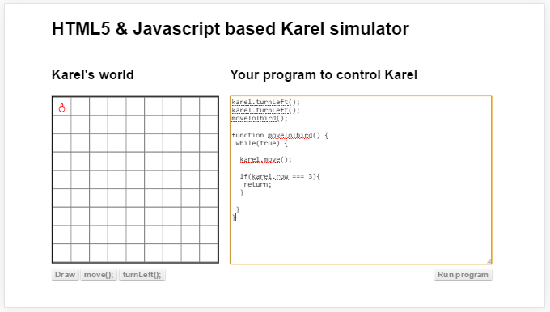

#ഫങ്ഷൻ (`Function`)
നമ്മുടെ കരെല്‍ വലതു വശത്തേക്ക് തിരിയണം എന്ന് വയ്ക്കുക. നമുക്ക് എങ്ങിനെ നിര്‍ദേശങ്ങള്‍ കൊടുക്കാം. നിങ്ങള്‍ക്ക് പ്രോഗ്രാമ്മറുടെ ചിന്താരീതി ഉണ്ടെങ്കില്‍ പെട്ടെന്ന്‍ തന്നെ പറയാന്‍ പറ്റും.

ഉത്തരം ലളിതം ആണ്. മൂന്ന് പ്രാവശ്യം ഇടത്തോട്ട് തിരിഞ്ഞാല്‍ വലത്തോട്ട് തിരിഞ്ഞപോലെയായി. 

അങ്ങനെ 3 ഇടത്തോട്ട് തിരിയാനുള്ള നിര്‍ദേശങ്ങള്‍ ആണ് വലത്തോട്ട് തിരിയാന്‍ ഉള്ളത് എന്ന് നമുക്ക് ഇപ്പോള്‍ അറിയാം. 2 കൊല്ലം കഴിഞ്ഞു വേറെ ഒരാള്‍ നമ്മള്‍ എഴുതിയ പ്രോഗ്രാം നോക്കുമ്പോള്‍ അയാള്‍ക്ക് ഒറ്റനോട്ടത്തില്‍അത് മനസിലായിക്കോളും എന്നില്ല, കുറച്ചു സമയം അയാള്‍ ചിന്തിച്ചാല്‍, അല്ലെങ്കില്‍ ഓരോ സ്റ്റെപ്പുകള്‍ ആയി എങ്ങിനെ പ്രോഗ്രാം പ്രവര്‍ത്തിക്കും എന്ന് നോക്കിയാല്‍ അയാള്‍ക്ക് മനസിലാകും. 

ഇത് ഒരു ചെറിയ ഉദാഹരണം മാത്രമാണ്. ശരിക്കും വലിയ പ്രോഗ്രാമുകള്‍ എഴുതുമ്പോള്‍ ഇതല്ല സ്ഥിതി. പുതിയ ആള്‍ കഠിനമായി പരിശ്രമിച്ചാലേ വല്ലതും മനസിലാകൂ. അപ്പോള്‍ അതിനു എന്താണ് ഒരു പ്രതിവിധി?

ഒരു കാര്യം അല്ലെങ്കില്‍ പൂര്‍ണമായ പ്രവൃത്തി ചെയ്യുന്ന നിര്‍ദേശങ്ങള്‍ എല്ലാം ഒരു കൂട്ടം ആയി വച്ചിട്ട് അതിനു അര്‍ത്ഥപൂര്‍ണമായ ഒരു പേരുകൊടുത്തു അത് ഒരു നിര്‍ദേശം ആക്കിയാല്‍ പോരെ? അങ്ങിനെ നിര്‍ദേശങ്ങളുടെ ഒരു കൂട്ടത്തെയാണ് ഫങ്ഷന്‍ എന്ന് പറയുന്നത്.

ഇവിടെ നോക്കുകയാണെങ്കില്‍, 3 ഇടത്തോട്ട് തിരിയാനുള്ള നിര്‍ദേശങ്ങളെ ചേര്‍ത്തു വലത്തോട്ട് തിരിയാനുള്ള ഒരു ഫങ്ഷന്‍ ഉണ്ടാക്കാം. ഫങ്ഷന്‍ പിന്നെ ഒരു നിര്‍ദേശം പോലെ ഉപയോഗിക്കാം. ആ വലത്തോട്ട് തിരിയാനുള്ള നിര്‍ദേശം ഭാവിയില്‍ വരുന്ന പ്രോഗ്രാമ്മര്‍ നോക്കുമ്പോള്‍ അയാള്‍ക്ക് എളുപ്പം അര്‍ത്ഥം മനസിലാക്കാന്‍ പറ്റും.

##ഫങ്ഷന്‍ വിളിക്കുന്ന രീതി

ഇടത്തോട്ട് തിരിയാന്‍ ഉള്ള ഫങ്ഷന്‍ നമുക്ക് രണ്ടു രീതിയില്‍ പ്രവര്‍ത്തിപ്പിക്കാം.വെറുതെ `turnLeft()` എന്ന് പറയാം അല്ലെങ്കില്‍ `karel.turnLeft()` എന്നും പറയാം. പക്ഷെ നമ്മള്‍ ഇപ്പോള്‍ ഉണ്ടാക്കിയ `turnRight()` എന്ന ഫങ്ഷന്‍ `karel.turnRight()` എന്ന് പറഞ്ഞു വിളിച്ചാല്‍ പ്രവര്‍ത്തിക്കില്ല. കാരണം നമ്മള്‍ ഉണ്ടാക്കിയ ഫങ്ഷന്‍ കരെലിന്റെ അല്ല. കരെലിനു ഇപ്പോള്‍ആകെ രണ്ടേ രണ്ടു നിര്‍ദേശങ്ങളെ അറിയൂ. വേണമെങ്കില്‍ നമ്മള്‍ ഇപ്പോള്‍ ഉണ്ടാക്കിയ ഫങ്ഷന്‍ കരെലിനോട് ചേര്‍ക്കാം. അതിനുള്ള വഴിയാണ് താഴെ കൊടുത്തിരിക്കുന്നത്.

ഇവിടെയുള്ള പ്രധാന വ്യത്യാസം,`turnRight` ഫങ്ഷന്‍ കരെല്‍ എന്ന ഒബ്ജെക്റ്റില്‍ ചേര്‍ത്തതിനു ശേഷം മാത്രമേ അതിനെ വിളിക്കാവൂ എന്നതാണ്. അല്ലെങ്കില്‍ ഫങ്ഷന്‍ കാണാനില്ല എന്ന് പറഞ്ഞുകൊണ്ടുള്ള മെസ്സേജ് വരും. പിന്നീടു ഉള്ള നിര്‍ദേശങ്ങള്‍ പ്രവര്‍ത്തിക്കുകയും ഇല്ല.
##ഫങ്ഷനെ ചരത്തില്‍ സൂക്ഷിക്കാം
ഒരു ഫങ്ഷന്‍ ഉണ്ടാക്കിയിട്ട് അതിനെ ഒരു ചരത്തില്‍ സൂക്ഷിക്കാം. അതുപോലെ ആ ചരം ഉപയോഗിച്ച് ഫങ്ഷനെ വിളിക്കുകയും ചെയ്യാം. ആ ചരത്തില്‍ വേറെ ഫങ്ഷന്‍ വച്ചാല്‍ പിന്നീടു അതെ ചരം ഉപയോഗിച്ച് ഫങ്ഷന്‍ വിളിക്കുമ്പോള്‍ ആ സമയം ഏതു ഫങ്ഷന്‍ ആണോ ചരത്തില്‍ ഉള്ളത് ആ ഫങ്ഷന്‍ ആയിരിക്കും പ്രവര്‍ത്തിക്കുക.

ഇവിടെ ആദ്യം ഒരു ഫങ്ഷന്‍ ആണ് ഉണ്ടാക്കിയിരിക്കുന്നത്. അതിനു ശേഷം പ്രോഗ്രാം പ്രവര്‍ത്തിക്കുന്ന സമയത്തെ സെക്കന്റ്‌ എടുത്തു `currentSecond` എന്ന ചരത്തില്‍
 വച്ചു.എന്നിട്ട് അത് ഒരു ഇരട്ടസംഖ്യ ആണോ എന്ന് നോക്കുന്നു. ആണെങ്കില്‍ `operation` എന്ന ചരത്തില്‍ `turnLeft` എന്ന ഫങ്ഷന്‍ വച്ചു. `currentSecond` ഒറ്റ സംഖ്യ ആണെങ്കില്‍ `turnRight` എന്ന ഫങ്ഷന്‍ ആണ് വെക്കുന്നത്. എന്നിട്ട് `operation` എന്ന ചരത്തില്‍ ഉള്ള ഫങ്ഷനെ പ്രവര്‍ത്തിപ്പിച്ചു. ഏതു ഫങ്ഷന്‍ ആണ് പ്രവര്‍ത്തിക്കുക എന്ന് പ്രോഗ്രാം പ്രവര്‍ത്തിക്കുന്ന സമയത്തെ സെക്കന്റ്‌ ആണ് തീരുമാനിക്കുന്നത്.
 % എന്ന ചിഹ്നം എങ്ങിനെയാണ്‌ പ്രവര്‍ത്തിക്കുന്നത് എന്ന് മുന്‍പത്തെ അദ്ധ്യായത്തില്‍ കണ്ടതാണല്ലോ. ഇരട്ട സംഖ്യ ആണെങ്കില്‍ 2 കൊണ്ട് ഹരിക്കുമ്പോള്‍ ശിഷ്ടം 0 ആയിരിക്കും.

##ഫങ്ഷന്‍റെ സ്വഭാവനിയന്ത്രണം
ഇംഗ്ലീഷില്‍ ഫങ്ഷനിലേക്ക് പരാമെറ്റര്‍ കൊടുക്കുക എന്ന് പറയും. മുകളില്‍ പറഞ്ഞപോലെ ഒരു ഫങ്ഷന്‍ എഴുതിയാല്‍ അത് ഒരു കാര്യം ഒരേ പോലെയാണ് എപ്പോള്‍ വിളിച്ചാലും ചെയ്യുക. വിളിക്കുന്നതിനു അനുസരിച് ചെയ്യുന്ന കാര്യത്തിന്‍റെ സ്വഭാവം കുറച്ചു മാറ്റണം എന്നുണ്ടെങ്കില്‍ നമുക്ക് വിളിക്കുമ്പോള്‍ പരാമെറ്റര്‍ ആയി വിവിധ ഡാറ്റകള്‍/ചരങ്ങള്‍ കൊടുക്കാം.

നിത്യജീവിതത്തിലെ ഒരു ഉദാഹരണത്തിലെക്ക് വരാം. നമ്മള്‍ ചായക്കടയില്‍ പോയി അവിടെയുള്ള സപ്ലൈ ചെയ്യുന്ന ആളോട് ചായ എന്ന് പറയുന്നു. വെറുതെ ചായ എന്ന് പറഞ്ഞാല്‍ അത് എങ്ങിനെ ഉണ്ടാക്കണം എന്നുള്ള നിര്‍ദേശങ്ങള്‍ അവിടെ  അടുക്കളയില്‍ ചായ ഉണ്ടാക്കുന്ന ആള്‍ക്ക് അറിയാം. അതുപോലെ ചായ ഉണ്ടാക്കി നമുക്ക് കിട്ടും. ഇതിനെ നമുക്ക് ഒരു ഫങ്ഷന്‍ ആയി പരിഗണിക്കാം.

ഇനി കടുപ്പം ഉള്ള ഒരു ചായ വേണമെങ്കില്‍ അയാളോട് ഒരു ചായ കടുപ്പത്തില്‍ എന്ന് പറഞ്ഞാല്‍ മതി. അതുപോലെ ചായ മധുരം കുറച്ചു എന്ന് പറഞ്ഞാല്‍ മധുരം കുറഞ്ഞ ചായ കിട്ടും. ഇപ്പോള്‍ എന്തായി? ഫങ്ഷന്‍ ആയ ചായ ഉണ്ടാക്കല്‍ എന്നാ പ്രക്രിയയുടെ സ്വഭാവം കുറച്ചു മാറ്റി. അതിനു നമ്മള്‍ കടുപ്പം അല്ലെങ്കില്‍ മധുരം തുടങ്ങിയ പരാമെറ്ററുകള്‍ അത് പ്രാവര്‍ത്തികമാക്കുന്നതിനു മുന്പ് അത് പ്രവര്‍ത്തിപ്പിക്കുന്ന ആളോട് പറഞ്ഞു. അപ്പോള്‍ ആ ഫങ്ഷന്‍റെ പ്രവര്‍ത്തന രീതി കുറച്ചു മാറി നമുക്ക് വേണ്ട ചായ കിട്ടി.എന്നാല്‍ അടിസ്ഥാനപരമായി ചെയ്യുന്ന കാര്യം മാറിയിട്ടും ഇല്ല.

മുകളിലെ പ്രോഗ്രാമില്‍ എന്താണ് നടക്കുന്നത് എന്ന് നോക്കാം.ആദ്യത്തെ രണ്ട് നിര്‍ദേശങ്ങള്‍ പരിചിതമാണ്. അവ പ്രവര്‍ത്തിച്ചു കഴിയുമ്പോള്‍ കരെല്‍ താഴേക്കുള്ള ദിശയിലേക്ക് ആയിരിക്കും ഇരിക്കുക. പിന്നെയാണ് നമ്മള്‍ ഉണ്ടാക്കിയ `walk` എന്ന ഫങ്ഷന്‍ പ്രവര്‍ത്തിപ്പിക്കാനുള്ള നിര്‍ദേശം വരുന്നത്. ബ്രാക്കറ്റില്‍ 3 എന്ന് കൊടുതിരിക്കുന്നതുകൊണ്ട് ഫങ്ഷന്‍ പ്രവര്‍ത്തിച്ചു തുടങ്ങുമ്പോള്‍ 3 എന്ന ഡാറ്റയായിരിക്കും `steps` എന്ന ചരത്തില്‍ ഉണ്ടാകുക.

ഫങ്ഷന് ഉള്ളില്‍ ഒരു ലൂപ്പ് ആണ് ഉള്ളത്. ലൂപ്പ് എങ്ങിനെയാണ്‌ പ്രവര്‍ത്തിക്കുക എന്ന് മുന്‍പത്തെ അദ്ധ്യായത്തില്‍ കണ്ടതാണല്ലോ. `count` എന്ന ചരം ഉപയോഗിച്ച് `steps` എന്ന ചരത്തിലെ ഡാറ്റ എത്രയാണോ അത്രയും തവണ കരെലിനെ മുന്‍പോട്ട് ഓരോ കളം ചലിപ്പിക്കുന്നു. `for` ലൂപ്പ് ഉപയോഗിച്ചത് ഒരു വരിയില്‍ തന്നെ ലൂപ്പിന് ആവശ്യമായ എല്ലാം എഴുതാം എന്നുള്ളത് കൊണ്ടാണ്. വയില്‍ ലോപ്പ് വേണമെങ്കിലും ഉപയോഗിക്കാം.

മുന്‍പേ പറഞ്ഞപോലെ ഫങ്ഷന്‍ എന്നത് നിര്‍ദേശങ്ങളുടെ ഒരു കൂട്ടം ആണ്. അതില്‍ ഏതു നിര്‍ദേശങ്ങളും വരാം. ഇവിടെ ഒരു ലൂപ്പ് ആണ്. വേണമെങ്കില്‍ താരതമ്യനിര്‍ദേശങ്ങള്‍ ആയ ഇഫ്, സ്വിച്ച് എന്നിവ ഉപയോഗിക്കാം.അതുപോലെ ഒരു ഫങ്ഷന് ഉള്ളില്‍ നിന്നും വേറെ ഫങ്ഷന്‍ വിളിക്കാം. 

## പരാമെറ്റര്‍ (`Parameter`)കോപ്പി

പരാമെറ്റര്‍ ഉപയോഗിക്കുമ്പോള്‍ ശ്രദ്ധിക്കേണ്ട ഒരു പ്രധാന വസ്തുതയാണ് ഫങ്ഷന്‍റെ ഉള്ളിലേക്ക് കൊടുക്കുമ്പോള്‍ ഉള്ള അതിന്‍റെ കോപ്പിയെടുക്കല്‍. ഫങ്ഷന് ഉള്ളില്‍ വച്ച് പരാമെറ്ററിന്റെ ഡാറ്റ മാറ്റിയാലും അത് വിളിച്ച സ്ഥലത്തെ ഡാറ്റ മാറുകയില്ല. ഒരു ഉദ്ദാഹരണം താഴെ കൊടുക്കുന്നു.

മുകളില്‍ കൊടുത്ത പ്രോഗ്രാമില്‍ 10 എന്നായിരിക്കും മെസ്സേജ് വരിക.കാരണം a എന്ന ചരം ഫങ്ഷന് പുറത്തു ഉണ്ടാക്കി ഫങ്ഷനിലേക്ക് കൊടുത്തിരിക്കുകയാണ്. ഫങ്ഷന് അകത്തു വരുമ്പോള്‍ അത് പുതിയ ചരം ആയിട്ടാണ് കണക്കാക്കുക. എന്നിട്ട് അതിലേക്ക് 10 എന്ന ഡാറ്റ കോപ്പി ചെയ്യും. അങ്ങനെ വരുമ്പോള്‍ ഫങ്ഷന് അകത്തുള്ള `a` എന്ന ചരത്തില്‍ സങ്കലനം കഴിഞ്ഞു കിട്ടുന്ന തുകയായ 15 വയ്ക്കുമ്പോള്‍ അത് ഒരിക്കലും പുറത്തു ഉള്ള a എന്ന ചരത്തെ ബാധിക്കുകയില്ല.ഇങ്ങനെയുള്ള സന്ദര്‍ഭങ്ങളില്‍ റിട്ടേണ്‍ എന്ന സൂചകപടം ആണ് ഉപയോഗിക്കേണ്ടത്. റിട്ടേണ്‍ എന്ന സൂചകപടം ഫങ്ഷനില്‍ നിന്നും ഡാറ്റ പുറത്തെത്തിക്കാന്‍ ഉപയോഗിക്കുന്ന സങ്കേതമാണ്.

## ഫങ്ഷന്‍റെ പരാമെറ്റര്‍ ആയി മറ്റൊരു ഫങ്ഷന്‍

ഒരു ഫങ്ഷനിലേക്ക് നമ്പര്‍ അതുപോലെവാചകങ്ങള്‍ 
കൊടുക്കുന്നതുപോലെഫങ്ഷനേയും കൊടുക്കാം.

##ഫങ്ഷന്‍റെ മറുപടി / വരവ് (റിട്ടേണ്‍) 

ഒരു ഫങ്ഷന് അതിന്‍റെ പ്രവര്‍ത്തനഫലമായി ഉണ്ടാകുന്ന ഡാറ്റ അതിനു പുറത്തേക്കു അഥവാ അതിനെ വിളിച്ചവര്‍ക്ക് പ്രതിഫലമായി കൊടുക്കാനുള്ള വഴിയാണ് `return` സൂചക പദം. ഈ സൂചകപദം ഫങ്ഷന്‍റെ പ്രവര്‍ത്തനം നിറുത്താനും ഉപയോഗിക്കാം. എന്തെങ്കിലും തിരികെ കൊടുക്കണം എന്ന് ഒരു നിര്‍ബന്ധവും ഇല്ല.

താഴെ കൊടുത്തിരിക്കുന്നത് ഫങ്ഷന്‍റെ പ്രവര്‍ത്തനം കഴിഞ്ഞുണ്ടായ ഉത്തരം പുറത്തേക്കു കൊടുക്കുന്ന ഉദാഹരണമാണ്‌.

ഇവിടെ `a` എന്ന ചരത്തില്‍ 10ഉം `b` എന്ന ചരത്തില്‍ 5ഉം ആണ് ഉള്ളത്. ഇവയാണ് `add` എന്ന ഫങ്ഷനിലേക്ക് കൊടുക്കുന്നത്. ഫങ്ഷന്‍ അവ തമ്മില്‍ കൂട്ടി ഉത്തരം മറുപടിയായി നല്‍കുന്നു. അത് വന്നു ചേരുന്നത് `sum` എന്ന ചരത്തിലാണ്. അപ്പോള്‍ അതിനുള്ളിലെ ഡാറ്റ 15 ആകുന്നു. അടുത്ത വരിയില്‍ അതെടുത്തു മെസ്സേജ് ആയി കാണിക്കുന്നു.

ഒരു ഫങ്ഷന് ഒരു മറുപടിമാത്രമേ നല്‍കാന്‍ കഴിയൂ. ഒന്നില്‍കൂടുതല്‍ ഡാറ്റകള്‍ മറുപടിയായി തിരിച്ചു വേണമെങ്കില്‍ ഒബ്ജെക്റ്റെന്ന സങ്കേതം ഉപയോഗിക്കണം. അത് ഇനി വരുന്ന അദ്ധ്യായത്തില്‍ കാണാം.

ഇനിയിപ്പോള്‍ എന്തെങ്കിലും മറുപടി കൊടുക്കാന്‍ ഇല്ലെങ്കില്‍പോലും റിട്ടേണ്‍ എന്ന സൂചകപദം ഉപയോഗിക്കാം. അപ്പോള്‍ അത് ഫങ്ഷന്‍റെ പ്രവര്‍ത്തനം നിറുത്തി ഫങ്ഷനെ വിളിച്ച സ്ഥലത്തേക്ക് പോകുന്നു. എന്നിട്ട് അതിനു ശേഷമുള്ള നിര്‍ദേശങ്ങള്‍ സാധാരണപോലെ പ്രവര്‍ത്തിപ്പിക്കും.

## ഫങ്ഷന്‍റെ മറുപടിയായി മറ്റൊരു ഫങ്ഷന്‍
ഒരു ഫങ്ഷനിലേക്ക് മറ്റൊരുഫങ്ഷന്‍ കൊടുക്കാന്‍ പറ്റുന്നതുപോലെ ഫങ്ഷനില്‍ നിന്നും മറ്റൊരു ഫങ്ഷന്‍ മറുപടിയായികൊടുക്കുവാനും
കഴിയും.

##ഫങ്ഷനില്‍ നിന്നും തിരിച്ചുവരവ്‌

ഇവിടെ എന്താണ് നടക്കുന്നത് എന്ന് നോക്കാം. ആദ്യം തന്നെ കരെലിനെ രണ്ട് പ്രാവശ്യം ഇടത്തോട്ട് തിരിക്കുന്നു. സാധാരണയായി പ്രോഗ്രാം തുടങ്ങുമ്പോള്‍ കരെല്‍ ആദ്യത്തെ നിരയില്‍ മുകളിലേക്ക് നോക്കിയിരിക്കുന്നത് കൊണ്ടാണ് ഇത് വേണ്ടി വരുന്നത്. അതിനുശേഷം `moveToThird` എന്ന ഫങ്ഷന്‍ പ്രവര്‍ത്തിപ്പിച്ചിരിക്കുന്നു. 
ഫങ്ഷന് ഉള്ളില്‍ എന്താണ് നടക്കുന്നത്. ആദ്യം തന്നെ ഒരു അനന്തലൂപ്പ് ആണ്. അതായത് താരതമ്യം ഇല്ലാതെ അതിനുള്ളിലെ നിര്‍ദേശങ്ങള്‍ അനന്തമായി ആവര്‍ത്തിച്ചുകൊണ്ടിരിക്കും. പക്ഷെ ഇവിടെ ലൂപ്പിനുള്ളില്‍ കരെലിനെ ഒരു കളം മുന്‍പോട്ടു നീക്കിയിട്ട് താരതമ്യം ചെയ്യുന്നുണ്ട്. കരെല്‍ ഇരിക്കുന്ന നിര 3 ആണെങ്കില്‍ റിട്ടേണ്‍ എന്ന സൂചകപദം ഉപയോഗിച്ച് ഫങ്ഷന് വെളിയിലേക്ക് പോകാനുള്ള നിര്‍ദേശം. അത് ഉള്ളതുകൊണ്ട് കരെല്‍ 3 ആമത്തെ നിരയില്‍ എത്തുമ്പോള്‍ ഫങ്ഷന് വെളിയില്‍ വരും. അങ്ങനെ നമ്മുടെ പ്രോഗ്രാമിന്‍റെ പ്രവര്‍ത്തനം സാധാരണ ഗതിയില്‍ അനന്തമായി പോകുകയില്ല.

പക്ഷെ അത് ചില സാഹചര്യങ്ങളില്‍ നടക്കില്ല. കാരണം നമ്മള്‍ ഇവിടെ വലിയ ഒരു മുന്‍വിധി നടത്തിയിട്ടുണ്ട്. പ്രോഗ്രാം തുടങ്ങുമ്പോള്‍ കരെല്‍ ആദ്യത്തെ നിരയില്‍ മുകളിലേക്ക് ആയിരിക്കും ഇരിക്കുക എന്ന്. സന്ദര്‍ഭവശാല്‍ നമ്മുടെ പ്രോഗ്രാം പ്രവര്‍ത്തിച്ചു തുടങ്ങുമ്പോള്‍ കരെല്‍ ആദ്യത്തെ നിരയില്‍ വലത്തോട്ട് തിരിഞ്ഞു ആണ് ഇരിക്കുന്നത് എന്ന് കരുതുക. അപ്പോള്‍ എന്ത് സംഭവിക്കും?

കരെല്‍ രണ്ട് പ്രാവശ്യം ഇടത്തോട്ട് തിരിയും. അതില്‍ കുഴപ്പമില്ല. പിന്നെ മുന്‍പോട്ടു പോകാന്‍ ശ്രമിക്കുമ്പോള്‍ പറ്റുകയില്ല. ഒരു മെസ്സേജ് വരും. നമ്മള്‍ മെസ്സേജ് വരുന്ന വിന്‍ഡോ കളഞ്ഞാലും നമ്മുടെ പ്രോഗ്രാം പിന്നെയും മുന്‍പോട്ടു പോകാന്‍ ശ്രമിക്കും. വീണ്ടും മെസ്സേജ്, വീണ്ടും മുന്‍പോട്ടു പോകാനുള്ള ശ്രമം. അങ്ങനെ അനന്തമായി പ്രോഗ്രാം പ്രവര്‍ത്തിക്കും.

ഇവിടെയാണ് പ്രോഗ്രമെഴുത്ത് ബുദ്ധിമുട്ടാകുന്നത്. അല്ലെങ്കില്‍ പ്രോഗ്രാമ്മര്‍ക്ക് സാധാരണയില്‍ കവിഞ്ഞ ബുദ്ധി വേണ്ടി വരുന്നത്. അല്ലെങ്കില്‍ കാര്യങ്ങള്‍ മുന്‍കൂട്ടി കാണാനുള്ള കഴിവ് വേണ്ടത്. നമ്മള്‍ പ്രോഗ്രാം എഴുതുമ്പോള്‍ ഏതൊക്കെ സാഹചര്യങ്ങള്‍ ആണോ നേരിടേണ്ടി വരിക അതൊക്കെ മുന്‍കൂട്ടി കണ്ടു അപ്പോള്‍ ഒക്കെ എങ്ങിനെ നമ്മുടെ പ്രോഗ്രാം പ്രതികരിക്കണം എന്ന് എഴുതി വയ്ക്കണം. അല്ലെങ്കില്‍ നമ്മുടെ ഉപയോക്താക്കള്‍ക്ക് പ്രോഗ്രാം ഉപയോഗശൂന്യമയിരിക്കും.
പ്രോഗ്രമെഴുത്ത് മാത്രമല്ല, എവിടെയൊക്കെ നമ്മള്‍ക്ക് വിജയിക്കണോ അവിടെയൊക്കെ നമ്മള്‍ സാധാരണ ആളുകള്‍ ചിന്തിക്കുന്നതില്‍ നിന്നും കുറച്ചുകൂടി മുന്‍പോട്ടു ചിന്തിക്കണം. ഒരു കമ്പനി അതിന്‍റെ ഭാവി പരിപാടികള്‍ അതുപോലെ ഉല്‍പ്പന്നങ്ങള്‍ തീരുമാനിക്കുമ്പോഴും, ചെസ് കളിയില്‍ ഒരു കരു നീക്കുമ്പോഴും ഒക്കെ നമ്മള്‍ എങ്ങിനെയാണോ ഭാവിയില്‍ വരാന്‍ സാധ്യതയുള്ള അവസ്ഥകള്‍ അഥവാ റിസ്ക്‌ ചിന്തിക്കുന്നത് അതുപോലെതന്നെ പ്രോഗ്രാം എഴുതുമ്പോഴും ചിന്തിക്കണം.

ഇത് സാധാരണക്കാരന്‌ പറ്റിയ പണിയല്ല എന്ന് തീരുമാനിക്കാന്‍ ഇത് ഒരു കാരണമല്ല.ഒരു വ്യത്യാസം ഉണ്ട്.
പ്രോഗ്രമെഴുത്തില്‍ തീരുമാനമെടുക്കുന്നതും ബാക്കിയുള്ള സ്ഥലങ്ങളില്‍ തീരുമാനം എടുക്കുന്നതും തമ്മിലുള്ള വ്യത്യാസം പ്രോഗ്രാം എഴുതുമ്പോള്‍ എടുക്കുന്ന തീരുമാനം തെറ്റാണെങ്കില്‍ നമുക്ക് അത് പ്രോഗ്രാം ഗുണമേന്മ പരിശോദന(`test`) ചെയ്യുമ്പോള്‍ കണ്ടു പിടിക്കാം. എന്നിട്ട് തിരുത്താം. പക്ഷെ ഒരു കമ്പനി തീരുമാനം തെറ്റിയാല്‍ കമ്പനി പൂട്ടിപ്പോകാം അതുപോലെ ചെസിലെ തെറ്റായ നീക്കം കളി തന്നെ തോല്‍പ്പിക്കാം.

അപ്പോള്‍ ശ്രദ്ധിക്കേണ്ട സംഗതി, നമ്മള്‍ എന്ത് പ്രോഗ്രാം എഴുതിയാലും അത് ഉപയോഗിച്ച് തുടങ്ങുന്നതിനു മുന്‍പ് അതിന്‍റെ ഗുണമേന്മ നന്നായി പരിശോദിച്ചിരിക്കണം
