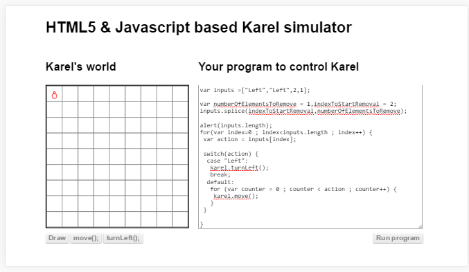

#വിവിധ തരം ഫങ്ഷനുകള്‍

രണ്ടു തരത്തിലുള്ള ഫങ്ഷനുകള്‍ ഉണ്ട്. ഒന്ന് നമ്മള്‍ പ്രോഗ്രാം എഴുതുന്നവര്‍ ഉണ്ടാക്കുന്നതും, അടുത്തത് പ്രോഗ്രാമ്മിംഗ്  ഭാഷയില്‍ മുന്‍കൂട്ടി ഉള്ളതും.

##യൂസര്‍ ഫങ്ഷന്‍

ഇതാണ് മുന്‍പത്തെ അദ്ധ്യായത്തില്‍ കൊടുത്തിട്ടുള്ള ജാവാസ്ക്രിപ്റ്റ് പ്രോഗ്രാം എഴുതുന്ന യൂസര്‍ ആകുന്ന നമ്മള്‍ ഉണ്ടാക്കുന്ന ഫങ്ഷനുകള്‍. ഇങ്ങനെ നമ്മള്‍ ഉണ്ടാക്കിയ ഫങ്ഷനുകള്‍ക്കും പരാമെറ്ററുകള്‍ എടുത്ത് സ്വഭാവം നിയന്ത്രിക്കാം. 

##സിസ്റ്റം ഫങ്ങ്ഷന്‍

ഈ ഫങ്ഷനുകള്‍ നമുക്ക് വിളിക്കാന്‍ ആയി ഭാഷയില്‍ തന്നെ ഉള്ളതാണ്. കമ്പ്യൂട്ടര്‍ നമുക്ക് വേണ്ടി സ്വന്തമായി കണ്ടു പിടിച്ചതൊന്നും അല്ല മുന്‍കൂട്ടി അവിടെയുണ്ട് എന്ന് പറയുമ്പോള്‍. അത് ആ ഭാഷയിലുള്ള പ്രോഗ്രാം പ്രവര്‍ത്തിപ്പിക്കാന്‍ വേണ്ട പ്രോഗ്രാം അതായത് ജാവാസ്ക്രിപ്റ്റ് എടുത്താല്‍ബ്രൌസര്‍ ഉണ്ടാക്കിയ  പ്രോഗ്രാം എഴുത്തുകാര്‍ എഴുതി വച്ചിരിക്കുന്നതാണ്. മുന്‍പേ പറഞ്ഞപോലെ കമ്പ്യൂട്ടര്‍ സ്വന്തമായി ചിന്താശേഷി ഇല്ലാത്ത ഒരു യന്ത്രം മാത്രമാണ്.

## രണ്ടു തരം സിസ്റ്റം ഫങ്ഷനുകള്‍

രണ്ടു തരം സിസ്റ്റം ഫങ്ഷനുകള്‍ ഉണ്ട്. ജാവാസ്ക്രിപ്റ്റ് എന്ന ഭാഷയില്‍ ഉള്ളവയും. അതുപോലെ അത് എവിടെ പ്രവര്‍ത്തിക്കുന്നു എന്നതിനനുസരിച്ച് ഉപയോഗിക്കാവുന്ന ഫങ്ഷനുകളും. 
###ഭാഷയില്‍ ഉള്ള സിസ്റ്റം ഫങ്ഷനുകള്‍

വാചകങ്ങളെ മാറ്റിമറിക്കാന്‍ ഉപയോഗിക്കുന്ന ഫങ്ഷനുകള്‍ ഭാഷയില്‍ ഉള്ളതാണ്. അതുപോലെ അറയില്‍ എന്തെങ്കിലും ചെയ്യാന്‍ ഉപയോഗിക്കുന്ന ഫങ്ഷനുകളും ഭാഷ തരുന്നതായിരിക്കും.
താഴെ കൊടുത്തിരിക്കുന്നത് നമ്മള്‍ മുന്‍പേ കണ്ട സ്പ്ലെസ് എന്ന സിസ്റ്റം ഫങ്ഷനാണ്. 

###പ്രവര്‍ത്തിക്കുന്ന സ്ഥലം അനുസരിച്ചുള്ള സിസ്റ്റം ഫങ്ഷനുകള്‍

നമ്മള്‍ മുന്‍പ് മെസ്സേജ് കാണിക്കാന്‍ ഉപയോഗിച്ച അലേര്‍ട്ട്  എന്ന ഫങ്ഷന്‍ ബ്രൌസര്‍ തരുന്നതാണ്. ഇതേ ജാവാസ്ക്രിപ്റ്റ്, നോഡ് ജെഎസ് എന്ന ടെക്നോളജി ഉപയോഗിച്ച് പ്രവര്‍ത്തിക്കുമ്പോള്‍ അലേര്‍ട്ട് എന്ന ഫങ്ഷന്‍ ഉപയോഗിക്കാന്‍ പറ്റില്ല.

എല്ലാ ഫങ്ഷന്‍ പേരുകളും ഓര്‍ത്ത് വയ്ക്കുക എന്നത് പ്രായോഗികമല്ല. അതുപോലെ അവ ഭാഷയില്‍ ഉള്ളതാണോ അല്ലയോ എന്നും ഓര്‍ത്തു വയ്ക്കാന്‍ ബുദ്ധിമുട്ടാണ്. സാധാരണ ചെയ്യേണ്ടത്, നമ്മള്‍ക്ക് എന്തെങ്കിലും ആവശ്യം വരുമ്പോള്‍ ഗൂഗിള്‍ നോക്കി ഫങ്ഷന്‍ കണ്ടുപിടിച്ചു ആവശ്യം പോലെ ഉപയോഗിക്കുകയാണ്. അപ്പോള്‍ നമ്മള്‍ എഴുതുന്ന ജാവാസ്ക്രിപ്റ്റ് പ്രോഗ്രാം എവിടെയാണോ പ്രവര്‍ത്തിക്കാന്‍ പോകുന്നത് അതിനു അനുസരിച്ചുള്ള ഫങ്ഷന്‍ എടുക്കണം എന്നേയുള്ളൂ. പിന്നെ കുറച്ചു കാലം കഴിയുമ്പോള്‍ ഏതൊക്കെ ഫങ്ഷനുകള്‍ ആണ് എവിടെയൊക്കെയാണ് ഉപയോഗിക്കേണ്ടത് എന്ന് ഒരു ധാരണ നമുക്ക് കിട്ടും.  