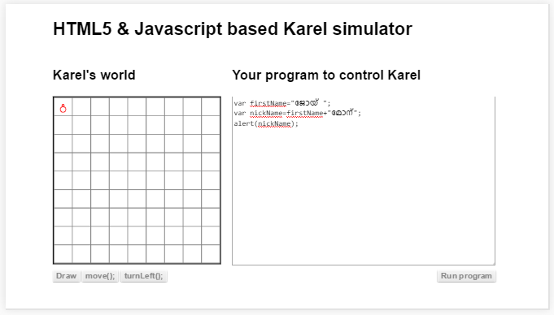
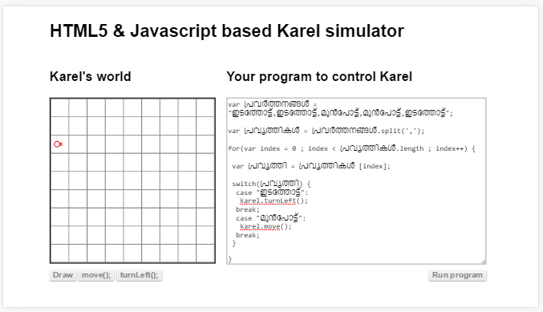

##വാചകകസര്‍ത്തുകള്‍

അക്ഷരങ്ങള്‍, വാക്കുകള്‍ അല്ലെങ്കില്‍ വാചകങ്ങള്‍ ഒക്കെ ചരങ്ങളില്‍ ആക്കി സൂക്ഷിക്കാം എന്ന് മുന്പ് കണ്ടല്ലോ. ഈ അദ്ധ്യായത്തില്‍ കൊടുത്തിരിക്കുന്നത് അവയെ എങ്ങിനെ  കൈകാര്യം ചെയ്യാം എന്നാണ്. ഭൂരിഭാഗം ചെയ്യുന്നത് ഫങ്ഷന്‍ എന്ന പ്രോഗ്രാമിംഗ് സങ്കേതം വച്ചിട്ടാണ്. അവയെല്ലാം ജാവാസ്ക്രിപ്റ്റ് ഭാഷ തന്നെ തരുന്നവയാണ്. അതായത് സിസ്റ്റം ഫങ്ഷനുകള്‍.

###വാചകങ്ങള്‍ കൂട്ടിയോജിപ്പിക്കല്‍
രണ്ടു വാചകങ്ങള്‍ തമ്മില്‍ കൂട്ടിയോജിപ്പിക്കാന്‍ + ചിഹ്നം ഉപയോഗിക്കാം. താഴെ കൊടുത്തിരിക്കുന്ന പ്രോഗ്രാം നോക്കുക. ഇത് നമ്മള്‍ മുന്‍പത്തെ അദ്ധ്യായത്തില്‍ സങ്കലനം പഠിച്ചപ്പോള്‍ കണ്ടതാണ്.

ഇവിടെ ആദ്യത്തേതിലേക്ക് രണ്ടാമത്തെത് കൂട്ടിച്ചേര്‍ത്തു അതിനെ തിരിച്ചു തരികയാണ്. ആദ്യത്തെ ചരത്തില്‍ ഉള്ള വാചകം മാറുന്നില്ല. തിരിച്ചു തരുന്ന വാചകം ഏത് ചരത്തില്‍ വേണെമെങ്കിലും സൂക്ഷിക്കാം. ആദ്യത്തേതും രണ്ടാമത്തേതും ചരങ്ങള്‍ ആണെങ്കില്‍ അവയിലേക്ക് വേണമെങ്കില്‍ തിരിച്ചു തരുന്ന വാചകം സൂക്ഷിക്കാം.

###വാചകങ്ങള്‍ മുറിക്കല്‍

സ്പ്ളിറ്റ് എന്ന ഫങ്ഷന്‍ ആണ് മുറിക്കുന്നതിനു വേണ്ടി ഉപയോഗിക്കുന്നത്. ഒരു ഉദ്ദാഹരണം താഴെ കൊടുത്തിരിക്കുന്നു.

###ഒരു അക്ഷരം എടുക്കാന്‍

ഒരു വാചകം അല്ലെങ്കില്‍ വാക്ക് എന്ന് പറയുന്നത് അക്ഷരങ്ങളുടെ അറയാണ്. ഒരു വാചകം ആണ് ചരത്തില്‍ ഇരിക്കുന്നത് എങ്കില്‍ അറയെ ലൂപ്പ് ചെയ്യുന്നതുപോലെ ലൂപ്പ് ചെയ്തു ഓരോ അക്ഷരങ്ങളും എടുക്കാം. അല്ലെങ്കില്‍ charAt() എന്ന ഫങ്ഷന്‍ ഉപയോഗിക്കാം. ഈ ഫങ്ഷന്‍ ഒരു ചരത്തിന്‍റെ അല്ലെങ്കില്‍ "" എന്ന ചിഹ്നങ്ങളുടെ ഇടയില്‍ ഇരിക്കുന്ന വാചകത്തിന്‍റെ കൂടെയാണ് ഉപയോഗിക്കേണ്ടത്.

താഴെ കൊടുത്തിരിക്കുന്ന ഉദാഹരണം ഒരു വാചകത്തില്‍ നിന്നും ചുരുക്കരൂപത്തില്‍ കൊടുത്തിട്ടുള്ള കരെലിനു വേണ്ട നിര്‍ദേശങ്ങള്‍ വലത്തുനിന്നും ഇടത്തോട്ട് എടുത്തു പ്രവര്‍ത്തിപ്പിക്കുകയാണ്. 

ഇവിടെ നമ്മുടെലൂപ്പ് തുടങ്ങുന്നത് വാചകത്തിന്‍റെ 'നീളം - 1' ഇല്‍ നിന്നാണ്. എന്നിട്ട് ഓരോ പടി കഴിയുമ്പോഴും കുറച്ചു കൊണ്ടുവരുന്നു. അറയില്‍ആദ്യത്തെ ഡാറ്റ ഇരിക്കുന്നത് 0 ആയതുകൊണ്ട് 0 വരെ ലൂപ്പ് പ്രവര്‍ത്തിക്കണം.

###വാചകത്തില്‍ തിരച്ചില്‍ നടത്താന്‍