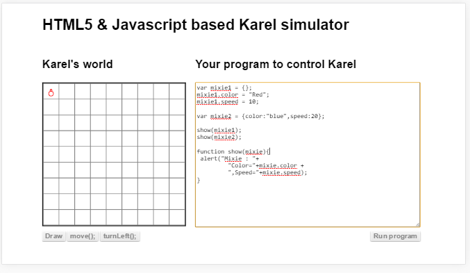
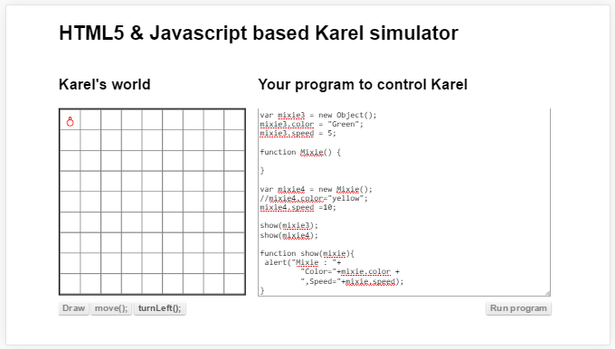
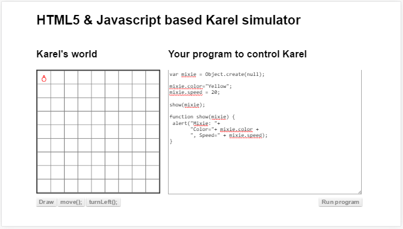
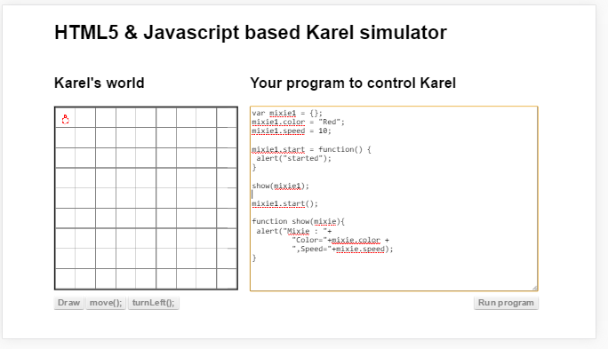

## നിര്‍മാണം - ലളിതമായ വഴി

മറ്റുള്ള ഭൂരിഭാഗം പ്രോഗ്രാമിംഗ് ഭാഷകളിലും ഒരു ഒബ്ജെക്റ്റ് ഉണ്ടാക്കണമെങ്കില്‍ കുറച്ചു പണിയാണ്. ആദ്യം അതിന്‍റെ ക്ലാസ്സ്‌ ഉണ്ടാക്കണം. എന്നിട്ട് `new` എന്ന സൂചകപദം ഉപയോഗിച്ച് മാത്രമേ ഒരു ചരത്തിലേക്ക് ഒരു ഒബ്ജെക്റ്റ് ഉണ്ടാക്കി ആ ഡാറ്റ വയ്ക്കാന്‍ പറ്റൂ. എന്നാല്‍ ജാവാസ്ക്രിപ്റ്റ് ആ കാര്യത്തില്‍ ക്ലാസ്സ്‌ ഉണ്ടാക്കണം എന്നൊന്നും നിര്‍ബന്ധം പിടിക്കുന്നില്ല. ചുമ്മാ ഒരു ചരത്തിലേക്ക് {} എന്ന് കൊടുത്താല്‍ ഒരു ഒബ്ജെക്റ്റ് ഉണ്ടായി അത് ചരത്തിലെ ഡാറ്റ ആയിട്ടുണ്ടാകും. പക്ഷെ അതിനു ഫങ്ഷനുകളോ അല്ലെങ്കില്‍ അതിന്‍റെ അവസ്ഥ വിവരിക്കാന്‍ വസ്തുവകകളോ ഉണ്ടായിരിക്കില്ല. താഴെ കൊടുത്തിരിക്കുന്ന പ്രോഗ്രാം നോക്കുക.

ഇവിടെ രണ്ടു തരത്തില്‍ ഒബ്ജെക്റ്റ് ഉണ്ടാക്കിയിരിക്കുന്നത് കാണാം. `mixie1` എന്ന ഒബ്ജെക്റ്റ് ഉണ്ടാക്കിയിരിക്കുന്നത് പടിപടിയായിട്ടാണ്.ആദ്യം ഒരു ആസ്തികള്‍ ഒന്നും ഇല്ലാത്ത ഒബ്ജെക്റ്റ് ഉണ്ടാക്കി. അതിനുശേഷം ഓരോ ആസ്തികള്‍ അഥവാ ഡാറ്റകള്‍ അതിനോട് ചേര്‍ത്തു.

പക്ഷെ `mixie2` എന്ന ഒബ്ജെക്റ്റ് നേരിട്ട് അതിന്‍റെ ആസ്തികളോടു കൂടിയാണ് ഉണ്ടാക്കിയിരിക്കുന്നത്. അങ്ങനെ ഉണ്ടാക്കാന്‍ ഉപയോഗിക്കുന്ന ചിഹ്നങ്ങള്‍ ആണ് {},: തുടങ്ങിയവ. ഡാറ്റ വാക്കോ വാചകമോ ആണെങ്കില്‍ "" ഉപയോഗിക്കാം. അതുപോലെ ആസ്തികള്‍ കൊടുക്കാന്‍ ചരവും ഉപയോഗപ്പെടുത്താവുന്നതാണ്.

## ന്യൂ/`new` എന്ന സൂചകപദം ഉപയോഗിച്ച്

ന്യൂ എന്ന സൂചകപദം ഉപയോഗിച്ചും നമുക്ക് പുതിയ ഒബ്ജെക്റ്റ് ഉണ്ടാക്കാം. അങ്ങനെയുള്ള ഉദാഹരണങ്ങള്‍ ആണ് താഴെ കൊടുത്തിരിക്കുന്നത്.

ആദ്യം കൊടുത്തിരിക്കുന്ന `mixie3` ഉണ്ടാക്കിയിരിക്കുന്നത് `Object()` ഉപയോഗിച്ചാണ്‌. `new Object()` എന്ന് പറയുന്നത് ജാവാസ്ക്രിപ്റ്റ് ഭാഷയിലെ അടിസ്ഥാന ഒബ്ജെക്റ്റ് ആണ്. അങ്ങനെ ഉണ്ടാക്കുന്ന ഒബ്ജെക്റ്റിനു ഡാറ്റ ഉണ്ടാകില്ല. ഡാറ്റ മുന്‍പ് നമ്മള്‍ കണ്ടതുപോലെ പിന്നീടു ചേര്‍ക്കണം.

## `Object.create()` ഫങ്ഷന്‍ ഉപയോഗിച്ച്
ഇവിടെ `create` എന്ന ഫങ്ഷന്‍ ഉപയോഗിച്ച് ആണ് പുതിയ ഒബ്ജെക്റ്റ് ഉണ്ടാക്കിയിരിക്കുന്നത്. അതിലേക്ക് `null` ആണ് കൊടുത്തിരിക്കുന്നത്. 

ഒരു ഒബ്ജെക്റ്റില്‍ നിന്നും മറ്റൊരു ഒബ്ജെക്റ്റ് ഉണ്ടാക്കാന്‍ ആണ് ഈ വഴി പ്രധാനമായി ഉപയോഗിച്ച് വരുന്നത്.

##ഒബ്ജെക്റ്റിലെക്ക് ഫങ്ഷന്‍ ചേര്‍ക്കാന്‍

മുന്‍പ് നമ്മള്‍ ഉപയോഗിച്ചുകൊണ്ടിരുന്ന കരെല്‍ ഒരു ഒബ്ജെക്റ്റ് ആണ്. അതിനു `row, col` തുടങ്ങിയ ഡാറ്റകള്‍ ഉള്ളതുപോലെ `turnLeft(), move()` എന്നിങ്ങനെ ഫങ്ഷനുകളും ഉണ്ടായിരുന്നു. നമ്മള്‍ `turnRight()` എന്നൊരു ഫങ്ഷന്‍ കൂട്ടിച്ചേര്‍ക്കുകയും ചെയ്തിട്ടുണ്ട്. അതുപോലെ ഫങ്ഷന്‍ ചേര്‍ക്കുന്ന ഒരു ഉദാഹരണമാണ്‌ താഴെ.

