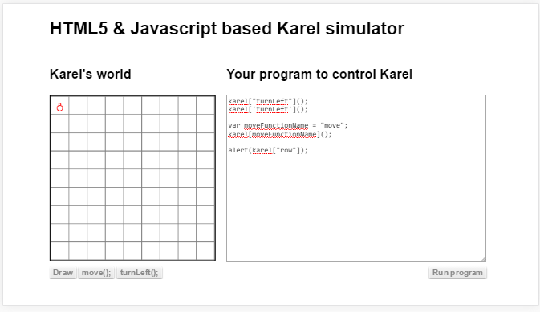

##ഒബ്ജെക്റ്റുകളെ ഉപയോഗിക്കുന്ന വിധം
ഒബ്ജെക്റ്റുകളെ എങ്ങിനെയൊക്കെ പ്രോഗ്രാമില്‍ ഉപയോഗിക്കാം എന്നതാണ് ഇവിടെ നമ്മള്‍ കാണാന്‍ പോകുന്നത്. താഴെ കൊടുത്തിരിക്കുന്നത് ഒബ്ജെക്റ്റില്‍ ഉള്ള ഡാറ്റയെ വിവിധ രീതിയില്‍ എടുക്കുന്നതാണ്.
### നേരിട്ട് പേര് കൊടുത്തു എടുക്കാം

ഇങ്ങനെ ഉപയോഗിക്കുമ്പോള്‍ ഉള്ള പ്രശ്നം ആസ്തികള്‍ക്ക് കൊടുക്കാവുന്ന പേരുകള്‍ക്ക് ചില പരിമിതികള്‍ ഉണ്ടെന്നാണ്.

മുകളില്‍ കൊടുത്തിട്ടുള്ള പ്രോഗ്രാം മുന്‍പത്തെ അദ്ധ്യായത്തില്‍ കണ്ടതാണ്. ഇവിടെ `karel` എന്ന ഒബ്ജെക്റ്റിന്‍റെ ആസ്തികളായ  രണ്ടു ഫങ്ഷനുകളെയും `row` എന്ന ഡാറ്റയേയും നേരിട്ട് പേര് ഉപയോഗിച്ച് ഉപയോഗപ്പെടുത്തിയിരിക്കുന്നു.

ഇനി ഇങ്ങനെ കുത്ത് (.) ഉപയോഗിച്ച് ആസ്തികളെ എടുക്കുമ്പോള്‍ ഉള്ള പരിമിതികള്‍ എന്താണെന്ന് നോക്കാം. 
* ആസ്തിയുടെ പേരില്‍ വിടവ് (സ്പേസ്) വരാന്‍ പാടില്ല
* ആസ്തിയുടെ പേര്‍ നമ്പര്‍ വച്ച് തുടങ്ങാന്‍ പറ്റില്ല
* ആസ്തിയുടെ പേരില്‍ - വരാന്‍ പറ്റില്ല

### അറപോലെ ഉപയോഗിക്കാം
ഇങ്ങനെ ഉപയോഗിക്കുമ്പോള്‍ നമുക്ക് ആസ്തികള്‍ക്ക് മുന്‍പേ കണ്ട പരിമിതികള്‍ ഇല്ലാതെ എന്ത് പേര് വേണമെങ്കിലും കൊടുക്കാം.താഴെ കൊടുത്തിരിക്കുന്ന പ്രോഗ്രാം ശ്രദ്ധിക്കുക. 

 

മുന്‍പ് കണ്ട പ്രോഗ്രാമില്‍ നേരിട്ട് പേര്‍ ഉപയോഗിച്ച് പ്രവര്‍ത്തിപ്പിച്ച ഫങ്ഷന്‍ ഇപ്പോള്‍ അറയില്‍ നിന്നും ഡാറ്റഎടുക്കുന്നത് പോലെയാണ് ഉപയോഗിച്ചിരിക്കുന്നത്. അങ്ങനെ ഉപയോഗിക്കുമ്പോള്‍ ആസ്തിയുടെ അല്ലെങ്കില്‍ ഫങ്ഷന്‍റെ പേര്‍ ഒരു വാചകം ആയാല്‍ മതി. ഒരു ചരത്തില്‍ ഉള്ള ഡാറ്റ ആസ്തിയുടെ പേരാണെങ്കില്‍ ആ ചരം വേണമെങ്കിലും ഉപയോഗിക്കാം.
###ഒബ്ജെക്റ്റിന്‍റെ ആസ്തികളുടെ പട്ടിക
ഇപ്പോള്‍ സ്വാഭാവികമായി ഒരു ചോദ്യം ഉയര്‍ന്നുവരാം. ഒരു ഒബ്ജെക്റ്റിന്‍റെ എല്ലാ ആസ്തികളും എങ്ങിനെ കണ്ടു പിടിക്കാം എന്ന്.

