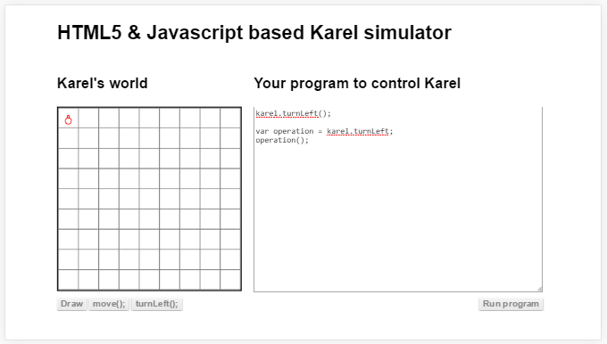

##`this` എന്ന മാജിക്‌

ഒരു ഒബ്ജെക്റ്റിനു അകത്തു ഉള്ള ഫങ്ഷനില്‍ നിന്നും അതെ ഒബ്ജെക്റ്റിന്റെ ഡാറ്റ ആയിട്ടുള്ള ആസ്തികള്‍ എടുക്കാന്‍ അതുപോലെ ഒബ്ജെക്റ്റിനു അകത്തു പ്രവര്‍ത്തിക്കുന്ന ഒരു ഫങ്ഷനില്‍ നിന്നും മറ്റുള്ള അതിനകത്ത് തന്നെയുള്ള ഫങ്ഷനുകളെ വിളിക്കാന്‍ഉപയോഗിക്കാവുന്ന സൂചകപദമാണ്‌ `this`. ഇതൊരു ചരം പോലെയാണ് ഉപയോഗിക്കുന്നത്. 

ലളിതമായി പറഞ്ഞാല്‍ ഫങ്ഷന്‍റെ അത് പ്രവര്‍ത്തിക്കുമ്പോള്‍ ഉള്ള ഉടമസ്ഥന്‍ എന്നു പറയാം. 

ഇത് മനസിലാവാന്‍ കുറച്ചു പ്രയാസം ഉണ്ടാകാം.ഇനിയും മനസിലാകാത്തവര്‍ക്ക് ഒരു ഉദ്ദാഹരണം താഴെ കൊടുക്കുന്നു. എടുക്കുന്ന ഉദ്ദാഹരണം `ATM` യന്ത്രത്തിന്‍റെ പ്രവര്‍ത്തനമാണ്. യന്ത്രത്തിന്റെ പണം പിന്‍വലിക്കല്‍, ബാലന്‍സ് നോക്കല്‍ ഒക്കെ ഓരോ ഫങ്ഷനുകള്‍ ആയി എടുക്കാം. വെറുതെ പിന്‍വലിക്കുക എന്ന് പറഞ്ഞാല്‍ അതിനു ചെയ്യാന്‍ കഴിയില്ല. അതിനു നമ്മള്‍ നമ്മുടെ പിന്‍ നമ്പര്‍ കൊടുക്കണം. അപ്പോള്‍ നമ്മളാണ് അല്ലെങ്കില്‍ നമ്മുടെ അക്കൗണ്ട്‌ ആണ് അവിടത്തെ സന്ദര്‍ഭത്തിന് അനുസരിച്ചുള്ള ഡാറ്റ. അങ്ങനെ ഒരു അക്കൗണ്ട്‌ അതിനു കിട്ടിയാല്‍, പിന്നെ അതിന്‍റെ ഫങ്ഷനുകള്‍ അതിനു ചെയ്യാന്‍ കഴിയും. വേറെ ആള്‍ വരുമ്പോള്‍ അതിന്‍റെ ഉടമസ്ഥന്‍ മാറുന്നു. പക്ഷെ ചെയ്യുന്ന പണി ഒന്നുതന്നെ.

ഇതുപോലെയാണ് ജാവസ്ക്രിപ്റ്റ് ഭാഷയിലെ ഫങ്ഷന്‍ അതിന്‍റെ സന്ദര്‍ഭത്തിന് ചേര്‍ന്ന ഡാറ്റയില്‍ മാറ്റങ്ങള്‍ വരുത്തുന്നത്. ഫങ്ഷനില്‍ `this` ഉപയോഗിക്കുന്നില്ലെങ്കില്‍ സന്ദര്‍ഭം അതിനു ഒരു പ്രശ്നവും ഇല്ല. 

ഫങ്ഷന്‍ പ്രവര്‍ത്തിക്കുന്ന സന്ദര്‍ഭത്തിന് അനുസരിച്ച് `this` എന്ന ചരത്തിന്റെ ഡാറ്റ മാറാം. ഒരു ഉദാഹരണം താഴെ.

###ആഗോള(`global`) `this`

സാധാരണ നമ്മള്‍ ഫങ്ഷന്‍ എഴുതുന്നത് ഒരു ഒബ്ജെക്റ്റിനു അകത്ത് അല്ല. അപ്പോള്‍ `this` എന്ന ചരത്തില്‍ ഡാറ്റ ഉണ്ടാകുമോ? അങ്ങനെയുണ്ടെങ്കില്‍ അതിനെ നമുക്ക് ആഗോള `this` എന്ന് വിളിക്കാം. താഴെ കൊടുത്തിരിക്കുന്ന പ്രോഗ്രാം അത് തെളിയിക്കുന്നു.
`
കോഡ് to ഗ്ലോബല്‍ this`

### സന്ദര്‍ഭം എങ്ങിനെ അനുയോജ്യമാക്കം 

ഒരു ഫങ്ഷന്‍ നമുക്ക് ഒരു ചരത്തില്‍ കിട്ടി എന്നിരിക്കട്ടെ. അതിനെ നമുക്ക് പ്രവര്‍ത്തിപ്പിക്കണം. അത് പ്രവര്‍ത്തിക്കാന്‍ ഒരു `this` ഒബ്ജെക്റ്റ് ആവശ്യമാണ്. അതിനു വേണ്ടിയുള്ള `this` എന്ന ഒബ്ജെക്റ്റ് എങ്ങിനെ കൊടുക്കാം?
അതിനുള്ള 2 വഴികളാണ് call() & apply() ഫങ്ഷനുകള്‍.