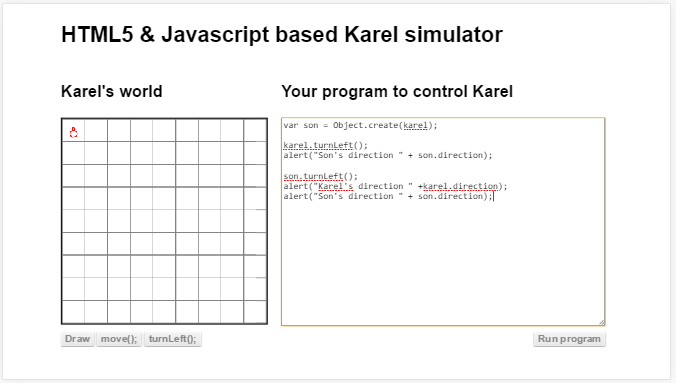

##പാരമ്പര്യം / `Inheritance`
പാരമ്പര്യം എന്ന് പറയുമ്പോള്‍ പിന്തുടര്‍ച്ചയായി നമുക്ക് / ഒബ്ജെക്റ്റിനു അതിന്‍റെ പിതാമഹന്മാരില്‍ നിന്നും കിട്ടുന്നകാര്യങ്ങള്‍ ആണ് ഇവിടെ അര്‍ത്ഥമാക്കുന്നത്. അതായത് ഒരു ഒബ്ജെക്റ്റ് മറ്റൊരു ഒബ്ജെക്റ്റില്‍ നിന്നും ഉണ്ടാക്കാന്‍ പറ്റിയാല്‍ അതിന്‍റെ ഗുണങ്ങള്‍ കിട്ടും എന്നതാണ് പിന്തുടര്‍ച്ചാവകാശം. 

ഒരു ഒബ്ജെക്റ്റില്‍ നിന്നും മറ്റൊരു ഒബ്ജെക്റ്റ് ഉണ്ടാക്കുന്നത് എങ്ങിനെയെന്ന് നോക്കാം.

ഇവിടെ പുതിയ `son` എന്ന ചരത്തിലെക്ക് പുതിയ ഒബ്ജെക്റ്റ് ഉണ്ടാക്കി വച്ചിരിക്കുന്നതാണ് ആദ്യ വരിയില്‍ ചെയ്തിരിക്കുന്നത്. ഒബ്ജെക്റ്റ് ഉണ്ടാക്കാന്‍ ഉപയോഗിച്ചിരിക്കുന്ന മാതൃകയാണ് `karel` എന്ന ഒബ്ജെക്റ്റ്. മാതൃകയില്‍ നിന്ന് ഡാറ്റയും ഫങ്ഷനും പുതിയ ഒബ്ജെക്റ്റിനും കിട്ടും.

അതിനു ശേഷം `karel` ഒബ്ജെക്റ്റിനെ ഇടത്തോട്ട് തിരിക്കാനുള്ള നിര്‍ദേശമാണ് നല്‍കിയിരിക്കുന്നത്. അത് ഇടത്തോട്ടു തിരിയും ഒപ്പം അതിന്‍റെ `direction` എന്ന ചരത്തിലെക്ക് പുതിയ ഡാറ്റ വയ്ക്കും. അതായത് പ്രോഗ്രാം തുടങ്ങുമ്പോള്‍ കരെല്‍ മുകളിലേക്ക് ആണെങ്കില്‍ `direction` 'N` ആയിരിക്കും. തിരിഞ്ഞതിനുശേഷം 'W` എന്ന ഡാറ്റയാകും.

`karel` ആണ് മാതൃക എന്നതുകൊണ്ട് പുതുതായി ഉണ്ടാക്കിയ ഒബ്ജെക്റ്റിനും പുതിയ `direction` ഡാറ്റ കിട്ടും. അങ്ങനെ വരുമ്പോള്‍ ആദ്യത്തെ മെസ്സേജ് ബോക്സില്‍ `W` എന്നായിരിക്കും കാണിക്കുക.

അതിനുശേഷം പുതിയ ഒബ്ജെക്റ്റ് ആയ `son` ന്‍റെ `turnLeft` വിളിച്ചിരിക്കുന്നു. അത് `son` എന്ന ചരത്തില്‍ ഇരിക്കുന്ന ഒബ്ജെക്റ്റിന്റെ `direction` മാറ്റും. പക്ഷെ `karel` ഒബ്ജെക്റ്റ് അപ്പോഴും `W` എന്ന് തന്നെയായിരിക്കും കാണിക്കുക. 

അവസാനത്തെ വരിയില്‍ പുതിയ ഒബ്ജെക്റ്റിന്റെ `direction` കാണിക്കുമ്പോള്‍ `s` എന്നായിരിക്കും കാരണം അതിന്‍റെ ഫങ്ഷന്‍ ആണ് മുന്‍പ് പ്രവര്‍ത്തിപ്പിച്ചത്. 

###മാതൃക അഥവാ പ്രോട്ടോടൈപ്പ് (`Prototype`)

മലയാളത്തില്‍ വേണമെങ്കില്‍ മാതൃകഎന്നോ അസ്സല്‍ എന്നോ മൂലരൂപം എന്നോ `prototype` എന്ന വാക്കിന്‍റെ അര്‍ത്ഥമാക്കിയെടുക്കം.
ഓരോ ഒബ്ജെക്റ്റിനും അതിന്‍റെതായ ഒരു `prototype` അഥവാ മാതൃകയുണ്ട്. അതില്‍ നിന്നും പുതിയ ഒബ്ജെക്റ്റ് ഉണ്ടാക്കിയാല്‍ അതിനും ഒരേ ഘടനതന്നെയുണ്ടാക്കും.അതുപോലെ പ്രോട്ടോടൈപ്പ് മാറ്റിയാല്‍ ഒബ്ജെക്റ്റിന്റെ ഘടനയും മാറും.

ഇങ്ങനെ ഒബ്ജെക്റ്റുകള്‍ ഉപയോഗിച്ച് പ്രോഗ്രാം എഴുതുന്ന രീതിയെ ആണ് ഒബ്ജെക്റ്റ് അധിഷ്ഠിത പ്രോഗ്രാമിംഗ് എന്ന് പറയുന്നത്.അതിനെക്കുറിച്ച് മാത്രം വേണമെങ്കില്‍ ഒരു പുസ്തകം എഴുതാം. സാധാരണ തുടക്കക്കാര്‍ക്ക് ഇത് ആവശ്യം ഇല്ലാത്തതുകൊണ്ടും ഈ പുസ്തകത്തിന്‍റെ ലക്ഷ്യം വായനക്കാരനെ ഒരു കമ്പനി ജോലിക്ക് പ്രാപ്തനാക്കുക എന്നതല്ല എന്നതുകൊണ്ടും ഒബ്ജെക്റ്റ് അധിഷ്ഠിത പ്രോഗ്രമെഴുത്തിന്‍റെ ആമുഖംമാത്രമേപറയുന്നുള്ളൂ.