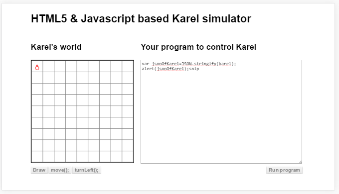

## ജെസോന്‍

ഒബ്ജെക്റ്റ് എന്നത് നമ്മുടെ നിത്യജീവിതത്തില്‍ നിന്നും പ്രോഗ്രാം എഴുതുന്നത് എളുപ്പമാക്കാന്‍ കൊണ്ട് വന്ന ഒരു സങ്കേതമാണ്. ഒബ്ജെക്റ്റ് സാധാരണ മെയിന്‍ മെമ്മറിയില്‍ ആണ് സൂക്ഷിക്കപ്പെടുന്നത് കാരണം പ്രോഗ്രാം പ്രവര്‍ത്തിപ്പിക്കപെടുമ്പോള്‍ ഉണ്ടാകുന്ന ഒന്നാണല്ലോ ഒബ്ജെക്റ്റ്.  ചില സമയങ്ങളില്‍ ഒബ്ജെക്റ്റ് ഒരു പ്രോഗ്രാമില്‍ നിന്നും വേറെ പ്രോഗ്രാമിലേക്ക് കൈമാറ്റം ചെയ്യേണ്ടി വരും. അപ്പോള്‍ ഒബ്ജെക്റ്റ് കൊടുക്കുന്നതിനായി മെമ്മറി അപ്പാടെ നെറ്റ്‌വര്‍ക്ക് വഴി അത് കേബിളോ, വയര്‍ലസൊ ആകട്ടെ ഒരു മെഷിനില്‍ നിന്ന് മറ്റേ മെഷീനിലേക്ക് കോപ്പി ചെയ്യാന്‍ പറ്റില്ല. അല്ലെങ്കില്‍ അത് ഉചിതം അല്ല. അപ്പോള്‍ അതിനെ വേറെ ഒരു രൂപത്തിലേക്ക് മാറ്റി ബിറ്റുകള്‍ ആയി കൈമാറ്റം ചെയ്യേണ്ടി വരും. അതിനെ കമ്പ്യൂട്ടര്‍ ഭാഷയില്‍ വിളിക്കുന്ന പേരാണ് സീരിയലൈസെഷന്‍(`Serialization`) 

ഒരു ഒബ്ജെക്റ്റ് എന്ന് പറയുന്നത് കുറെ ഡാറ്റകളുടെ കൂട്ടം ആണല്ലോ. എല്ലാം പാരല്ലെല്‍ ആയി ഒരിടത്തു നിന്നും മറ്റൊരിടത്തേക്ക് കൊണ്ട് പോകുന്നതിനു പകരം ഓരോ ഡാറ്റ ആയി നെറ്റ്വര്‍ക്കിലൂടെ ഒന്നിന് പുറകെ മറ്റൊന്നായി (സീരിയല്‍)  കൊണ്ട് പോകുന്നു. അങ്ങനെ കൊണ്ട് പോകാന്‍ എന്ത് ഫോര്‍മാറ്റ്‌ വേണമെങ്കിലും ഉപയോഗിക്കാം. പക്ഷെ ഇപ്പോള്‍ സര്‍വസാധാരണമായി ഉപയോഗിക്കുന്ന ഫോര്‍മാറ്റ്‌ ആണ് ജെസോന്‍(`JSON -JavaScript Object Notation`). 

###സീരിയലൈസെഷന്‍(`Serialization`)

താഴെ കാണുന്ന പ്രോഗ്രാം നോക്കുക. നമ്മള്‍ പ്രോഗ്രാം എഴുതി കരെല്‍ എന്ന ഒബ്ജെക്റ്റ്റിനെ  ജെസോന്‍ ഉപയോഗിച്ച് സീരിയലൈസ് ചെയ്‌താല്‍ എങ്ങിനെയുണ്ടാകും എന്ന് നോക്കാം.

കരെല്‍ ആദ്യത്തെ കളത്തില്‍ മുകളിലേക്ക് ആണ് ഇരിക്കുന്നത് എങ്കില്‍ നമുക്ക് കിട്ടുന്ന ജെസോന്‍ വാചകം താഴെ കൊടുത്തിരിക്കുന്നത്‌ പോലെയായിരിക്കും.

`{"row":0,"col":0,"direction":"N","world":{"size":{"rows":9,"cols":9},"boardWidth":300,"boardHeight":300}}`

ഇപ്പോള്‍ ഒരു വാചകം കിട്ടി. ഇനി ഈ വാചകം ഹാര്‍ഡ് ഡിസ്കില്‍ വയ്ക്കുകയോ അല്ലെങ്കില്‍ നെറ്റ്‌വര്‍ക്ക് വഴി വേറെ കമ്പ്യൂട്ടറില്‍ പ്രവര്‍ത്തിക്കുന്ന പ്രോഗ്രാമിന് കൊടുക്കുകയോ ചെയ്യാം. 

### ഡിസീരിയലൈസേഷന്‍

അവിടെ അത് എത്തിക്കഴിഞ്ഞാല്‍ ഈ വാചകത്തില്‍ നിന്നും ഒബ്ജെക്റ്റ് ഉണ്ടാക്കിയെടുക്കാം. അതിനു പറയുന്ന പേരാണ് ഡിസീരിയലൈസേഷന്‍. അതുപോലെ ഹാര്‍ഡ് ഡിസ്ക്കില്‍ ഉള്ള ജെസോന്‍ ഫോര്‍മാറ്റില്‍ വച്ചിട്ടുള്ള ഒബ്ജെക്റ്റ് വേണമെങ്കില്‍ ഇതുപോലെ ഡിസീരിയലൈസ് ചെയ്തു മെമ്മറിയില്‍ ഉള്ള ഒബ്ജെക്റ്റ് ആക്കി മാറ്റം. അതായത് ഒരിക്കല്‍ നമ്മള്‍ പ്രോഗ്രാം പ്രവര്‍ത്തിച്ചു കഴിഞ്ഞു കമ്പ്യൂട്ടര്‍ഓഫ്‌ ആക്കിയാല്‍ മെയിന്‍ മെമ്മറിയില്‍ ഉള്ള ഡാറ്റ ഒക്കെ പോകും. നമ്മള്‍ ഉണ്ടാക്കിയ ഒരു   ഒബ്ജെക്റ്റ് അത് കാര്‍ എന്നായിക്കൊള്ളട്ടെ, അതില്‍ നമ്മള്‍ ഡാറ്റയായി കളറും, സൈസും കൊടുത്തിട്ടുണ്ടെങ്കില്‍ അതൊക്കെ ഓഫ് ചെയ്യുമ്പോള്‍ പോകും. അപ്പോള്‍ നമ്മള്‍ അത് സേവ് ചെയ്തു വക്കണം. അങ്ങനെ സേവ് ചെയ്തു വച്ച ഒബ്ജെക്റ്റ് നാളെ/അല്ലെങ്കില്‍ അടുത്ത പ്രാവശ്യം പ്രോഗ്രാം പ്രവര്‍ത്തിപ്പിക്കുമ്പോള്‍ കിട്ടണം / ലോഡ് ചെയ്യണം എങ്കില്‍ അത് ഹാര്‍ഡ് ഡിസ്ക്കില്‍ സേവ് ചെയ്യണം. അതിനു ജെസോന്‍ ഫോര്‍മാറ്റ്‌ ഉപയോഗിക്കാം.

program deserialization

###ജെസോന്‍ ഉപയോഗങ്ങള്‍