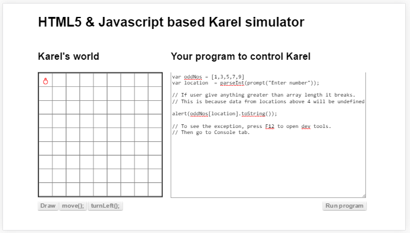
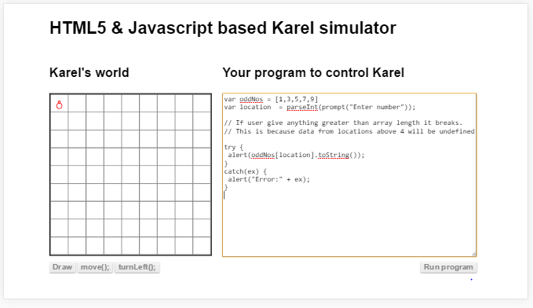

#Exception handling
നമ്മള്‍ എങ്ങിനെയൊക്കെ പ്രോഗ്രാം എഴുതിയാലും പ്രോഗ്രാം പ്രവര്‍ത്തിക്കുന്ന സമയത്തെ ചില കാര്യങ്ങള്‍ പ്രോഗ്രാമിന്‍റെ ശരിയായ പ്രവര്‍ത്തനം തടസപ്പെടുത്തിയേക്കാം. പ്രോഗ്രാമിന്‍റെ പ്രശ്നം കൊണ്ടല്ല ഡാറ്റ ഒരു പ്രത്യേക ഗണത്തില്‍ പെടുന്നത് കൊണ്ടാണ്.നമ്മുടെ പ്രോഗ്രാം ഇന്റര്‍നെറ്റില്‍ നിന്നും ഡാറ്റ എടുക്കുന്നുണ്ട് എന്ന് വിചാരിക്കുക. പ്രവര്‍ത്തന സമയത്ത് യൂസറുടെ കമ്പ്യൂട്ടറില്‍ അല്ലെങ്കില്‍ മൊബൈലില്‍ ഇന്റര്‍നെറ്റ്‌ പ്രവര്‍ത്തിക്കുന്നില്ലെങ്കില്‍ നമ്മുടെ പ്രോഗ്രാമും പ്രവര്‍ത്തിക്കില്ല. അങ്ങനെ വരുന്ന സന്ദര്‍ഭങ്ങളെ നേരിടാന്‍ ഉള്ള ഒരു സങ്കേതമാണ് "എക്സേപ്ഷന്‍ കൈകാര്യം ചെയ്യല്‍".

ഒരു ഉദ്ദാഹരണം താഴെ കൊടുത്തിരിക്കുന്നു.

ഇവിടെ ഒരു അറയില്‍ 5 ഒറ്റസംഖ്യകള്‍ വച്ചിരിക്കുന്നു. യൂസറില്‍ നിന്നും വാങ്ങുന്ന സംഖ്യ ഉപയോഗിച്ച് അറയിലെ സംഖ്യ എടുത്തു അതിനെ ഒരു അക്ഷരമാക്കി മെസ്സേജ് ബോക്സില്‍ കാണിക്കുന്നു.യൂസര്‍ തരുന്നത് 4 ഓ അതില്‍ താഴെ 0 വരെയുള്ള സംഖ്യകളോ ആണെങ്കില്‍ അറയില്‍ നിന്നും സാധുവായ ഒരു നമ്പര്‍ കിട്ടും. അല്ലെങ്കില്‍ `undefined` ആയിരിക്കും കിട്ടുക. `undefined` ഒരു സാധുവായ ഒബ്ജെക്റ്റ് അല്ലാത്തതുകൊണ്ട് `toString` എന്ന ഫങ്ഷന്‍ ഉണ്ടായിരിക്കുകയില്ല. അതുമൂലം പ്രോഗ്രാമിന് ശരിയായി പ്രവര്‍ത്തിക്കാന്‍ സാധിക്കില്ല. നമുക്ക് വേണമെങ്കില്‍ അതൊക്കെ മുന്‍കൂട്ടി താരതമ്യം ചെയ്തു മെസ്സേജ് കാണിച്ചുകൂടെ എന്ന് ചോദിക്കാം. പക്ഷെ എല്ലാ സാഹചര്യങ്ങളിലും നമുക്ക് മുന്‍കൂട്ടി പ്രശ്നങ്ങള്‍ കാണാന്‍ പറ്റും എന്നില്ല. അതുകൊണ്ട് എന്തെങ്കിലും പ്രശനം ഉണ്ടാകും എന്ന് തോന്നുന്ന സ്ഥലങ്ങളില്‍ പ്രശ്ന ഉണ്ടായാല്‍ എന്ത് ചെയ്യണം എന്ന് പറയേണ്ടി വരും. അതാണ് `Exception handling` എന്ന സങ്കേതം വഴി പരിഹരിക്കുന്നത്.

## `try,catch` സൂചകപദങ്ങള്‍
അതിനു ഉപയോഗിക്കുന്ന സൂചക പദങ്ങളാണ്‌ `try, catch` എന്നിവ. ഉദ്ദാഹരണം താഴെ

മുകളില്‍ കൊടുത്ത പ്രോഗ്രാമില്‍ {} ചിഹ്നങ്ങള്‍ക്കിടയില്‍ എഴുതിയിരിക്കുന്ന 2 പ്രോഗ്രാം വാചകകൂട്ടങ്ങള്‍ കാണാം. ആദ്യത്തെ `try` ഉപയോഗിച്ച് എഴുതിയിരിക്കുന്നവയാണ് യഥാര്‍ത്ഥ നമുക്ക് ആവശ്യമുള്ള പ്രോഗ്രാം നിര്‍ദേശങ്ങള്‍. ആ നിര്‍ദേശങ്ങള്‍ എന്തെങ്കിലും കാരണത്താല്‍ പ്രവര്‍ത്തിച്ചില്ലെങ്കില്‍ മാത്രമേ`catch` ഉപയോഗിച്ച് എഴുതിയിരിക്കുന്ന ഭാഗം പ്രവര്‍ത്തിക്കൂ.

പ്രധാനമായി യൂസര്‍ നല്‍കുന്നത് 4ഇല്‍ കൂടിയ സംഖ്യ ആണെങ്കില്‍ അറയില്‍ നിന്നും സാധുവായ ഒരു സംഖ്യ എടുക്കാന്‍ പറ്റില്ല. `undefind` വരും അതില്‍ toString എന്ന ഫങ്ഷന്‍ ഇല്ല. അപ്പോള്‍ ബ്രൌസര്‍ എക്സേപ്ഷന്‍ പുറപ്പെടുവിക്കും. അതാണ് `catch` ഭാഗത്തെ പ്രവര്‍ത്തിപ്പിക്കുന്നത്.
## `finally` സൂചകപദം

